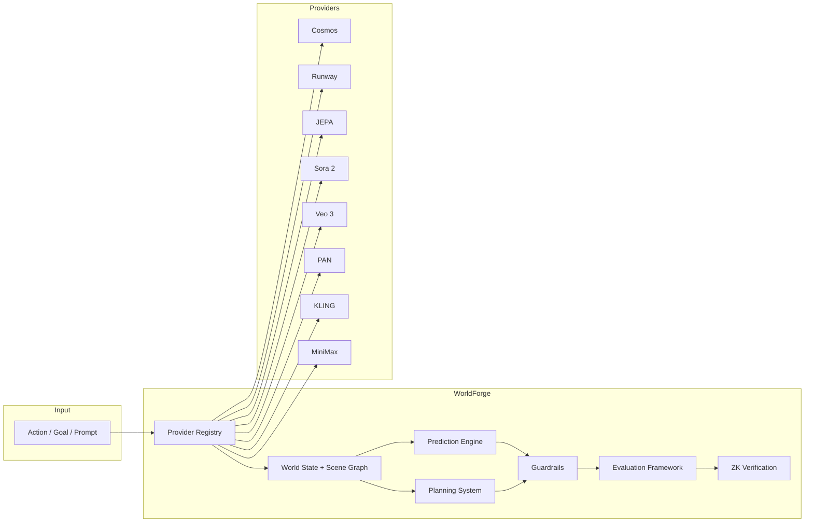

<p align="center">
  <h1 align="center">WorldForge</h1>
  <p align="center">
    <strong>Unified orchestration layer for world foundation models.</strong>
  </p>
  <p align="center">
    One API to predict, plan, evaluate, and verify across
    NVIDIA Cosmos, Runway GWM, Meta JEPA, Google Veo, OpenAI Sora, KLING, MiniMax, PAN, and more.
  </p>
  <p align="center">
    <a href="https://github.com/AbdelStark/worldforge/blob/main/LICENSE"></a>
    
    
    
    
  </p>
</p>

---

```
        ┌─────────────────────────────────────────────────┐
        │                 Your Application                │
        │    Python · Rust · CLI · REST API (27 routes)   │
        └────────────────────────┬────────────────────────┘
                                 │
              ┌──────────────────┴──────────────────┐
              │           WorldForge Core            │
              │   predict · plan · eval · verify     │
              │   state · guardrails · scene graph   │
              └──────────────────┬──────────────────┘
                                 │
  ┌──────────┬──────────┬────────┴─┬──────────┬──────────┐
  │  Cosmos  │  Runway  │   JEPA   │  Sora 2  │   PAN    │
  │  Predict │  GWM-1   │ V-JEPA 2 │  OpenAI  │  MBZUAI  │
  │  Reason  │  Worlds  │  local   │          │ stateful │
  │  Embed   │  Robots  │ gradient │          │  rounds  │
  └──────────┴──────────┴──────────┴──────────┴──────────┘
  ┌──────────┬──────────┬──────────┬──────────┬──────────┐
  │  Veo 3   │  KLING   │ MiniMax  │  Genie   │  Marble  │
  │  Google  │ Kuaishou │  Hailuo  │  local   │  local   │
  │          │   JWT    │  T2V-01  │          │          │
  └──────────┴──────────┴──────────┴──────────┴──────────┘
```

## Quick Start

### 1. Install

```bash
# Rust library
cargo add worldforge-core worldforge-providers

# Python bindings
pip install worldforge

# CLI
cargo install worldforge-cli
```

### 2. Set provider credentials

```bash
export NVIDIA_API_KEY="your-key"        # Cosmos
export RUNWAY_API_SECRET="your-secret"  # Runway GWM
export OPENAI_API_KEY="your-key"        # Sora 2
export GOOGLE_API_KEY="your-key"        # Veo 3
export PAN_API_KEY="your-key"           # PAN
# Providers auto-register when env vars are present
```

### 3. Run

```python
from worldforge import WorldForge, Action

wf = WorldForge()  # auto-detects all providers from env
world = wf.create_world("kitchen", provider="cosmos")

# Predict what happens when the robot pushes the mug
prediction = world.predict(Action.move_to(0.5, 0.8, 0.0), steps=10)
print(f"Physics score: {prediction.physics_score}")
# Physics score: 0.87

# Plan a multi-step task
plan = world.plan(goal="red mug in the dishwasher", planner="cem", max_steps=20)
print(f"Plan: {len(plan.actions)} steps, P(success)={plan.success_probability}")
# Plan: 6 steps, P(success)=0.82
```

## Architecture



## Usage

### Cross-Provider Comparison

```python
comparison = world.compare(
    Action.move_to(0.5, 0.8, 0.0),
    providers=["cosmos", "runway", "sora"],
    steps=10,
)
print(comparison.to_markdown())
```

### Evaluation Across Providers

```bash
# Run the built-in physics eval suite
worldforge eval --suite physics --providers cosmos,runway,jepa \
  --output-markdown report.md --output-csv report.csv

# 12 evaluation dimensions: object permanence, gravity, collisions,
# spatial/temporal consistency, action prediction, material understanding,
# spatial reasoning + WR-Arena metrics (action fidelity, smoothness,
# generation consistency, simulative reasoning)
```

### Planning with Verification

```python
plan = world.plan(
    goal="stack red block on blue block",
    planner="cem",           # or: sampling, mpc, gradient
    max_steps=20,
    verify_backend="stark",  # ZK proof of guardrail compliance
)
assert plan.verification_proof is not None
```

### REST API

```bash
worldforge serve  # starts on 127.0.0.1:8080

curl -X POST http://localhost:8080/v1/worlds \
  -H "Content-Type: application/json" \
  -d '{"name": "kitchen", "provider": "cosmos"}'
```

## Providers

| Provider | Env Var | Capabilities | Access |
|----------|---------|-------------|--------|
| **Cosmos** | `NVIDIA_API_KEY` | predict, generate, reason, transfer, embed, plan | NIM API / self-hosted |
| **Runway** | `RUNWAY_API_SECRET` | predict, generate, transfer, plan | REST API |
| **JEPA** | `JEPA_MODEL_PATH` | predict, reason, embed, plan (gradient) | Local weights |
| **Sora 2** | `OPENAI_API_KEY` | predict, generate | OpenAI API |
| **Veo 3** | `GOOGLE_API_KEY` | predict, generate | GenAI API |
| **PAN** | `PAN_API_KEY` | predict, generate, plan (stateful rounds) | MBZUAI API |
| **KLING** | `KLING_API_KEY` + `KLING_API_SECRET` | predict, generate | JWT REST API |
| **MiniMax** | `MINIMAX_API_KEY` | predict, generate | REST API |
| **Genie** | `GENIE_API_KEY` | predict, generate, reason, transfer, plan | Local surrogate |
| **Marble** | *(always on)* | predict, generate, reason, transfer, embed, plan | Local surrogate |
| **Mock** | *(always on)* | all | Deterministic testing |

## Evaluation Dimensions

| Dimension | Source | Method |
|-----------|--------|--------|
| Object Permanence | WorldForge | Occlusion tracking |
| Gravity Compliance | WorldForge | Unsupported object fall test |
| Collision Accuracy | WorldForge | Contact physics validation |
| Spatial Consistency | WorldForge | Viewpoint stability |
| Temporal Consistency | WorldForge | Time-reversal stability |
| Action Prediction | WorldForge | Physics outcome matching |
| Material Understanding | WorldForge | Material-specific behavior |
| Spatial Reasoning | WorldForge | Depth/scale/distance |
| Action Simulation Fidelity | WR-Arena | LLM-as-judge (0-3 scale) |
| Transition Smoothness | WR-Arena | MRS metric (optical flow) |
| Generation Consistency | WR-Arena | WorldScore (7 aspects) |
| Simulative Reasoning | WR-Arena | VLM + WFM planning loop |

Built-in suites: `physics`, `manipulation`, `spatial`, `comprehensive`.
Report formats: JSON, Markdown, CSV.

## Project Structure

```
worldforge/
├── crates/
│   ├── worldforge-core/       # Types, traits, state, scene graph, planning
│   ├── worldforge-providers/  # 11 provider adapters + polling infra
│   ├── worldforge-eval/       # 12 eval dimensions + WR-Arena datasets
│   ├── worldforge-verify/     # ZK verification (STARK, EZKL)
│   ├── worldforge-server/     # REST API (27 endpoints)
│   ├── worldforge-cli/        # CLI tool (27 commands)
│   └── worldforge-python/     # PyO3 bindings
├── SPECIFICATION.md           # Full type-level specification
└── architecture/ADR.md        # Architecture decision records
```

## REST API Endpoints

| Method | Endpoint | Description |
|--------|----------|-------------|
| `GET` | `/v1/providers` | List registered providers |
| `GET` | `/v1/providers/{name}/health` | Provider health check |
| `POST` | `/v1/worlds` | Create a world |
| `GET` | `/v1/worlds/{id}` | Get world state |
| `POST` | `/v1/worlds/{id}/predict` | Predict next state |
| `POST` | `/v1/worlds/{id}/plan` | Plan action sequence |
| `POST` | `/v1/worlds/{id}/evaluate` | Run eval suite |
| `POST` | `/v1/worlds/{id}/verify` | Generate ZK proof |
| `POST` | `/v1/compare` | Cross-provider comparison |
| `POST` | `/v1/evals/run` | Run evaluation suite |

*27 endpoints total. Full OpenAPI spec generated by the server.*

## Deployment

### Docker

```bash
docker run -e NVIDIA_API_KEY=$NVIDIA_API_KEY \
  -p 8080:8080 worldforge/server:latest
```

### As a library

```rust
use worldforge_providers::auto_detect_worldforge;

let wf = auto_detect_worldforge();
let world = wf.create_world("sim-env", "cosmos")?;
let prediction = world.predict(&action, &config).await?;
```

### With state persistence

```python
wf = WorldForge(state_backend="sqlite", state_db_path="worlds.db")
# Also supports: file, redis, s3, msgpack
```

## Development

```bash
cargo build                          # Build all crates
cargo test                           # Run all 1,000+ tests
cargo clippy -- -D warnings          # Lint (zero warnings policy)
cargo bench -p worldforge-core       # Run benchmarks
```

## License

Apache 2.0. See [LICENSE](LICENSE).
