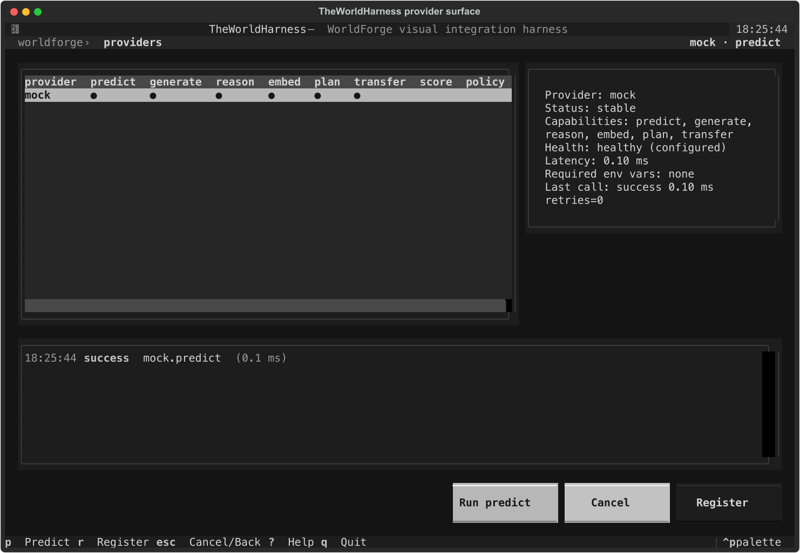

<div align="center">

# WorldForge

**An integration layer for physical-AI world models.**

Python library for wiring world-model providers, action scorers, embodied policies, and media
generators behind a typed capability interface. Includes planning, evaluation, benchmarks,
diagnostics, and a CLI.

[](https://github.com/AbdelStark/worldforge/actions/workflows/ci.yml)
[](https://github.com/AbdelStark/worldforge/blob/main/pyproject.toml)
[](./LICENSE)
[](./.github/workflows/ci.yml)
[](./src/worldforge/py.typed)
[](https://github.com/astral-sh/ruff)
[](https://github.com/astral-sh/uv)
[](#project-status)

[**Quickstart**](#quickstart) ·
[**Providers**](#provider-surfaces) ·
[**Capability Model**](#capability-model) ·
[**Architecture**](#architecture) ·
[**Docs**](./docs/src) ·
[**Playbooks**](./docs/src/playbooks.md)

</div>

<p align="center">
  
</p>

---

## Overview

A score model, a robot policy server, a video simulator, and a remote media API have different
inputs, runtimes, and failure modes. WorldForge does not flatten those differences. Each provider
adapter declares which of eight capabilities it supports (`predict`, `score`, `policy`, `generate`,
`transfer`, `reason`, `embed`, `plan`). The contract is strict and fail-closed: calling an
unsupported capability raises rather than quietly returning empty results.

Planning, evaluation, benchmarks, diagnostics, and persistence are built on top of that contract,
not on any specific runtime.
Benchmark budget files can turn success rate, error count, retry count, latency, and throughput
thresholds into non-zero CLI gates for release checks or preserved benchmark claims.

WorldForge is not a hosted service, a model API abstraction, or a training framework. Optional
runtimes, robot stacks, credentials, checkpoints, and durable storage remain the host
application's responsibility.

## Highlights

| | |
| --- | --- |
| **Capability contracts** | Eight named capabilities. Adapters advertise only what they actually implement and return typed WorldForge results. Unknown names raise instead of behaving like empty filters. |
| **Composable planning** | Combine predictive, score, and policy providers in a single planning loop. Rank candidates, roll out futures, execute actions, persist state. |
| **Deterministic by default** | Built-in `mock` provider, reusable contract assertions (`worldforge.testing`), and packaged demos that run from a clean checkout without credentials or GPUs. |
| **Host-owned runtimes** | No torch, CUDA, robot controllers, or checkpoints in base dependencies. LeWorldModel, GR00T, LeRobot, Cosmos, and Runway integrate through their own surfaces. |
| **Diagnostics** | `worldforge doctor`, provider events, benchmark and evaluation harnesses, and an optional Textual TUI (`TheWorldHarness`) for inspecting traces. |
| **Quality gates** | `py.typed`, ruff, a 90% coverage floor, and wheel + sdist contract tests in CI across Python 3.10 to 3.13. |

## Install

### Library (recommended)

```bash
uv add "worldforge @ git+https://github.com/AbdelStark/worldforge"
```

### Repository development

```bash
git clone https://github.com/AbdelStark/worldforge.git
cd worldforge
uv sync --group dev
cp .env.example .env
```

Optional extras:

```bash
uv sync --group dev --extra harness   # TheWorldHarness Textual TUI
```

Python 3.10+. Base install depends only on `httpx`. Optional runtimes are host-owned.

## Quickstart

### Python

```python
from worldforge import Action, BBox, Position, SceneObject, StructuredGoal, WorldForge

forge = WorldForge()
world = forge.create_world("kitchen", provider="mock")

world.add_object(
    SceneObject(
        "red_mug",
        Position(0.0, 0.8, 0.0),
        BBox(Position(-0.05, 0.75, -0.05), Position(0.05, 0.85, 0.05)),
    )
)

prediction = world.predict(Action.move_to(0.3, 0.8, 0.0), steps=2)
print(prediction.provider, prediction.physics_score)

plan = world.plan(
    goal_spec=StructuredGoal.object_at(
        object_name="red_mug",
        position=Position(0.3, 0.8, 0.0),
    )
)
print(plan.action_count, plan.success_probability)

doctor = forge.doctor()
print(doctor.healthy_provider_count, doctor.provider_count)
```

### CLI

```bash
uv run worldforge examples                                              # runnable scripts index
uv run worldforge doctor                                                # provider health
uv run worldforge world create lab --provider mock                      # save a local world
uv run worldforge world add-object <world-id> cube --x 0 --y 0.5 --z 0  # edit scene state
uv run worldforge world predict <world-id> --object-id <object-id> --x 0.4 --y 0.5 --z 0
uv run worldforge world list                                            # persisted worlds
uv run worldforge world objects <world-id>                              # scene objects
uv run worldforge world history <world-id>                              # object edits + predictions
uv run worldforge world export <world-id> --output world.json           # portable state JSON
uv run worldforge world delete <world-id>                               # remove local JSON state
uv run worldforge provider list                                         # registered providers
uv run worldforge provider info mock                                    # capability surface
uv run worldforge predict kitchen --provider mock --x 0.3 --y 0.8 --z 0.0 --steps 2
uv run worldforge eval --suite planning --provider mock --format json
uv run worldforge benchmark --provider mock --iterations 5 --format json
uv run worldforge benchmark --provider mock --operation embed --input-file benchmark-inputs.json
uv run worldforge benchmark --provider mock --operation generate --budget-file benchmark-budget.json
```

Scene mutations append persisted history entries with typed action payloads. Position patches keep
the object's bounding box translated with the pose so saved snapshots stay coherent.

## Capability Model

In WorldForge, a "capability" names an operation an adapter actually supports, not the upstream
model's branding.

| Capability | Signature | Example providers |
| --- | --- | --- |
| `predict` | `state + action → predicted state` | `mock` |
| `score` | `observations + goal + candidates → ranked candidates` | `leworldmodel` |
| `policy` | `observation + instruction → action chunks` | `gr00t`, `lerobot` |
| `generate` | `prompt + options → media artifact` | `cosmos`, `runway`, `mock` |
| `transfer` | `artifact + prompt/options → artifact` | `runway`, `mock` |
| `reason` | structured reasoning over state | `mock` |
| `embed` | observation → embedding | `mock` |
| `plan` | facade over composed surfaces | `mock` |

LeWorldModel is a score provider, not a video generator. GR00T and LeRobot are policy providers,
not predictive world models. Cosmos and Runway are media generators, not controllable physical
planning.

The canonical loop:

```text
observe state
  → propose candidate actions
  → score or roll out possible futures  (score / predict)
  → select an action sequence            (plan)
  → execute through a provider           (policy / predict)
  → persist, evaluate, observe again
```

## Provider Surfaces

<!-- provider-catalog-readme:start -->
| Provider | Capability surface | Registration | Runtime ownership |
| --- | --- | --- | --- |
| `mock` | `predict`, `generate`, `transfer`, `reason`, `embed`, `plan` | always registered | in-repo deterministic local provider |
| [`cosmos`](./docs/src/providers/cosmos.md) | `generate` | `COSMOS_BASE_URL` | host supplies a reachable Cosmos deployment and optional `NVIDIA_API_KEY` |
| [`runway`](./docs/src/providers/runway.md) | `generate`, `transfer` | `RUNWAYML_API_SECRET` or `RUNWAY_API_SECRET` | host supplies Runway credentials and persists returned artifacts |
| [`leworldmodel`](./docs/src/providers/leworldmodel.md) | `score` | `LEWORLDMODEL_POLICY` or `LEWM_POLICY` | host installs `stable_worldmodel`, torch, and compatible checkpoints |
| [`gr00t`](./docs/src/providers/gr00t.md) | `policy` | `GROOT_POLICY_HOST` | host runs or reaches an Isaac GR00T policy server |
| [`lerobot`](./docs/src/providers/lerobot.md) | `policy` | `LEROBOT_POLICY_PATH` or `LEROBOT_POLICY` | host installs LeRobot and compatible policy checkpoints |
| `jepa` | scaffold | `JEPA_MODEL_PATH` | credential-gated mock-backed reservation, not a real JEPA runtime |
| `genie` | scaffold | `GENIE_API_KEY` | credential-gated mock-backed reservation, not a real Genie runtime |
<!-- provider-catalog-readme:end -->

Scaffold adapters stay outside package exports and auto-registration until they have a validated
runtime path, typed parser coverage, request limits, and docs. The active candidate is
[`jepa-wms`](./docs/src/providers/jepa-wms.md), a direct-construction scaffold targeting future
`facebookresearch/jepa-wms` score-provider work.

## Architecture

```text
  ┌──────────────────────────────────────────────┐
  │  Host application / CLI                      │
  └──────────────────────┬───────────────────────┘
                         │
                         ▼
  ┌──────────────────────────────────────────────┐
  │  WorldForge facade                           │
  │  catalog · registry · diagnostics · persist  │
  └──────────────────────┬───────────────────────┘
                         │
                         ▼
  ┌──────────────────────────────────────────────┐
  │  World runtime                               │
  │  state · history · planning · execution      │
  └──────────────────────┬───────────────────────┘
                         │
                         ▼
  ┌──────────────────────────────────────────────┐
  │  Provider adapter                            │
  │  capability contract · validation · events   │
  └──────────────────────┬───────────────────────┘
                         │
                         ▼
  ┌──────────────────────────────────────────────┐
  │  Upstream runtime or API                     │
  │  local model · policy server · media API     │
  └──────────────────────────────────────────────┘
```

| Path | Responsibility |
| --- | --- |
| `src/worldforge/models.py` | Domain models, serialization, validation errors, provider metadata, result types, request policies |
| `src/worldforge/framework.py` | `WorldForge`, `World`, persistence, planning, prediction, comparison, diagnostics |
| `src/worldforge/providers/catalog.py` | In-repo provider factories and auto-registration policy |
| `src/worldforge/providers/base.py` | Provider interfaces, `ProviderError`, remote-provider behavior, `PredictionPayload` |
| `src/worldforge/providers/` | Concrete adapters: mock, Cosmos, Runway, LeWorldModel, GR00T, LeRobot, JEPA, Genie |
| `src/worldforge/evaluation/` | Deterministic evaluation suites and report renderers |
| `src/worldforge/benchmark.py` | Capability-aware latency, retry, throughput, and event benchmark harness |
| `src/worldforge/observability.py` | `ProviderEvent` sinks for logs, recording, and metrics |
| `src/worldforge/testing/` | Reusable provider contract assertions |

Read [architecture](./docs/src/architecture.md) ·
[world-model taxonomy](./docs/src/world-model-taxonomy.md) ·
[provider authoring guide](./docs/src/provider-authoring-guide.md)
before adding a new adapter.

## Demos

Packaged demos run against injected deterministic runtimes. No checkpoints, credentials, or GPU
required:

```bash
uv run worldforge-demo-leworldmodel          # score-based planning demo
uv run worldforge-demo-lerobot               # policy + score planning demo
```

Visual TUI (optional `harness` extra):

```bash
uv run --extra harness worldforge-harness
uv run --extra harness worldforge-harness --flow leworldmodel
uv run --extra harness worldforge-harness --flow lerobot
uv run --extra harness worldforge-harness --flow diagnostics
```

| Flow | Exercises |
| --- | --- |
| `leworldmodel` | Score-provider planning with LeWorldModel-shaped costs, path selection, execution, persistence, reload, events. |
| `lerobot` | Policy-plus-score planning with LeRobot-shaped action chunks, translation, ranking, execution, persistence, reload, events. |
| `diagnostics` | Provider catalog diagnostics and a mock-provider benchmark across predict, reason, generate, transfer, embed. |

Real-checkpoint live smoke (host-provided dependencies and assets):

```bash
scripts/lewm-real \
  --checkpoint ~/.stable-wm/pusht/lewm_object.ckpt \
  --device cpu
```

See [examples/](./examples) and [`uv run worldforge examples`](./docs/src/examples.md) for the full
runnable index.

## Who It's For

- Researchers comparing world-model surfaces without rewriting the harness for each one.
- Robotics and physical-AI engineers wiring policies, scorers, simulators, and media providers
  around their own stacks.
- Framework builders shipping adapter packages, CLI workflows, and reproducible demos.
- Anyone who wants the repo to run from a clean checkout before installing CUDA or downloading
  checkpoints.

## Operating Boundaries

- Capabilities are contracts. Don't advertise an operation unless the adapter implements it and
  returns the typed WorldForge result.
- Optional runtimes remain host-owned. No torch, LeWorldModel, LeRobot, GR00T, CUDA, TensorRT,
  controllers, checkpoints, or datasets in base dependencies.
- Embodiment-specific action translation is host-owned. Policy providers preserve raw actions; the
  caller converts them into executable `Action` objects.
- Local JSON persistence is single-writer and available through both Python APIs and
  `worldforge world` CLI commands. Services needing locking, transactions, or migrations own that
  layer.
- Built-in evaluation suites are deterministic contract harnesses. They are not physical-fidelity,
  media-quality, or real-world safety claims.
- Scaffold adapters (`jepa`, `genie`, `jepa-wms`) are placeholders, not real integrations.
- World IDs are local storage identifiers. Path separators and traversal-shaped IDs are rejected.

## Development

Primary local gate (same as CI):

```bash
uv sync --group dev
uv lock --check
uv run ruff check src tests examples scripts
uv run ruff format --check src tests examples scripts
uv run python scripts/generate_provider_docs.py --check
uv run pytest
uv run --extra harness pytest --cov=src/worldforge --cov-report=term-missing --cov-fail-under=90
bash scripts/test_package.sh
```

Scaffold a new provider:

```bash
uv run python scripts/scaffold_provider.py "Acme WM" \
  --taxonomy "JEPA latent predictive world model" \
  --planned-capability score
```

Contributor guide: [CONTRIBUTING.md](./CONTRIBUTING.md). Repository agent context:
[AGENTS.md](./AGENTS.md).

## Project Status

WorldForge is pre-1.0 beta. Minor releases may still include breaking changes when the public API
needs to tighten.

**Useful today for**

- local provider adapter development
- deterministic planning and evaluation experiments
- checkout-safe demos and optional-runtime smoke tests
- contract testing for third-party provider packages
- CLI diagnostics around provider registration, health, and capabilities

**Known limits**

- `jepa` and `genie` are credential-gated scaffold adapters backed by mock behavior
- `jepa-wms` is a direct-construction candidate, not exported or auto-registered
- local JSON persistence is single-writer only
- evaluation scores are contract signals, not physical-fidelity or safety claims
- optional runtimes, checkpoints, trace export, dashboards, and production telemetry stay
  host-owned

## Citing WorldForge

If you use WorldForge in academic work, a BibTeX entry is:

```bibtex
@software{worldforge,
  title   = {WorldForge: An integration layer for physical-AI world models},
  author  = {AbdelStark and {WorldForge contributors}},
  year    = {2026},
  url     = {https://github.com/AbdelStark/worldforge},
  version = {0.3.0}
}
```

## Contributing

Issues, discussions, and pull requests are welcome. Please read
[CONTRIBUTING.md](./CONTRIBUTING.md) and open an issue for non-trivial changes before sending a
patch. For provider work, start with the
[provider authoring guide](./docs/src/provider-authoring-guide.md) and the
[playbooks](./docs/src/playbooks.md).

## License

WorldForge is released under the [MIT License](./LICENSE).

## Links

- Documentation: [docs/src](./docs/src)
- Quickstart: [docs/src/quickstart.md](./docs/src/quickstart.md)
- Playbooks: [docs/src/playbooks.md](./docs/src/playbooks.md)
- Architecture: [docs/src/architecture.md](./docs/src/architecture.md)
- World-model taxonomy: [docs/src/world-model-taxonomy.md](./docs/src/world-model-taxonomy.md)
- Repository: <https://github.com/AbdelStark/worldforge>
- Issues: <https://github.com/AbdelStark/worldforge/issues>
