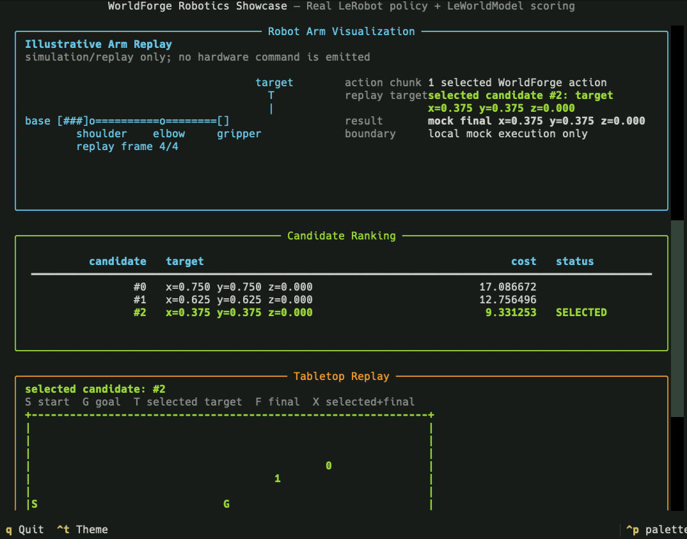

# WorldForge

<p align="center">
  
</p>

<div align="center">

### 🌐 &nbsp; **English** &nbsp; · &nbsp; [简体中文](./README.zh-CN.md)

**A harness framework for building world-model-based workflows for physical AI systems.**

WorldForge is the application builder's counterpart to model-training stacks like Stable World
Model: where those help researchers *train* world models, WorldForge helps roboticists and
physical-AI builders *compose, evaluate, and benchmark* workflows built on top of them — so they can
pick the best provider and configuration for their task.

The whole framework is organized around one backbone loop: **plan and score actions with an
action-conditioned predictive world model, in latent space.** A policy proposes candidate actions, a
world model scores and rolls them out as a cost oracle, a latent MPC controller refines and executes
under a receding horizon, and evaluation plus benchmarking tell you which configuration wins.
Checkpoints, credentials, robot controllers, and deployment stay host-owned.

[](https://github.com/AbdelStark/worldforge/actions/workflows/ci.yml)
[](https://abdelstark.github.io/worldforge/)
[](https://github.com/AbdelStark/worldforge/blob/main/pyproject.toml)
[](https://pypi.org/project/worldforge-ai/)
[](./LICENSE)
[](./.github/workflows/ci.yml)
[](./src/worldforge/py.typed)
[](https://github.com/astral-sh/ruff)
[](https://github.com/astral-sh/uv)
[](#project-status)
<!-- ALL-CONTRIBUTORS-BADGE:START - Do not remove or modify this section -->
[](#contributors)
<!-- ALL-CONTRIBUTORS-BADGE:END -->

[**Quickstart**](#quickstart) ·
[**Docs Map**](https://abdelstark.github.io/worldforge/docs-map/) ·
[**CLI**](https://abdelstark.github.io/worldforge/cli/) ·
[**Showcases**](https://abdelstark.github.io/worldforge/demo-showcases/) ·
[**Providers**](#provider-surfaces) ·
[**Rerun**](https://abdelstark.github.io/worldforge/rerun/) ·
[**Capability Model**](#capability-model) ·
[**Architecture**](#architecture) ·
[**Quality**](https://abdelstark.github.io/worldforge/quality/) ·
[**Evidence**](https://abdelstark.github.io/worldforge/claim-evidence-map/) ·
[**Docs**](https://abdelstark.github.io/worldforge/) ·
[**Playbooks**](https://abdelstark.github.io/worldforge/playbooks/) ·
[**Support**](./SUPPORT.md) ·
[**Security**](./SECURITY.md)

</div>

## What WorldForge Does

WorldForge is a harness for the action-conditioned planning-and-scoring loop. It makes each step
explicit, swappable, and measurable.

- **Policy providers propose candidate actions** from robot observations or task instructions.
- **World-model providers score and roll out those candidates** in latent space as a cost oracle —
  instead of pretending every model has the same interface.
- **A latent MPC controller owns the optimizer** (CEM/MPPI-style refinement, elite selection,
  receding horizon) and calls the score capability; providers stay pure oracles.
- **Evaluation and benchmarking compare configurations** so a builder can pick the best
  provider/horizon/cost setup for their task, with typed contracts, recorded runs, and replay.

## First Run

Install the package, then run the checkout-safe backbone loop on the deterministic `mock` provider:

```bash
uv add worldforge-ai
uv run worldforge doctor --registered-only
uv run python examples/latent_mpc_planning.py
uv run worldforge benchmark --provider mock --operation predict --operation embed
```

The mock provider needs no credentials, checkpoints, GPU, or robot. Success is a latent MPC plan that
selects the lowest-cost action under a receding horizon, plus a benchmark report over the provider's
callable operations.

## Robotics Showcase: LeRobot + LeWorldModel

WorldForge's front-door robotics demo composes a
[Hugging Face LeRobot](https://github.com/huggingface/lerobot) policy with a
[LeWorldModel](https://github.com/lucas-maes/le-wm) checkpoint. LeRobot proposes PushT action
candidates, WorldForge bridges those policy actions into LeWorldModel-native candidate tensors,
LeWorldModel scores the candidates, and WorldForge selects and mock-replays the lowest-cost action
chunk.

The LeWorldModel runtime path intentionally follows the official LeWM loading contract:
`stable_worldmodel.policy.AutoCostModel("pusht/lewm")` loads the Lucas Maes LeWM object checkpoint.
`stable-worldmodel` is the runtime/evaluation library used by the official LeWorldModel repo, not
a substitute score model.

This is simulation/replay planning. It demonstrates policy inference, score-model inference,
typed provider composition, candidate ranking, event capture, and visual replay. Hardware control,
safety checks, robot-controller integration, and task-specific preprocessing stay host-owned.

For measured decision evidence without a live robot, run the Go2 Air ControlBench trace replay:

```bash
uv run python examples/go2-controlbench-decisiontrace/run.py
```

It consumes a compact public `espejelomar/go2-air-controlbench-v1` DecisionTrace fixture, reranks
candidate Unitree sport-mode commands through WorldForge's `score` capability, and reports measured
native-odometry regret against the best counterfactual command. It does not import DimOS, Unitree
SDKs, Hugging Face datasets, or connect robot hardware.

<div align="center">
<table>
  <tr>
    <td width="50%">
      
      <br />
      <sub><strong>Pipeline:</strong> real policy, real score checkpoint, WorldForge planner, local mock replay.</sub>
    </td>
    <td width="50%">
      
      <br />
      <sub><strong>Decision:</strong> candidate ranking, robot-arm illustration, and fixed tabletop replay.</sub>
    </td>
  </tr>
</table>
</div>

```bash
scripts/robotics-showcase
uv run python scripts/demo_showcases.py run all --workspace-dir .worldforge/demo-showcases
```

The first command launches a staged Textual report by default, writes the same run data to
`/tmp/worldforge-robotics-showcase/real-run.json`, and writes a visual Rerun recording to
`/tmp/worldforge-robotics-showcase/real-run.rrd`. Press `o` in the TUI to open that recording in
Rerun. Use `--tui-stage-delay 0.1` for a faster reveal, `--no-tui-animation` to skip sleeps and
arm motion, `--no-tui` for the plain terminal report, `--no-rerun` to skip the Rerun artifact,
`--json-only` for automation, or `--health-only` for a non-mutating dependency/checkpoint
preflight. Use `--lewm-revision <40-char-commit-sha>` to pin auto-built LeWorldModel assets.
The second command runs the checkout-safe demo showcase suite without external credentials.

The optional live robotics workflow, `.github/workflows/robotics-showcase.yml`, runs this same
showcase in non-interactive JSON mode on every pull request run and on pushes to `main`. It caches
Hugging Face downloads, LeWorldModel build assets, and the built object checkpoint with
`actions/cache`; CI uploads `real-run.json`, `stdout.json`, and `run_manifest.json` as evidence,
while checkpoint artifacts are not uploaded.

Read the walkthrough and implementation notes: [Robotics Replay Showcase](https://abdelstark.github.io/worldforge/robotics-showcase/)
and [Robotics Showcase Technical Deep Dive](https://abdelstark.github.io/worldforge/robotics-showcase-deep-dive/).

<details>
<summary><strong>Robotics showcase TUI</strong> - optional Textual report for the LeRobot + LeWorldModel showcase</summary>

The only Textual interface kept in WorldForge is the robotics showcase report. It is launched by
the host-owned robotics wrapper and focuses on policy proposals, score-model ranking, tensor
contracts, provider events, and the local replay result.

```bash
scripts/robotics-showcase
scripts/robotics-showcase --no-tui
```

</details>

<details>
<summary><strong>Rerun observability</strong> - optional recording layer for events, world snapshots, plans, and benchmark artifacts</summary>

WorldForge can stream sanitized provider events and run artifacts into
[Rerun](https://github.com/rerun-io/rerun) without making Rerun a provider or base dependency.

```bash
uv run --extra rerun worldforge-demo-rerun
uv run --extra rerun rerun .worldforge/rerun/worldforge-rerun-showcase.rrd
scripts/robotics-showcase
uvx --from "rerun-sdk>=0.24,<0.32" rerun /tmp/worldforge-robotics-showcase/real-run.rrd
```

The checkout-safe Rerun demo records provider event logs, world snapshots, a predictive plan,
workflow trace artifacts, 3D object boxes, and benchmark metrics into a local `.rrd` file. The
robotics showcase records the real PushT policy+score run with candidate target points, selected
trajectory, score bars, latency bars, provider events, plan payload, and replay snapshots. Use
`--spawn`, `--connect-url`, or `--serve-grpc-port` for live viewer workflows in the checkout-safe
demo.

More detail: [Rerun integration docs](https://abdelstark.github.io/worldforge/rerun/).

</details>

---

## Overview

A predictive world model, a score model, and a robot policy server have different inputs, runtimes,
and failure modes. WorldForge does not flatten those differences. Each provider adapter declares
which of five capabilities it supports (`predict`, `score`, `policy`, `embed`, `plan`). The contract
is strict and fail-closed: calling an unsupported capability raises rather than quietly returning
empty results.

The backbone loop composes those capabilities: a `policy` proposes candidate actions, a `predict`
provider rolls them out as forward dynamics, a `score` provider ranks them as a cost oracle, and the
`LatentMPCController` owns the CEM/receding-horizon optimizer that ties them together in latent
space. Evaluation and benchmarking sit on top so a builder can measure and select the best
configuration. Budget files turn success rate, error count, retry count, latency, and throughput
thresholds into non-zero CLI gates for release checks or preserved benchmark claims. The
[claim-to-evidence map](https://abdelstark.github.io/worldforge/claim-evidence-map/) links public
capability and runtime claims to concrete tests, commands, artifacts, and non-claims.

WorldForge is not a hosted service, a model API abstraction, a world generator, or a training
framework. Optional runtimes, robot stacks, credentials, checkpoints, and durable storage remain the
host application's responsibility.

## Highlights

| | |
| --- | --- |
| **Capability contracts** | Five named capabilities. Adapters advertise only what they actually implement and return typed WorldForge results. Unknown names raise instead of behaving like empty filters. |
| **Latent planning loop** | The `LatentMPCController` runs CEM/receding-horizon planning in latent space over any `score` provider. Combine predictive, score, and policy providers; rank candidates, roll out futures, execute the lowest-cost action, replan. |
| **Deterministic by default** | Built-in `mock` provider, reusable contract assertions (`worldforge.testing`), and packaged demos that run from a clean checkout without credentials or GPUs. |
| **Host-owned runtimes** | No torch, CUDA, robot controllers, or checkpoints in base dependencies. LeWorldModel, GR00T, LeRobot, and Cosmos-Policy integrate through their own surfaces. |
| **Diagnostics** | `worldforge doctor`, provider events, workflow traces, benchmark and evaluation reports, run workspaces, and the robotics showcase TUI. |
| **Rerun observability** | Optional `rerun-sdk` bridge for event streams, workflow traces, world snapshots, plans, and benchmark artifacts. |
| **Quality gates** | `py.typed`, import-isolated pytest, ruff, a 90% coverage floor, strict docs, and wheel + sdist contract tests in CI on Python 3.13. |

## Install

### Library (recommended)

```bash
# From PyPI (recommended)
uv add worldforge-ai
# or
pip install worldforge-ai
```

The Python import path stays the same:

```python
import worldforge
```

If you want the optional Textual harness UI:

```bash
uv add "worldforge-ai[harness]"
```

If you want Rerun-backed event and artifact recording:

```bash
uv add "worldforge-ai[rerun]"
```

If you want TensorBoard inspection of the LeWorldModel checkpoint used during
the robotics showcase:

```bash
uv add "worldforge-ai[tensorboard]"
```

### From source (bleeding edge)

```bash
uv add "worldforge-ai @ git+https://github.com/AbdelStark/worldforge"
```

### Repository development

```bash
git clone https://github.com/AbdelStark/worldforge.git
cd worldforge
uv sync --group dev
cp .env.example .env
```

Optional extras:

```bash
uv sync --group dev --extra harness   # robotics showcase Textual report
uv sync --group dev --extra rerun     # Rerun event and artifact recording
uv sync --group dev --extra tensorboard  # TensorBoard LeWorldModel checkpoint inspection
```

Python 3.13 only. Base install depends only on `httpx`. Optional runtimes are host-owned.

## Quickstart

The short path is the mock provider: it runs from a clean checkout and exercises the same typed
world, provider, planning, persistence, and diagnostics surfaces used by richer runtimes.

Full references:
[Python API](https://abdelstark.github.io/worldforge/api/python/) ·
[CLI reference](https://abdelstark.github.io/worldforge/cli/) ·
[Examples index](https://abdelstark.github.io/worldforge/examples/)

<details>
<summary><strong>Python API sample</strong></summary>

```python
from worldforge import Action, LatentMPCController, PlannerConfig, WorldForge

forge = WorldForge()

# Predict: the world model as action-conditioned forward dynamics.
prediction = forge.predict({"objects": {}}, Action.move_to(0.3, 0.8, 0.0), provider="mock")
print(prediction.provider, prediction.physics_score)

# Plan: a latent MPC controller owns the optimizer and calls `score` as a cost oracle.
# The controller stays a pure optimizer; the world-model provider stays a pure cost oracle.
# See examples/latent_mpc_planning.py for a runnable, checkout-safe score oracle.
controller = LatentMPCController(
    forge=forge,
    score_provider="leworldmodel",  # any `score`-capable provider
    config=PlannerConfig(horizon=1, num_samples=64, num_iterations=5),
)

doctor = forge.doctor()
print(doctor.healthy_provider_count, doctor.provider_count)
```

</details>

<details>
<summary><strong>CLI sample</strong></summary>

```bash
uv run worldforge examples                                              # runnable scripts index
uv run worldforge doctor --registered-only                              # active provider health
uv run worldforge provider list                                         # registered providers
uv run worldforge provider info mock                                    # capability and lifecycle surface
uv run worldforge provider contract mock --format json                  # attachable contract evidence
uv run worldforge negotiate --list                                      # workflows providers can satisfy
uv run worldforge predict kitchen --provider mock --x 0.3 --y 0.8 --z 0.0 --steps 2
uv run worldforge eval --suite planning --provider mock --format json
uv run worldforge benchmark --provider mock --iterations 5 --format json
uv run worldforge benchmark --provider mock --operation embed --input-file examples/benchmark-inputs.json
uv run worldforge benchmark --provider mock --operation predict --budget-file examples/benchmark-budget.json
```

`eval` and `benchmark` are the configuration-selection surface: run a workflow across providers and
operations, then compare the typed evaluation and benchmark reports to pick a setup. Budget files
turn success rate, latency, and throughput thresholds into non-zero CLI gates.

Full CLI reference: [worldforge/cli](https://abdelstark.github.io/worldforge/cli/).

</details>

## Capability Model

In WorldForge, a "capability" names an operation an adapter actually supports, not the upstream
model's branding.

| Capability | Signature | Example providers |
| --- | --- | --- |
| `predict` | `state + action → predicted state` | `mock` |
| `score` | `observations + goal + candidates → ranked candidates` | `leworldmodel` |
| `policy` | `observation + instruction → action chunks` | `cosmos-policy`, `gr00t`, `lerobot` |
| `embed` | observation → embedding | `mock` |
| `plan` | facade over composed surfaces | WorldForge facade |

Adapters can register a full `BaseProvider` or a narrow capability protocol implementation such
as a `Cost`, `Policy`, `Predictor`, or `Embedder`. The protocol path is intentionally small:
declare `name`, optional profile metadata, and the one method behind the advertised capability.
Registered protocol implementations are visible through diagnostics, planning, and benchmarks
without forcing unrelated provider methods into the adapter.

LeWorldModel is a score provider, not a video generator. Cosmos-Policy, GR00T, and LeRobot are
policy providers, not predictive world models. The planning backbone composes these narrow
surfaces instead of treating every runtime as a generic media or chat model.

The canonical loop:

```text
observe state
  → propose candidate actions
  → score or roll out possible futures  (score / predict)
  → select an action sequence            (plan)
  → execute through a provider           (policy / predict)
  → persist, evaluate, observe again
```

## Provider Surfaces

<!-- provider-catalog-readme:start -->
| Provider | Maturity | Capability surface | Registration | Runtime ownership |
| --- | --- | --- | --- | --- |
| `mock` | `stable` | `predict`, `score`, `embed` | always registered | in-repo deterministic local provider |
| [`cosmos-policy`](https://abdelstark.github.io/worldforge/providers/cosmos-policy/) | `beta` | none (`policy` requires host `action_translator`) | `COSMOS_POLICY_BASE_URL` | WorldForge validates `/act` request/response and planning composition; host owns Cosmos-Policy reachability/CUDA/runtime, ALOHA observation construction, and translation of raw 14D rows into executable `Action` objects |
| [`leworldmodel`](https://abdelstark.github.io/worldforge/providers/leworldmodel/) | `stable` | `score` | `LEWORLDMODEL_POLICY` or `LEWM_POLICY` | host installs the official LeWM loading path (`stable_worldmodel.policy.AutoCostModel`), torch, and compatible checkpoints |
| [`gr00t`](https://abdelstark.github.io/worldforge/providers/gr00t/) | `beta` | `policy` | `GROOT_POLICY_HOST` | host runs or reaches an Isaac GR00T policy server |
| [`lerobot`](https://abdelstark.github.io/worldforge/providers/lerobot/) | `stable` | `policy` | `LEROBOT_POLICY_PATH` or `LEROBOT_POLICY` | host installs LeRobot and compatible policy checkpoints |
| [`jepa`](https://abdelstark.github.io/worldforge/providers/jepa/) | `experimental` | `score` | `JEPA_MODEL_NAME` | host supplies torch, facebookresearch/jepa-wms runtime dependencies, and task preprocessing |
| [`genie`](https://abdelstark.github.io/worldforge/providers/genie/) | `scaffold` | scaffold | `GENIE_API_KEY` | capability-fail-closed reservation; Project Genie has no supported automation API contract |
<!-- provider-catalog-readme:end -->

`jepa` is a score-only adapter for host-owned `facebookresearch/jepa-wms` torch-hub runtimes.
`genie` remains a capability-closed reservation. Executable scaffold candidates stay outside
package exports and auto-registration until they have a validated runtime path, typed parser
coverage, request limits, and docs.

## Architecture

```text
  ┌──────────────────────────────────────────────┐
  │  Host application / CLI                      │
  └──────────────────────┬───────────────────────┘
                         │
                         ▼
  ┌──────────────────────────────────────────────┐
  │  WorldForge facade                           │
  │  catalog · registry · diagnostics · persist  │
  └──────────────────────┬───────────────────────┘
                         │
                         ▼
  ┌──────────────────────────────────────────────┐
  │  World runtime                               │
  │  state · history · planning · execution      │
  └──────────────────────┬───────────────────────┘
                         │
                         ▼
  ┌──────────────────────────────────────────────┐
  │  Provider adapter                            │
  │  capability contract · validation · events   │
  └──────────────────────┬───────────────────────┘
                         │
                         ▼
  ┌──────────────────────────────────────────────┐
  │  Upstream runtime or API                     │
  │  local model · policy server · media API     │
  └──────────────────────────────────────────────┘
```

## Development

Primary local gate (same as CI):

```bash
uv sync --group dev
uv lock --check
uv run ruff check src tests examples scripts
uv run ruff format --check src tests examples scripts
uv run python scripts/generate_provider_docs.py --check
uv run python scripts/check_docs_commands.py
uv run python scripts/check_docs_snippets.py
uv run python scripts/check_wrapper_portability.py
uv run python scripts/check_optional_import_boundaries.py
uv run python scripts/check_core_performance.py
uv run mkdocs build --strict
uv run pytest
uv run --extra harness pytest --cov=src/worldforge --cov-report=term-missing --cov-fail-under=90
bash scripts/test_package.sh
uv build --out-dir dist --clear --no-build-logs
```

Before a tag, also run the locked dependency audit and generate the release evidence, release notes
draft, and quality dashboard artifacts. Dependency-audit, release-notes, and dashboard raw details
are sanitized before JSON or Markdown rendering so host-local paths, signed URLs, and secret-shaped
keys or text stay out of attachable review output. The expanded gate and triage steps live in the
[operator playbooks](https://abdelstark.github.io/worldforge/playbooks/#9-prepare-a-release-or-public-branch).
If local setup fails before the gate starts, run
`uv run python scripts/contributor_doctor.py --format markdown` for a safe-to-attach diagnosis.

Scaffold a new provider:

```bash
uv run python scripts/scaffold_provider.py "Acme WM" \
  --taxonomy "JEPA latent predictive world model" \
  --implementation-status scaffold \
  --planned-capability score
```

Contributor guide: [CONTRIBUTING.md](./CONTRIBUTING.md). Repository agent context:
[AGENTS.md](./AGENTS.md).

## Citing WorldForge

If you use WorldForge in academic work, a BibTeX entry is:

```bibtex
@software{worldforge,
  title   = {WorldForge: An integration layer for physical-AI world models},
  author  = {AbdelStark and {WorldForge contributors}},
  year    = {2026},
  url     = {https://github.com/AbdelStark/worldforge},
  version = {0.5.0}
}
```

## Contributing

Issues, discussions, and pull requests are welcome. Please read
[CONTRIBUTING.md](./CONTRIBUTING.md) and open an issue for non-trivial changes before sending a
patch. For provider work, start with the
[provider authoring guide](https://abdelstark.github.io/worldforge/provider-authoring-guide/) and
the [playbooks](https://abdelstark.github.io/worldforge/playbooks/). External adopters can share
integration stories through the
[adoption case-study template](./docs/src/adoption-case-studies/README.md).

## License

WorldForge is released under the [MIT License](./LICENSE).

## Resources

- Documentation: <https://abdelstark.github.io/worldforge/>
- Quickstart: <https://abdelstark.github.io/worldforge/quickstart/>
- Provider authoring guide: <https://abdelstark.github.io/worldforge/provider-authoring-guide/>
- Rerun integration: <https://abdelstark.github.io/worldforge/rerun/>
- Playbooks: <https://abdelstark.github.io/worldforge/playbooks/>
- Architecture: <https://abdelstark.github.io/worldforge/architecture/>
- World-model taxonomy: <https://abdelstark.github.io/worldforge/world-model-taxonomy/>
- Contributing: [CONTRIBUTING.md](./CONTRIBUTING.md)
- Security policy: [SECURITY.md](./SECURITY.md)
- Repository: <https://github.com/AbdelStark/worldforge>
- Issues: <https://github.com/AbdelStark/worldforge/issues>

## Contributors

<!-- ALL-CONTRIBUTORS-LIST:START - Do not remove or modify this section -->
<!-- prettier-ignore-start -->
<!-- markdownlint-disable -->
<table>
  <tbody>
    <tr>
      <td align="center" valign="top" width="14.28%"><a href="https://github.com/AbdelStark"><br /><sub><b>Abdel</b></sub></a><br /><a href="https://github.com/AbdelStark/worldforge/commits?author=AbdelStark" title="Code">💻</a> <a href="#ideas-AbdelStark" title="Ideas, Planning, & Feedback">🤔</a> <a href="#projectManagement-AbdelStark" title="Project Management">📆</a></td>
      <td align="center" valign="top" width="14.28%"><a href="https://github.com/0xLucqs"><br /><sub><b>0xLucqs</b></sub></a><br /><a href="https://github.com/AbdelStark/worldforge/commits?author=0xLucqs" title="Code">💻</a></td>
      <td align="center" valign="top" width="14.28%"><a href="https://github.com/Th0rgal"><br /><sub><b>Thomas Marchand</b></sub></a><br /><a href="https://github.com/AbdelStark/worldforge/commits?author=Th0rgal" title="Code">💻</a></td>
      <td align="center" valign="top" width="14.28%"><a href="https://github.com/omarespejel"><br /><sub><b>Omar U. Espejel</b></sub></a><br /><a href="https://github.com/AbdelStark/worldforge/commits?author=omarespejel" title="Code">💻</a></td>
      <td align="center" valign="top" width="14.28%"><a href="https://github.com/adrienlacombe"><br /><sub><b>Adrien Lacombe</b></sub></a><br /><a href="https://github.com/AbdelStark/worldforge/commits?author=adrienlacombe" title="Code">💻</a></td>
    </tr>
  </tbody>
</table>

<!-- markdownlint-restore -->
<!-- prettier-ignore-end -->

<!-- ALL-CONTRIBUTORS-LIST:END -->

Made with love by [Abdel](https://github.com/AbdelStark) and the WorldForge community.
