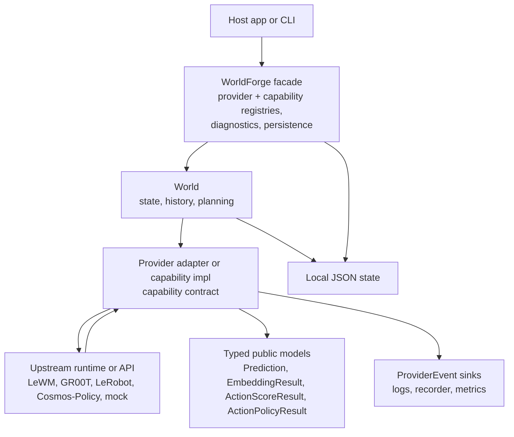
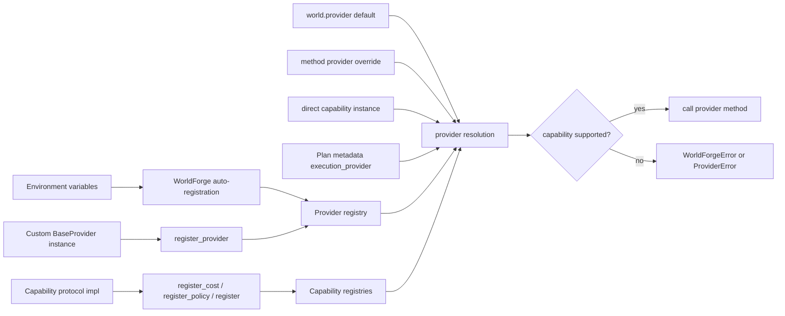
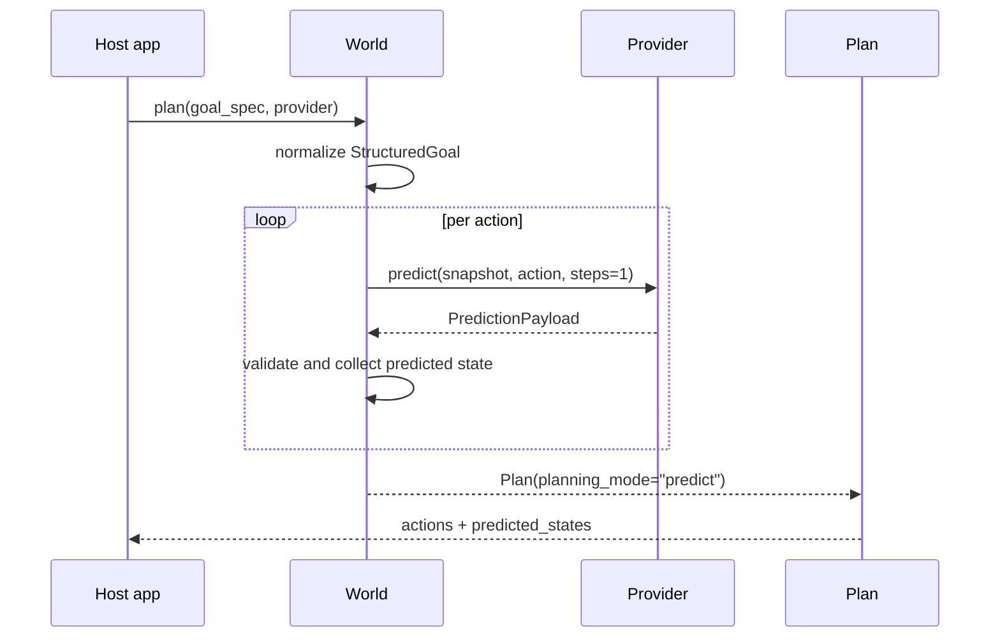
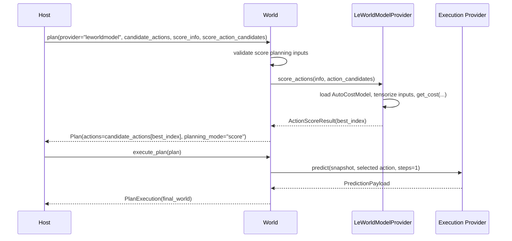

# Architecture

WorldForge is the Python integration layer around testable physical-AI world-model workflows. Its
job is to expose each provider through an honest typed capability surface, validate the boundary,
and let host applications compose planning, prediction, evaluation, persistence, and
observability without pretending every provider means the same thing by "world model."

The architecture centers on capability-specific contracts. LeWorldModel scores action candidates.
GR00T, Cosmos-Policy, and LeRobot select embodied action chunks. The framework keeps those
surfaces distinct, then composes them through typed planning, evaluation, diagnostics, and
observability.

## System Map

Repository layout:

```text
worldforge/
|-- src/worldforge/
|   |-- framework.py       # WorldForge facade, provider registry, diagnostics, persistence
|   |-- _world.py          # mutable World runtime, history, planning
|   |-- _world_prompt_seeders.py # deterministic prompt seed-scene helpers
|   |-- _results.py        # validated workflow result objects
|   |-- _model_utils.py    # shared JSON, ID, numeric, and probability validators
|   |-- models.py          # public compatibility facade and model re-exports
|   |-- scene_models.py    # geometry, action, scene object, goal, and history contracts
|   |-- capability_results.py # embedding, score, and policy results
|   |-- provider_models.py # compatibility facade for provider-facing contracts
|   |-- provider_profiles.py # provider capabilities and metadata
|   |-- provider_request_policy.py # retry/backoff and operation timeout policies
|   |-- provider_events.py # provider event validation and serialization
|   |-- provider_diagnostics.py # provider health, lifecycle readiness, and doctor reports
|   |-- provider_redaction.py # shared observable-field sanitization
|   |-- framework_capabilities.py # capability registry and dispatch internals
|   |-- capabilities/      # narrow runtime-checkable capability protocols
|   |-- providers/
|   |   |-- base.py        # provider interface, ProviderError, PredictionPayload
|   |   |-- catalog.py     # provider factories and auto-registration policy
|   |   |-- mock.py        # deterministic reference provider
|   |   |-- observable.py  # event/health wrapper for protocol implementations
|   |   |-- leworldmodel.py# local JEPA cost-model adapter
|   |   |-- gr00t.py       # host-owned embodied policy client adapter
|   |   |-- cosmos_policy.py # host-owned Cosmos-Policy adapter
|   |   |-- lerobot.py     # host-owned LeRobot policy adapter
|   |   `-- remote.py      # scaffold adapters for JEPA and Genie
|   |-- observability.py   # ProviderEvent sinks
|   |-- rerun.py           # optional Rerun event and artifact bridge
|   |-- benchmark.py       # provider benchmark harness
|   |-- benchmark_inputs.py # benchmark input fixture contract
|   |-- benchmark_budgets.py # benchmark budget gate contract
|   |-- benchmark_reports.py # benchmark result/report rendering contract
|   |-- evaluation/        # result contracts, reports, failure galleries, and built-in suites
|   `-- testing/           # reusable provider contract assertions
|-- docs/
|-- examples/
|-- scripts/
`-- tests/
```

Runtime layers:

```text
Host application
  |
  |  Python API / CLI
  v
+------------------------+
| WorldForge facade      |
| provider + capability  |
| registries, diagnostics|
+-----------+------------+
            |
            | owns
            v
+-------------------+
| World runtime     |
| state/history     |
| planning/execution|
+---------+---------+
          |
          | dispatches by capability
          v
+-------------------------+       +---------------------------+
| Provider adapter or     | ----> | upstream model/API/runtime|
| capability implementation| <---- | checkpoint/task/artifact  |
| validation/events       |       |                           |
+-------------------------+       +---------------------------+
          |
          v
+-------------------+
| typed result      |
| Prediction        |
| ActionScoreResult |
| ActionPolicyResult|
| EmbeddingResult   |
+-------------------+
```

Mermaid equivalent:


```mermaid
flowchart TD
    Host[Host app or CLI]
    Forge[WorldForge facade\nprovider + capability registries,\ndiagnostics, persistence]
    World[World\nstate, history, planning]
    Provider[Provider adapter or capability impl\ncapability contract]
    Upstream[Upstream runtime or API\nLeWM, GR00T, LeRobot, Cosmos-Policy, mock]
    Models[Typed public models\nPrediction, EmbeddingResult, ActionScoreResult, ActionPolicyResult]
    Obs[ProviderEvent sinks\nlogs, recorder, metrics]
    Store[Local JSON state]

    Host --> Forge
    Forge --> World
    World --> Provider
    Provider --> Upstream
    Upstream --> Provider
    Provider --> Models
    Provider --> Obs
    World --> Store
    Forge --> Store
```

## Operational Ownership Map

WorldForge owns the framework boundary. The host owns production operation around that boundary.

| Layer | WorldForge responsibility | Host responsibility |
| --- | --- | --- |
| provider catalog | factory metadata, auto-registration rules, provider profiles | deciding which optional providers are configured in each environment |
| provider call | typed inputs, explicit capabilities, result validation, provider events | credentials, endpoints, model packages, checkpoints, robot stacks, and upstream SLAs |
| planning | composition across `predict`, `score`, and `policy` surfaces | task preprocessing, action-space mapping, execution policy, and safety checks |
| local state | validated single-writer JSON import/export | backups, retention, locking, migrations, object storage, and multi-writer durability |
| evaluation and benchmarks | deterministic contract suites and capability-aware reports | preserving run artifacts and making empirical claims only from appropriate data |
| observability | `ProviderEvent` hook, JSON logger, recorder, and in-memory metrics | trace IDs, dashboards, alerting, distributed tracing, and on-call runbooks |

See [User And Operator Playbooks](./playbooks.md) for concrete commands that exercise these
boundaries.

## Module Responsibilities

`framework.py`

- `WorldForge`: top-level object for provider registration, diagnostics, persistence helpers, and
  provider-wide operations such as `predict(...)`, `embed(...)`, `score_actions(...)`, and
  `select_actions(...)`.

`_world.py`

- `World`: mutable world state with scene objects, history, prediction, comparison, planning, plan
  execution, and evaluation entry points.

`_world_prompt_seeders.py`

- Deterministic seed-scene templates for `create_world_from_prompt(...)`, including prompt
  matching, fallback object creation, and the prompt-specific history reset.

`_results.py`

- `Prediction`, `Plan`, `PlanExecution`, and `Comparison`: workflow-level result objects.

`models.py`

- Compatibility re-exports for public model contracts, shared validation helpers, public framework
  errors, and provider contracts. Existing adapter and CLI code can keep importing from
  `worldforge.models`.

`scene_models.py`

- Public scene-domain contracts such as `Position`, `Rotation`, `Pose`, `BBox`, `Action`,
  `SceneObjectPatch`, `SceneObject`, `StructuredGoal`, and `HistoryEntry`.

`capability_results.py`

- Public capability return payloads such as `EmbeddingResult`, `ActionScoreResult`, and
  `ActionPolicyResult`.

`_model_utils.py`

- Shared validation helpers and public framework errors: `WorldForgeError`, `WorldStateError`,
  `dump_json`, `require_json_dict`, finite-number checks, probability checks, and deterministic
  ID/float helpers.

`provider_models.py` and focused provider contract modules

- `provider_models.py` remains a compatibility facade for older imports.
- `provider_profiles.py` owns `ProviderCapabilities`, `ProviderInfo`, and `ProviderProfile`.
- `provider_request_policy.py` owns `RetryPolicy`, `RequestOperationPolicy`, and
  `ProviderRequestPolicy`.
- `provider_events.py` owns `ProviderEvent` validation and serialization.
- `provider_diagnostics.py` owns `ProviderHealth`, `ProviderLifecycleStatus`, and `DoctorReport`.
- `provider_redaction.py` owns observable-field sanitization shared by provider events, config
  profiles, logs, traces, and attachable artifacts.

`framework_capabilities.py`

- Internal capability registry used by `WorldForge` to register structural protocol
  implementations, wrap them with observability, resolve named or direct capability targets, and
  dispatch calls without bloating the facade.

`providers/base.py`

- `BaseProvider`, which defines the common capability surface.
- `ProviderError`, the public provider/runtime failure type.
- `PredictionPayload`, the validated payload returned by `predict(...)` implementations.

`capabilities/__init__.py`

- Runtime-checkable protocol contracts for narrow integrations: `Cost`, `Policy`, `Predictor`,
  `Embedder`, and reserved `Planner`.
- `RunnableModel`, an optional bundle for implementations that genuinely expose multiple
  capability protocols under one logical model.

`providers/observable.py`

- `_ObservableCapability`, the internal wrapper that adds provider events, timing, health,
  profile, and info surfaces around pure capability protocol implementations.
- Capability method mapping used by the `WorldForge` facade when dispatching protocol-registered
  implementations.

`providers/catalog.py`

- `PROVIDER_CATALOG`, the single in-repo list of known provider factories.
- Registration policy for providers that are always available versus providers enabled by host
  environment configuration.

`providers/leworldmodel.py`

- Optional local adapter for `stable_worldmodel.policy.AutoCostModel`.
- Exposes only `score=True`.
- Validates `pixels`, `goal`, `action`, four-dimensional action candidates, finite cost outputs,
  and direction-consistent `best_index`.

`providers/gr00t.py`, `providers/cosmos_policy.py`, and `providers/lerobot.py`

- Host-owned policy adapters for NVIDIA Isaac GR00T PolicyClient, Cosmos-Policy ALOHA `/act`, and
  Hugging Face LeRobot `PreTrainedPolicy` inference.
- Exposes only `policy=True`.
- Requires an explicit action translator because robot actions are embodiment-specific.

`observability.py` and `rerun.py`

- Host-side provider event composition through `JsonLoggerSink`, `InMemoryRecorderSink`,
  `ProviderMetricsSink`, and `compose_event_handlers(...)`.
- Optional Rerun SDK bridge through `RerunEventSink` and `RerunArtifactLogger` for events, world
  snapshots, object boxes, plans, benchmark artifacts, and robotics-showcase visual layers.

`evaluation/` and `benchmark.py`

- Deterministic evaluation suites and capability-aware benchmark reports for adapter comparison.
- `evaluation/suite_base.py` owns the generic suite runner, custom-suite registry, provenance, and
  workflow-trace construction; `evaluation/builtin_suites.py` owns only the bundled deterministic
  scenario implementations.

`harness/`

- Optional Textual front face for the same APIs: worlds CRUD, provider capability inspection,
  live provider events, evaluation, benchmark, and preserved report inspection.
- `tui.py` is the only Textual import surface; `flows.py`, `models.py`, and helper modules remain
  importable without the `harness` extra.
- `tui_styles.py` is the compatibility facade for Textual-free CSS constants; screen-family style
  modules keep `tui.py` focused on widgets, actions, and workers.

## End-to-End Pipeline

The shortest accurate pipeline is:

```text
configure providers
  -> create/load a World
  -> choose a workflow
  -> dispatch through a capability-specific provider method
  -> validate provider result
  -> return a typed result
  -> optionally persist, observe, evaluate, or benchmark
```

Expanded:

```text
1. Provider discovery
   - mock registers unconditionally
   - optional providers register only when their env vars are present
   - hosts may call register_provider(...) for full custom adapters
   - hosts may call register_cost(...), register_policy(...), or register(...) for narrow
     capability protocol implementations

2. World setup
   - create_world(...) starts from empty typed state
   - create_world_from_prompt(...) creates a deterministic local seed scene
   - load_world(...) restores local JSON state after validation
   - delete_world(...) validates the world id before removing local JSON state

3. Workflow call
   - world.predict(...) requires a provider with predict=True
   - forge.select_actions(...) requires policy=True
   - world.plan(...) can use predictive, score-based, policy, policy+score, or latent-MPC
     planning
   - world.evaluate(...) and benchmark harnesses select operations by capability

4. Provider boundary
   - provider receives a JSON world snapshot, embedding request, score payload, or policy
     observation
   - adapter validates local inputs before network/model calls when possible
   - provider emits ProviderEvent records for success, failure, and retries where supported

5. Result boundary
   - PredictionPayload updates world state only after validation
   - ActionScoreResult validates finite scores and a direction-consistent best_index
   - ActionPolicyResult validates executable actions and JSON-compatible raw actions
   - ProviderError surfaces provider/runtime failures with context
   - unexpected protocol exceptions are wrapped as ProviderError after failure events are emitted

6. Host-owned operation
   - JSON persistence is single-writer local storage
   - production logging, metrics export, trace IDs, dashboards, and locks remain host-owned
```

## Provider Injection

There are three injection points.

```text
Construction-time auto-registration

WorldForge(auto_register_remote=True)
  |
  |-- mock              always registered
  |-- cosmos-policy     if COSMOS_POLICY_BASE_URL is set
  |-- leworldmodel      if LEWORLDMODEL_POLICY or LEWM_POLICY is set
  |-- gr00t             if GROOT_POLICY_HOST is set
  |-- jepa              if JEPA_MODEL_NAME is set
  `-- genie             if GENIE_API_KEY is set
```

```text
Manual full-provider registration

forge = WorldForge(auto_register_remote=False)
forge.register_provider(MyProvider(...))
world = forge.create_world("lab", provider="my-provider")
```

```text
Manual capability-protocol registration

forge = WorldForge(auto_register_remote=False)
forge.register_cost(MyCostModel(name="my-cost"))
forge.register_policy(MyPolicy(name="my-policy"))

result = forge.score_actions(cost="my-cost", info=info, action_candidates=candidates)
plan = world.plan(
    goal="pick best policy candidate",
    policy_provider="my-policy",
    score_provider="my-cost",
    policy_info=policy_info,
    score_info=score_info,
)
```

```text
Call-site override

world = forge.create_world("lab", provider="mock")

world.predict(action)                         # uses world.provider
world.predict(action, provider="other")       # overrides for this call
world.plan(..., provider="leworldmodel")      # planner/scorer provider
world.execute_plan(plan, provider="mock")     # execution provider
forge.score_actions("local-score", info={}, action_candidates=[{}])
```

Provider lookup is name-based for registered full providers and registered protocol
implementations. Provider dispatch is capability-based. A full provider should never advertise a
capability unless the corresponding method is implemented end to end; a protocol implementation is
indexed only into the registry for the method it structurally implements.


```mermaid
flowchart LR
    Env[Environment variables] --> Auto[WorldForge auto-registration]
    Custom[Custom BaseProvider instance] --> Manual[register_provider]
    Protocol[Capability protocol impl] --> ManualProtocol[register_cost / register_policy / register]
    Auto --> Registry[Provider registry]
    Manual --> Registry
    ManualProtocol --> CapabilityRegistry[Capability registries]
    WorldProvider[world.provider default] --> Resolve[provider resolution]
    CallOverride[method provider override] --> Resolve
    Direct[direct capability instance] --> Resolve
    PlanExec[Plan metadata execution_provider] --> Resolve
    Registry --> Resolve
    CapabilityRegistry --> Resolve
    Resolve --> Capability{capability supported?}
    Capability -- yes --> Invoke[call provider method]
    Capability -- no --> Error[WorldForgeError or ProviderError]
```

## Predictive Planning Pipeline

Predictive planning is the path for providers that can take a world state plus an action and
return a future world state.

```text
World.plan(goal_spec=..., provider="mock")
  |
  |-- parse goal_spec or goal_json into StructuredGoal
  |-- resolve scene object selectors
  |-- create one or more WorldForge Action objects
  |-- for each action:
  |     provider.predict(simulated_state, action, steps=1)
  |     validate PredictionPayload
  |     append predicted state and physics score
  |
  `-- return Plan(
        planning_mode="predict",
        actions=[...],
        predicted_states=[...],
        success_probability=heuristic average of physics scores
      )
```

Mermaid sequence:


```mermaid
sequenceDiagram
    participant App as Host app
    participant World
    participant Provider
    participant Plan

    App->>World: plan(goal_spec, provider)
    World->>World: normalize StructuredGoal
    loop per action
        World->>Provider: predict(snapshot, action, steps=1)
        Provider-->>World: PredictionPayload
        World->>World: validate and collect predicted state
    end
    World-->>Plan: Plan(planning_mode="predict")
    Plan-->>App: actions + predicted_states
```

## Score-Based Planning Pipeline

Score-based planning is the LeWorldModel-shaped path. It keeps WorldForge-native actions separate
from optional model-native scorer payloads.

```text
Host owns task preprocessing
  |
  |-- score_info
  |     |-- pixels    task-shaped observation history
  |     |-- goal      task-shaped goal observation
  |     `-- action    task-shaped action history
  |
  |-- score_action_candidates (optional)
  |     |-- omitted: WorldForge serializes candidate_actions with Action.to_dict()
  |     `-- provided: tensor or nested numeric array shaped for the score provider
  |
  `-- candidate_actions
        `-- WorldForge Action sequences, one sequence per scored candidate

World.plan(..., provider="leworldmodel", execution_provider="mock")
  |
  |-- require provider.capabilities.score
  |-- call provider.score_actions(info, action_candidates)
  |-- receive ActionScoreResult(scores, best_index, lower_is_better=True)
  |-- choose candidate_actions[best_index]
  |-- return Plan(planning_mode="score", predicted_states=[])

World.execute_plan(plan)
  |
  |-- choose execution_provider from explicit arg or plan metadata
  |-- require execution provider supports predict
  `-- apply selected WorldForge actions through predict(...)
```

The separation is intentional:

- LeWorldModel ranks action tensors in its own task space.
- WorldForge stores and executes `Action` objects in its own public API.
- The host supplies the mapping between those two spaces because task preprocessing is model- and
  checkpoint-specific.
- A score provider is allowed to be a planner without being a predictor, generator, or reasoner.


```mermaid
sequenceDiagram
    participant Host
    participant World
    participant LeWM as LeWorldModelProvider
    participant Exec as Execution Provider

    Host->>World: plan(provider="leworldmodel", candidate_actions, score_info, score_action_candidates)
    World->>World: validate score planning inputs
    World->>LeWM: score_actions(info, action_candidates)
    LeWM->>LeWM: load AutoCostModel, tensorize inputs, get_cost(...)
    LeWM-->>World: ActionScoreResult(best_index)
    World-->>Host: Plan(actions=candidate_actions[best_index], planning_mode="score")
    Host->>World: execute_plan(plan)
    World->>Exec: predict(snapshot, selected action, steps=1)
    Exec-->>World: PredictionPayload
    World-->>Host: PlanExecution(final_world)
```

Concrete score-planning shape:

```python
from worldforge import Action

plan = world.plan(
    goal="select the lowest-cost LeWorldModel candidate",
    provider="leworldmodel",
    planner="leworldmodel-mpc",
    candidate_actions=[
        [Action.move_to(0.1, 0.5, 0.0)],
        [Action.move_to(0.4, 0.5, 0.0)],
    ],
    score_info={
        "pixels": pixels,
        "goal": goal_pixels,
        "action": action_history,
    },
    score_action_candidates=action_candidate_tensor,
    execution_provider="mock",
)

print(plan.metadata["score_result"]["best_index"])
execution = world.execute_plan(plan)
```

## Latent MPC Planning Pipeline

Latent MPC is the controller path for score providers that can evaluate many action horizons. It
keeps the optimizer inside WorldForge while keeping task-specific tensors and environment stepping
outside the base package.

```text
Host owns observation and goal construction
  |
  |-- score_info      current observation payload
  |-- goal_info       target or goal payload
  |-- planner_config  CEM horizon, samples, iterations, elites, execute_k, bounds
  `-- candidate_encoder (optional)
        `-- maps sampled WorldForge actions to score-provider-native payloads

World.plan(planner="latent-mpc", score_provider="...", ...)
  |
  |-- require explicit score_provider with capabilities.score
  |-- sample action horizons in WorldForge Action space
  |-- encode candidates for provider.score_actions(...)
  |-- score candidates and refit elites for each CEM iteration
  `-- return Plan(planning_mode="latent-mpc", control_mode="mpc", optimizer="cem")
```

The host closes the receding horizon by executing the returned `execute_k` actions, re-observing,
and calling `World.plan(planner="latent-mpc", ...)` again. WorldForge does not step a simulator or
robot controller in the planner contract.

```python
from worldforge import PlannerConfig

plan = world.plan(
    goal="optimize one action chunk",
    planner="latent-mpc",
    score_provider="leworldmodel",
    score_info=observation_info,
    goal_info=goal_info,
    planner_config=PlannerConfig(
        horizon=4,
        num_samples=256,
        num_iterations=5,
        num_elites=32,
        execute_k=1,
        action_kind="ee_delta",
        action_parameter_bounds={"x": (-0.05, 0.05), "y": (-0.05, 0.05)},
    ),
    candidate_encoder=my_task_encoder,
)
```

### Validate Locally

Run a focused local check after changing this workflow:

```bash
uv run pytest tests/test_latent_mpc_controller.py -q
```

The expected success signal is a `Plan` with `metadata["planning_mode"] == "latent-mpc"`,
`metadata["control_mode"] == "mpc"`, `metadata["optimizer"] == "cem"`, a non-empty action
sequence, a populated `iteration_best_scores` list, and a `candidate_count` equal to
`PlannerConfig.num_samples * PlannerConfig.num_iterations`. In task-specific hosts, the
post-execution observation should also improve the caller-owned goal metric after the returned
`execute_k` action chunk is applied.

First triage step: inspect the `PlannerConfig` bounds and sample counts, confirm the
`score_provider` advertises `score`, verify the `candidate_encoder` maps sampled `Action`
parameters into the provider-native action payload, and check the score provider error text if
`World.plan(planner="latent-mpc", ...)` fails before returning a `Plan`.

## Policy Planning Pipeline

Policy planning treats an embodied policy as an actor that proposes executable action chunks from
observations and instructions.

```text
policy_info
  |
  |-- observation
  |     |-- video       camera streams or image history
  |     |-- state       proprioception or environment state
  |     `-- language    task instruction
  |
  |-- embodiment_tag
  `-- action_horizon

World.plan(..., provider="gr00t", policy_info=...)
  |
  |-- require provider.capabilities.policy
  |-- call provider.select_actions(info)
  |-- receive ActionPolicyResult(actions, raw_actions, action_candidates)
  |-- return Plan(planning_mode="policy", predicted_states=[])
```

Policy plus score planning composes an actor with a world-model scorer:

```text
GR00T policy provider
  -> proposes one or more candidate action chunks

LeWorldModel / JEPA-WMS score provider
  -> scores serialized policy candidates or a host-supplied model-native candidate tensor

WorldForge
  -> selects policy_candidates[score_result.best_index]
```

Concrete shape:

```python
plan = world.plan(
    goal="choose the lowest-cost policy candidate",
    policy_provider="gr00t",
    score_provider="leworldmodel",
    policy_info=policy_info,
    score_info=lewm_info,
    execution_provider="mock",
)
```

WorldForge passes serialized policy candidates to the score provider by default. Pass
`score_action_candidates=...` when the scorer requires native tensors or latents. The host still
owns the mapping between GR00T raw actions, WorldForge `Action` objects, and score-provider native
payloads. WorldForge validates that each provider returns a typed result and that the selected
candidate index is in range. Score-based planning also requires the score result length to match
the executable candidate count, so provider-native tensors cannot silently drift from the actions
that WorldForge can execute or report.

## Provider Capability Surface

WorldForge does not ask "is this a world model?" at runtime. It asks which operations a provider
can honestly perform.

```text
BaseProvider subclass
|-- declares ProviderCapabilities(...)
|-- implements every advertised method end to end
`-- inherits ProviderError defaults for unsupported methods

Capability protocol implementation
|-- declares name and optional ProviderProfileSpec
|-- implements exactly the protocol method it exposes
|-- may implement preflight/warmup/teardown lifecycle hooks
|-- is wrapped for ProviderEvent, health, profile, and info surfaces
`-- can be registered with register_cost/register_policy/... or register(...)
```

In-repo provider mapping:

| Provider | Surface | Primary capability | Runtime kind |
| --- | --- | --- | --- |
| `mock` | implemented | predict, embed | deterministic local surrogate |
| `leworldmodel` | optional runtime adapter | score | local JEPA cost model |
| `gr00t` | optional runtime adapter | policy | host-owned Isaac GR00T policy client |
| `cosmos-policy` | optional runtime adapter | policy | host-owned Cosmos-Policy ALOHA server |
| `lerobot` | optional runtime adapter | policy | host-owned LeRobot policy checkpoint |
| `jepa` | optional runtime adapter | score | host-owned `facebookresearch/jepa-wms` torch-hub runtime |
| `genie` | scaffold | capability-fail-closed | reservation for future interactive simulator work |

`src/worldforge/providers/catalog.py` owns the in-repo provider factory list and auto-registration
policy. Provider profiles expose the same information through Python and CLI diagnostics.
`doctor()` also includes known but unregistered optional providers by default, so missing local
dependencies and missing credentials show up before a workflow fails.

## Data Contracts

Important public result contracts:

```text
Action
  type: non-empty string
  parameters: JSON object

SceneObject
  id: non-empty string
  metadata: JSON object

PredictionPayload
  state: JSON object
  confidence: probability
  physics_score: probability
  frames: list[bytes]
  metadata: JSON object
  latency_ms: finite non-negative number

ActionScoreResult
  provider: non-empty string
  scores: non-empty list of finite numbers
  best_index: direction-consistent index into scores
  best_score: scores[best_index]
  lower_is_better: bool
  metadata: JSON object

ActionPolicyResult
  provider: non-empty string
  actions: non-empty list of Action objects
  raw_actions: JSON object
  action_horizon: optional positive integer
  embodiment_tag: optional non-empty string
  metadata: JSON object
  action_candidates: non-empty list of action plans

Plan
  goal: string
  planner: string
  provider: planner/scorer/predictor provider name
  actions: list[Action]
  predicted_states: list[JSON objects]
  success_probability: probability
  metadata: JSON object
```

State invariants:

- persisted worlds contain `id`, `name`, and `provider`
- persisted worlds declare the current schema_version before nested state is accepted
- world `step` is always a non-negative integer
- `scene.objects` is a JSON object keyed by object ID
- embedded scene object IDs must match their map keys
- action parameters and metadata fields are JSON-native objects with string keys and finite numbers
- history entries have non-negative steps, validated snapshot states, non-empty summaries, and
  valid serialized action payloads when actions are present
- history entry steps cannot exceed the current world step
- provider capability names are a closed set; unknown capability filters fail explicitly instead
  of silently excluding every provider
- invalid public inputs fail explicitly instead of being silently coerced
- score providers return finite scores and a `best_index` that matches `lower_is_better`
- policy providers return executable actions and preserve raw provider actions
- provider events sanitize log-facing targets, messages, and metadata before event sinks record
  them; signed URL query strings and obvious credential fields are redacted

## Failure Boundaries

WorldForge uses three public failure families:

```text
WorldForgeError
  invalid caller input, unsupported local operation, invalid public model values

WorldStateError
  malformed persisted state or provider-supplied state that cannot be restored

ProviderError
  provider credentials, optional dependency failures, transport failures, malformed upstream
  responses, provider-specific input limits, unsupported provider operations, malformed model
  outputs
```

Boundary rule:

```text
caller input error     -> fail before provider call when possible
provider/runtime error -> ProviderError with provider-specific context
state mutation         -> only after provider output validates
score output           -> finite scores + direction-consistent best_index before Plan is returned
```

## Observability

Provider events are deliberately small. They are not a complete production telemetry stack; they
are the framework-level hook that host applications can fan out to their own logging and metrics.

```text
Provider operation
  |
  |-- ProviderEvent(provider, operation, phase, duration_ms, attempt, status_code, sanitized target, message, metadata)
  |
  `-- host event_handler
        |-- JsonLoggerSink
        |-- RunJsonLogSink
        |-- InMemoryRecorderSink
        |-- ProviderMetricsSink
        |-- ProviderMetricsExporterSink
        `-- RerunEventSink
```

Targets in provider events are intentionally route-level. They keep enough context to identify the
provider endpoint or artifact path, but query strings, fragments, URL userinfo, bearer tokens, and
secret-like metadata fields are removed before JSON logging, run log export, or in-memory
recording.

Example:

```python
import logging
from pathlib import Path

from worldforge import Action, WorldForge
from worldforge.observability import (
    JsonLoggerSink,
    OpenTelemetryProviderEventSink,
    ProviderMetricsExporterSink,
    ProviderMetricsSink,
    RunJsonLogSink,
    compose_event_handlers,
)
from worldforge.rerun import RerunEventSink, RerunRecordingConfig, RerunSession

run_id = "demo-run"
metrics = ProviderMetricsSink()
host_metrics_exporter = ...  # supplied by your service
rerun_session = RerunSession(RerunRecordingConfig(save_path=".worldforge/rerun/events.rrd"))
forge = WorldForge(
    event_handler=compose_event_handlers(
        JsonLoggerSink(logger=logging.getLogger("demo.worldforge"), extra_fields={"run_id": run_id}),
        RunJsonLogSink(Path(".worldforge") / "runs" / run_id / "provider-events.jsonl", run_id),
        RerunEventSink(session=rerun_session),
        ProviderMetricsExporterSink(host_metrics_exporter),
        metrics,
    )
)

world = forge.create_world_from_prompt("cube", provider="mock")
world.predict(Action(type="move_to", parameters={"target": {"x": 0.2, "y": 0.5, "z": 0.0}}))
print(metrics.get("mock", "predict").to_dict())
rerun_session.close()
```

## Persistence Ownership

Persistence is intentionally host-owned beyond local JSON state.

```text
WorldForge today
  local JSON files
  single-writer assumption
  import/export/delete validation

Host application owns
  locks
  transactions
  database adapters
  object storage
  retention policy
  multi-writer coordination
  production backup/restore
```

This keeps the library small and makes persistence ownership explicit. A future persistence
adapter must preserve the same state validation invariants before it becomes a supported runtime
surface.

ADR 0001, [Persistence Adapter Boundary](./adr/0001-persistence-adapter-boundary.md), names the
future `WorldPersistenceAdapter` interface and rejects replacing local JSON with an implicit
database backend.

## Design Implications

- Capability reporting is part of correctness. A provider that only scores must not be presented
  as a generator or predictor.
- LeWorldModel defines the canonical score-planning path: model-native candidate tensors in,
  `ActionScoreResult.best_index` out, WorldForge `Action` sequence selected.
- GR00T defines the first embodied-policy path: multimodal observation in, action chunk out, with
  host-owned translation from embodiment-specific raw actions to WorldForge actions.
- Generative video providers are useful, but video output is not the core abstraction of
  WorldForge.
- Host applications own preprocessing between sensors, robot task tensors, and WorldForge actions.
- The framework should stay strict at boundaries and flexible in provider registration.
- New provider integrations should add tests for every advertised capability and every documented
  failure mode.
