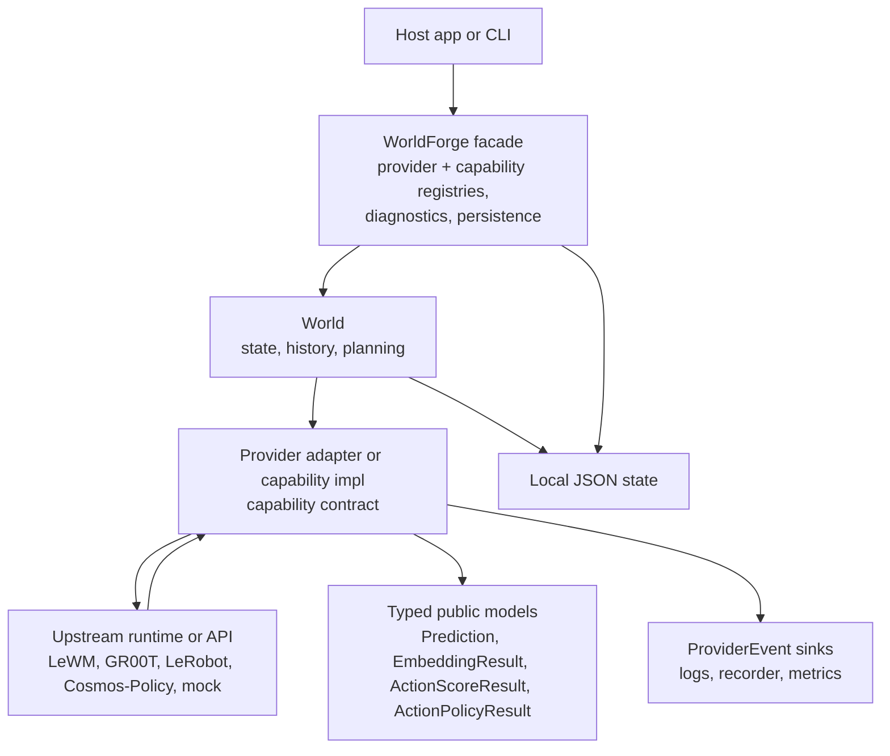
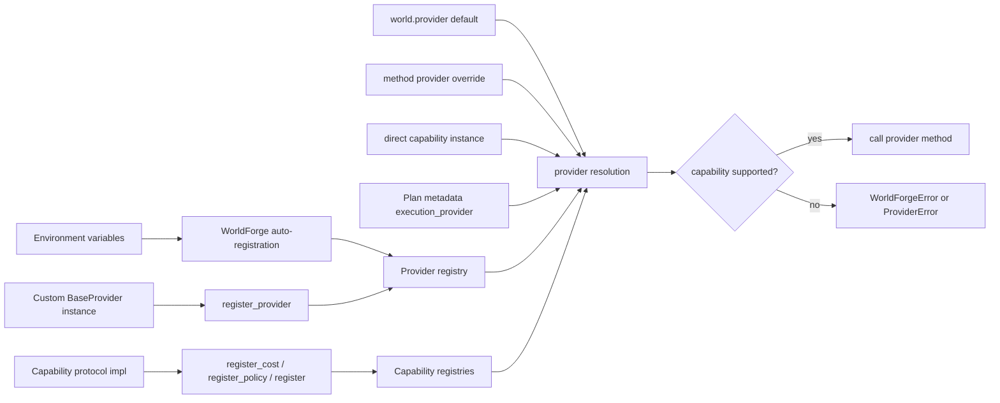
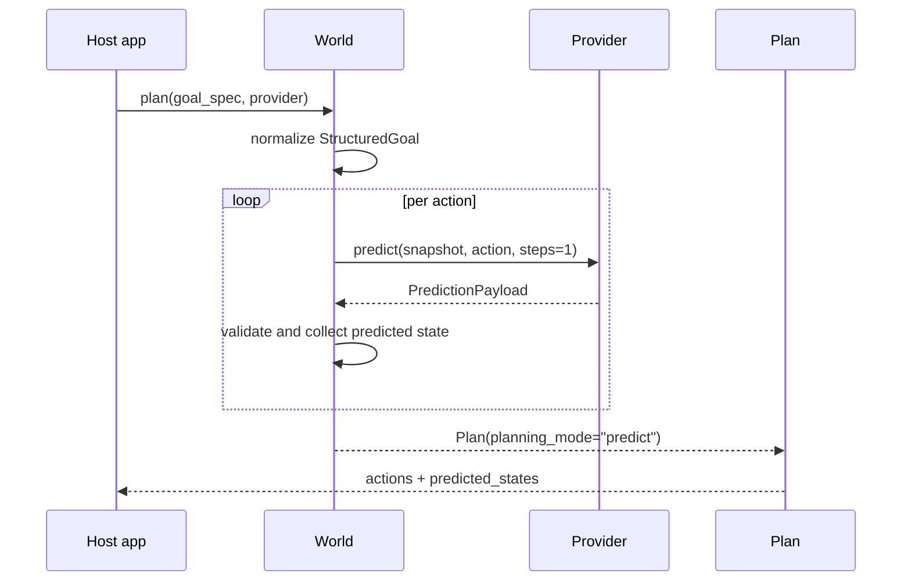
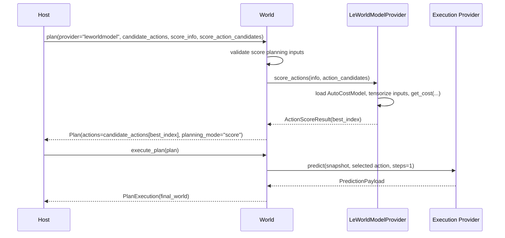

# 架构

WorldForge 是围绕可测试的物理 AI 世界模型工作流的 Python 集成层。其职责是通过诚实的类型化能力接口暴露每个提供方、验证边界，并让宿主应用程序能够组合规划、预测、生成、评估、持久化和可观测性，而无需假设每个提供方对"世界模型"的理解都相同。

该架构以能力专用契约为核心。LeWorldModel 对动作候选集进行打分。GR00T、Cosmos-Policy 和 LeRobot 选择具身动作块。框架保持这些接口的独立性，再通过类型化的规划、评估、诊断和可观测性将其组合起来。

## 系统全图

仓库布局：

```text
worldforge/
|-- src/worldforge/
|   |-- framework.py       # WorldForge 门面、提供方注册、诊断、持久化
|   |-- _world.py          # 可变 World 运行时、历史、规划
|   |-- _world_prompt_seeders.py # 确定性的提示词种子场景辅助工具
|   |-- _results.py        # 经验证的工作流结果对象
|   |-- _model_utils.py    # 共享 JSON、ID、数值与概率验证辅助工具
|   |-- models.py          # 公共兼容门面与模型重导出
|   |-- scene_models.py    # 几何、动作、场景对象、目标与历史契约
|   |-- capability_results.py # 嵌入、评分与策略结果
|   |-- provider_models.py # 提供方面向契约的兼容门面
|   |-- provider_profiles.py # 提供方能力与元数据
|   |-- provider_request_policy.py # 重试/退避与操作超时策略
|   |-- provider_events.py # 提供方事件验证与序列化
|   |-- provider_diagnostics.py # 提供方健康、生命周期就绪与 doctor 报告
|   |-- provider_redaction.py # 共享的可观测字段脱敏
|   |-- framework_capabilities.py # 能力注册表与分发内部实现
|   |-- capabilities/      # 窄范围的运行时可检查能力协议
|   |-- providers/
|   |   |-- base.py        # 提供方接口、ProviderError、PredictionPayload
|   |   |-- catalog.py     # 提供方工厂与自动注册策略
|   |   |-- mock.py        # 确定性的参考提供方
|   |   |-- observable.py  # 用于协议实现的事件/健康包装器
|   |   |-- leworldmodel.py# 本地 JEPA 代价模型适配器
|   |   |-- gr00t.py       # 由宿主方持有的具身策略客户端适配器
|   |   |-- cosmos_policy.py # 由宿主方持有的 Cosmos-Policy 策略适配器
|   |   |-- lerobot.py     # 由宿主方持有的 LeRobot 策略适配器
|   |   `-- remote.py      # JEPA 与 Genie 的脚手架适配器
|   |-- observability.py   # ProviderEvent 数据汇
|   |-- rerun.py           # 可选的 Rerun 事件与工件桥接
|   |-- benchmark.py       # 提供方基准测试框架
|   |-- benchmark_inputs.py # 基准测试输入夹具契约
|   |-- benchmark_budgets.py # 基准测试预算门禁契约
|   |-- benchmark_reports.py # 基准测试结果/报告渲染契约
|   |-- evaluation/        # 结果契约、报告、失败图集与内置评估套件
|   `-- testing/           # 可复用的提供方契约断言
|-- docs/
|-- examples/
|-- scripts/
`-- tests/
```

运行时层：

```text
宿主应用程序
  |
  |  Python API / CLI
  v
+------------------------+
| WorldForge 门面        |
| 提供方 + 能力          |
| 注册表、诊断           |
+-----------+------------+
            |
            | 拥有
            v
+-------------------+
| World 运行时      |
| 状态/历史         |
| 规划/执行         |
+---------+---------+
          |
          | 按能力分发
          v
+-------------------------+       +---------------------------+
| 提供方适配器或          | ----> | 上游模型/API/运行时       |
| 能力实现                | <---- | 检查点/任务/工件          |
| 验证/事件               |       |                           |
+-------------------------+       +---------------------------+
          |
          v
+-------------------+
| 类型化结果        |
| Prediction        |
| ActionScoreResult |
| ActionPolicyResult|
| EmbeddingResult   |
+-------------------+
```

Mermaid 等效图：



## 运营所有权映射

WorldForge 拥有框架边界。宿主方拥有该边界之外的生产运营。

| 层次 | WorldForge 职责 | 宿主方职责 |
| --- | --- | --- |
| 提供方目录 | 工厂元数据、自动注册规则、提供方配置 | 决定在各环境中配置哪些可选提供方 |
| 提供方调用 | 类型化输入、显式能力、结果验证、提供方事件 | 凭据、端点、模型包、检查点、机器人栈及上游 SLA |
| 规划 | 跨 `predict`、`score` 与 `policy` 接口的组合 | 任务预处理、动作空间映射、执行策略及安全检查 |
| 本地状态 | 经验证的单写者 JSON 导入/导出 | 备份、保留期、锁定、迁移、对象存储及多写者持久性 |
| 评估与基准测试 | 确定性契约套件与能力感知报告 | 保存运行工件，并仅从适当数据中提出实证性主张 |
| 可观测性 | `ProviderEvent` 钩子、JSON 日志记录器、记录器及内存指标 | 追踪 ID、仪表板、告警、分布式追踪及值班手册 |

具体操作这些边界的命令，请参阅[用户与运营者手册](./playbooks.md)。

## 模块职责

`framework.py`

- `WorldForge`：用于提供方注册、诊断、持久化辅助工具，以及提供方范围操作（如 `predict(...)`、`embed(...)`、`score_actions(...)` 和 `select_actions(...)`）的顶层对象。

`_world.py`

- `World`：可变的世界状态，包含场景对象、历史记录、预测、比较、规划、计划执行和评估入口点。

`_world_prompt_seeders.py`

- `create_world_from_prompt(...)` 使用的确定性种子场景模板，包括提示词匹配、兜底对象创建和提示词专用历史重置。

`_results.py`

- `Prediction`、`Plan`、`PlanExecution` 和 `Comparison`：工作流级别的结果对象。

`models.py`

- 对公共模型契约、共享验证辅助工具、公共框架错误和提供方契约的兼容性再导出。现有适配器与 CLI 代码可以继续从 `worldforge.models` 导入。

`scene_models.py`

- 公共场景域契约，如 `Position`、`Rotation`、`Pose`、`BBox`、`Action`、`SceneObjectPatch`、`SceneObject`、`StructuredGoal` 和 `HistoryEntry`。

`capability_results.py`

- 公共能力返回载荷，如 `EmbeddingResult`、`ActionScoreResult` 和 `ActionPolicyResult`。

`_model_utils.py`

- 共享验证辅助工具和公共框架错误：`WorldForgeError`、`WorldStateError`、`dump_json`、`require_json_dict`、有限数值检查、概率检查，以及确定性 ID/浮点辅助工具。

`provider_models.py` 与聚焦的提供方契约模块

- `provider_models.py` 保留为旧导入路径的兼容门面。
- `provider_profiles.py` 拥有 `ProviderCapabilities`、`ProviderInfo` 和 `ProviderProfile`。
- `provider_request_policy.py` 拥有 `RetryPolicy`、`RequestOperationPolicy` 和 `ProviderRequestPolicy`。
- `provider_events.py` 拥有 `ProviderEvent` 验证与序列化。
- `provider_diagnostics.py` 拥有 `ProviderHealth`、`ProviderLifecycleStatus` 和 `DoctorReport`。
- `provider_redaction.py` 拥有供提供方事件、配置、日志、追踪和可附加工件共享的可观测字段脱敏辅助工具。

`framework_capabilities.py`

- `WorldForge` 使用的内部能力注册表，负责注册结构化协议实现、添加可观测包装、解析具名或直接能力目标，并在不膨胀门面的情况下分发调用。

`providers/base.py`

- `BaseProvider`，定义通用能力接口。
- `ProviderError`，公共的提供方/运行时失败类型。
- `PredictionPayload`，由 `predict(...)` 实现返回的经验证载荷。

`capabilities/__init__.py`

- 用于窄范围集成的运行时可检查协议契约：`Cost`、`Policy`、`Predictor`、`Embedder` 以及保留的 `Planner`。
- `RunnableModel`，用于在一个逻辑模型下真正暴露多个能力协议的实现的可选捆绑包。

`providers/observable.py`

- `_ObservableCapability`，内部包装器，在纯能力协议实现之上添加提供方事件、计时、健康、配置和信息接口。
- `WorldForge` 门面在分发协议注册实现时使用的能力方法映射。

`providers/catalog.py`

- `PROVIDER_CATALOG`，仓库内已知提供方工厂的唯一列表。
- 针对始终可用的提供方与通过宿主环境配置启用的提供方的注册策略。

`providers/leworldmodel.py`

- 用于 `stable_worldmodel.policy.AutoCostModel` 的可选本地适配器。
- 仅暴露 `score=True`。
- 验证 `pixels`、`goal`、`action`、四维动作候选集、有限代价输出和方向一致的 `best_index`。

`providers/gr00t.py`、`providers/cosmos_policy.py` 和 `providers/lerobot.py`

- 用于 NVIDIA Isaac GR00T PolicyClient、Cosmos-Policy ALOHA `/act` 和 Hugging Face LeRobot `PreTrainedPolicy` 推理的、由宿主方持有的策略适配器。
- 仅暴露 `policy=True`。
- 需要显式的动作转换器，因为机器人动作与具体机器人形态相关。

`observability.py` 和 `rerun.py`

- 通过 `JsonLoggerSink`、`InMemoryRecorderSink`、`ProviderMetricsSink` 和 `compose_event_handlers(...)` 实现的宿主侧提供方事件组合。
- 通过 `RerunEventSink` 和 `RerunArtifactLogger` 实现的可选 Rerun SDK 桥接，用于事件、世界快照、对象包围盒、计划、基准测试工件和机器人案例展示可视化层。

`evaluation/` 和 `benchmark.py`

- 用于适配器比较的确定性评估套件和能力感知基准测试报告。
- `evaluation/suite_base.py` 负责通用套件运行器、自定义套件注册表、来源信息和工作流追踪构建；
  `evaluation/builtin_suites.py` 只负责内置的确定性场景实现。

`harness/`

- 针对相同 API 的可选 Textual 前端界面：世界的增删改查、提供方能力检查、实时提供方事件、评估、基准测试及已保存报告的查看。
- `tui.py` 是唯一的 Textual 导入界面；`flows.py`、`models.py` 及辅助模块无需 `harness` 扩展包即可导入。
- `tui_styles.py` 是无 Textual 依赖 CSS 常量的兼容门面；按屏幕族拆分的样式模块让
  `tui.py` 专注于控件、动作和 worker。

## 端到端流水线

最短的准确流水线如下：

```text
配置提供方
  -> 创建/加载一个 World
  -> 选择工作流
  -> 通过能力专用的提供方方法进行分发
  -> 验证提供方结果
  -> 返回类型化结果
  -> 可选地进行持久化、可观测、评估或基准测试
```

展开说明：

```text
1. 提供方发现
   - mock 无条件注册
   - 可选提供方仅在其环境变量存在时才注册
   - 宿主方可调用 register_provider(...) 注册完整的自定义适配器
   - 宿主方可调用 register_cost(...)、register_policy(...) 或 register(...) 注册窄范围能力协议实现

2. World 设置
   - create_world(...) 从空的类型化状态开始
   - create_world_from_prompt(...) 创建一个确定性的本地种子场景
   - load_world(...) 在验证后恢复本地 JSON 状态
   - delete_world(...) 在移除本地 JSON 状态前验证 world id

3. 工作流调用
   - world.predict(...) 需要 predict=True 的提供方
   - forge.select_actions(...) 需要 policy=True
   - world.plan(...) 可使用预测式、基于打分的、策略式或策略+打分规划
   - world.evaluate(...) 和基准测试框架按能力选择操作

4. 提供方边界
   - 提供方接收 JSON 世界快照、嵌入请求、打分载荷或策略观测
   - 适配器在网络/模型调用前尽可能在本地验证输入
   - 提供方在支持的情况下为成功、失败和重试发射 ProviderEvent 记录

5. 结果边界
   - PredictionPayload 仅在验证后才更新世界状态
   - ActionScoreResult 验证有限分数和方向一致的 best_index
   - ActionPolicyResult 验证可执行动作和 JSON 兼容的原始动作
   - ProviderError 附带上下文地暴露提供方/运行时失败
   - 意外的协议异常在发射失败事件后被包装为 ProviderError

6. 由宿主方持有的运营
   - JSON 持久化是单写者本地存储
   - 生产日志、指标导出、追踪 ID、仪表板和锁由宿主方持有
```

## 提供方注入

共有三个注入点。

```text
构造时自动注册

WorldForge(auto_register_remote=True)
  |
  |-- mock              始终注册
  |-- cosmos-policy     若设置了 COSMOS_POLICY_BASE_URL
  |-- leworldmodel      若设置了 LEWORLDMODEL_POLICY 或 LEWM_POLICY
  |-- gr00t             若设置了 GROOT_POLICY_HOST
  |-- jepa              若设置了 JEPA_MODEL_NAME
  `-- genie             若设置了 GENIE_API_KEY
```

```text
手动完整提供方注册

forge = WorldForge(auto_register_remote=False)
forge.register_provider(MyProvider(...))
world = forge.create_world("lab", provider="my-provider")
```

```text
手动能力协议注册

forge = WorldForge(auto_register_remote=False)
forge.register_cost(MyCostModel(name="my-cost"))
forge.register_policy(MyPolicy(name="my-policy"))

result = forge.score_actions(cost="my-cost", info=info, action_candidates=candidates)
plan = world.plan(
    goal="pick best policy candidate",
    policy_provider="my-policy",
    score_provider="my-cost",
    policy_info=policy_info,
    score_info=score_info,
)
```

```text
调用点覆盖

world = forge.create_world("lab", provider="mock")

world.predict(action)                         # 使用 world.provider
world.predict(action, provider="other")       # 仅覆盖本次调用
world.plan(..., provider="leworldmodel")      # 规划器/打分器提供方
world.execute_plan(plan, provider="mock")     # 执行提供方
forge.score_actions("local-score", info={}, action_candidates=[{}])
```

提供方查找对已注册的完整提供方和已注册的协议实现均基于名称。提供方分发基于能力。完整提供方绝不应宣传某项能力，除非对应方法已端到端实现；协议实现仅被索引到其结构性实现的方法所对应的注册表中。



## 预测式规划流水线

预测式规划适用于能够接收世界状态加动作并返回未来世界状态的提供方。

```text
World.plan(goal_spec=..., provider="mock")
  |
  |-- 将 goal_spec 或 goal_json 解析为 StructuredGoal
  |-- 解析场景对象选择器
  |-- 创建一个或多个 WorldForge Action 对象
  |-- 对每个动作：
  |     provider.predict(simulated_state, action, steps=1)
  |     验证 PredictionPayload
  |     追加预测状态和物理分数
  |
  `-- 返回 Plan(
        planning_mode="predict",
        actions=[...],
        predicted_states=[...],
        success_probability=物理分数的启发式平均值
      )
```

Mermaid 时序图：



## 基于打分的规划流水线

基于打分的规划是 LeWorldModel 形式的路径。它将 WorldForge 原生动作与可选的模型原生打分器载荷分开处理。

```text
宿主方负责任务预处理
  |
  |-- score_info
  |     |-- pixels    任务形状的观测历史
  |     |-- goal      任务形状的目标观测
  |     `-- action    任务形状的动作历史
  |
  |-- score_action_candidates（可选）
  |     |-- 省略时：WorldForge 使用 Action.to_dict() 序列化候选动作
  |     `-- 提供时：为打分提供方整形的张量或嵌套数值数组
  |
  `-- candidate_actions
        `-- WorldForge Action 序列，每个评分候选项一个序列

World.plan(..., provider="leworldmodel", execution_provider="mock")
  |
  |-- 要求 provider.capabilities.score
  |-- 调用 provider.score_actions(info, action_candidates)
  |-- 接收 ActionScoreResult(scores, best_index, lower_is_better=True)
  |-- 选择 candidate_actions[best_index]
  |-- 返回 Plan(planning_mode="score", predicted_states=[])

World.execute_plan(plan)
  |
  |-- 从显式参数或计划元数据中选择 execution_provider
  |-- 要求执行提供方支持 predict
  `-- 通过 predict(...) 应用所选的 WorldForge 动作
```

这种分离是有意为之的：

- LeWorldModel 在其自己的任务空间中对动作张量进行排序。
- WorldForge 在其自己的公共 API 中存储和执行 `Action` 对象。
- 宿主方负责提供这两个空间之间的映射，因为任务预处理与模型和检查点相关。
- 打分提供方可以作为规划器而不必是预测器、生成器或推理器。



打分规划的具体形式：

```python
from worldforge import Action

plan = world.plan(
    goal="select the lowest-cost LeWorldModel candidate",
    provider="leworldmodel",
    planner="leworldmodel-mpc",
    candidate_actions=[
        [Action.move_to(0.1, 0.5, 0.0)],
        [Action.move_to(0.4, 0.5, 0.0)],
    ],
    score_info={
        "pixels": pixels,
        "goal": goal_pixels,
        "action": action_history,
    },
    score_action_candidates=action_candidate_tensor,
    execution_provider="mock",
)

print(plan.metadata["score_result"]["best_index"])
execution = world.execute_plan(plan)
```

## 策略规划流水线

策略规划将具身策略视为一个动作者，它根据观测和指令提出可执行的动作块。

```text
policy_info
  |
  |-- observation
  |     |-- video       摄像头流或图像历史
  |     |-- state       本体感知或环境状态
  |     `-- language    任务指令
  |
  |-- embodiment_tag
  `-- action_horizon

World.plan(..., provider="gr00t", policy_info=...)
  |
  |-- 要求 provider.capabilities.policy
  |-- 调用 provider.select_actions(info)
  |-- 接收 ActionPolicyResult(actions, raw_actions, action_candidates)
  |-- 返回 Plan(planning_mode="policy", predicted_states=[])
```

策略加打分规划将动作者与世界模型打分器结合：

```text
GR00T 策略提供方
  -> 提出一个或多个候选动作块

LeWorldModel / JEPA-WMS 打分提供方
  -> 对序列化的策略候选项或宿主方提供的模型原生候选张量进行打分

WorldForge
  -> 选择 policy_candidates[score_result.best_index]
```

具体形式：

```python
plan = world.plan(
    goal="choose the lowest-cost policy candidate",
    policy_provider="gr00t",
    score_provider="leworldmodel",
    policy_info=policy_info,
    score_info=lewm_info,
    execution_provider="mock",
)
```

WorldForge 默认将序列化的策略候选项传递给打分提供方。当打分器需要原生张量或隐变量时，请传入 `score_action_candidates=...`。宿主方仍需负责 GR00T 原始动作、WorldForge `Action` 对象与打分提供方原生载荷之间的映射。WorldForge 验证每个提供方返回类型化结果，并且所选候选项的索引在合法范围内。基于打分的规划还要求打分结果的长度与可执行候选项数量匹配，从而防止提供方原生张量与 WorldForge 可以执行或报告的动作之间出现无声漂移。

## 提供方能力接口

WorldForge 在运行时不问"这是世界模型吗？"，而是问提供方能够诚实地执行哪些操作。

```text
BaseProvider 子类
|-- 声明 ProviderCapabilities(...)
|-- 端到端实现每个已宣传的方法
`-- 为不支持的方法继承 ProviderError 默认值

能力协议实现
|-- 声明名称和可选的 ProviderProfileSpec
|-- 仅实现其暴露的协议方法
|-- 可实现预检/预热/卸载生命周期钩子
|-- 被包装以提供 ProviderEvent、健康、配置和信息接口
`-- 可通过 register_cost/register_policy/... 或 register(...) 注册
```

仓库内的提供方映射：

| 提供方 | 接口 | 主要能力 | 运行时类型 |
| --- | --- | --- | --- |
| `mock` | 已实现 | predict, embed | 确定性的本地代理 |
| `leworldmodel` | 可选运行时适配器 | score | 本地 JEPA 代价模型 |
| `gr00t` | 可选运行时适配器 | policy | 由宿主方持有的 Isaac GR00T 策略客户端 |
| `cosmos-policy` | 可选运行时适配器 | policy | 由宿主方持有的 Cosmos-Policy ALOHA 策略服务器 |
| `lerobot` | 可选运行时适配器 | policy | 由宿主方持有的 LeRobot 策略检查点 |
| `jepa` | 可选运行时适配器 | score | 由宿主方持有的 `facebookresearch/jepa-wms` torch-hub 运行时 |
| `genie` | 脚手架 | 能力失败关闭 | 为未来交互式模拟器工作预留 |

`src/worldforge/providers/catalog.py` 负责仓库内的提供方工厂列表和自动注册策略。提供方配置通过 Python 和 CLI 诊断暴露相同的信息。`doctor()` 默认还包含已知但未注册的可选提供方，因此缺失的本地依赖项和凭据在工作流失败前就会显现。

## 数据契约

重要的公共结果契约：

```text
Action
  type: 非空字符串
  parameters: JSON 对象

SceneObject
  id: 非空字符串
  metadata: JSON 对象

PredictionPayload
  state: JSON 对象
  confidence: 概率值
  physics_score: 概率值
  frames: list[bytes]
  metadata: JSON 对象
  latency_ms: 有限非负数

ActionScoreResult
  provider: 非空字符串
  scores: 非空的有限数字列表
  best_index: scores 中方向一致的索引
  best_score: scores[best_index]
  lower_is_better: bool
  metadata: JSON 对象

ActionPolicyResult
  provider: 非空字符串
  actions: 非空的 Action 对象列表
  raw_actions: JSON 对象
  action_horizon: 可选的正整数
  embodiment_tag: 可选的非空字符串
  metadata: JSON 对象
  action_candidates: 非空的动作计划列表

Plan
  goal: 字符串
  planner: 字符串
  provider: 规划器/打分器/预测器提供方名称
  actions: list[Action]
  predicted_states: list[JSON 对象]
  success_probability: 概率值
  metadata: JSON 对象
```

世界状态不变式：

- 持久化的世界包含 `id`、`name` 和 `provider`
- 持久化的世界在接受嵌套状态前声明当前的 schema_version
- 世界的 `step` 始终为非负整数
- `scene.objects` 是以对象 ID 为键的 JSON 对象
- 嵌入的场景对象 ID 必须与其映射键匹配
- 动作参数和元数据字段是以字符串为键、以有限数字为值的 JSON 原生对象
- 历史记录条目具有非负步数、经验证的快照状态、非空摘要，以及在存在动作时合法的序列化动作载荷
- 历史记录条目的步数不能超过当前世界步数
- 提供方能力名称是封闭集合；未知的能力过滤器会显式失败，而不是静默排除所有提供方
- 无效的公共输入会显式失败，而不是被静默强制转换
- 打分提供方返回有限的分数和与 `lower_is_better` 匹配的 `best_index`
- 策略提供方返回可执行动作并保留提供方原始动作
- 提供方事件在事件数据汇记录前，对面向日志的目标、消息和元数据进行净化；签名 URL 查询字符串和明显的凭据字段会被脱敏

## 失败边界

WorldForge 使用三个公共失败类别：

```text
WorldForgeError
  无效的调用方输入、不支持的本地操作、无效的公共模型值

WorldStateError
  格式错误的持久化状态或无法恢复的提供方提供的状态

ProviderError
  提供方凭据、可选依赖项失败、传输失败、格式错误的上游响应、
  提供方特定的输入限制、不支持的提供方操作、格式错误的模型输出
```

边界规则：

```text
调用方输入错误     -> 尽可能在提供方调用前失败
提供方/运行时错误  -> 附带提供方特定上下文的 ProviderError
状态变更           -> 仅在提供方输出验证后进行
打分输出           -> 在返回 Plan 前验证有限分数和方向一致的 best_index
```

## 可观测性

提供方事件被刻意设计得很小。它们不是完整的生产遥测栈；它们是框架级别的钩子，宿主应用程序可以将其扇出到自己的日志和指标系统中。

```text
提供方操作
  |
  |-- ProviderEvent(provider, operation, phase, duration_ms, attempt, status_code, 净化目标, message, metadata)
  |
  `-- 宿主事件处理器
        |-- JsonLoggerSink
        |-- RunJsonLogSink
        |-- InMemoryRecorderSink
        |-- ProviderMetricsSink
        |-- ProviderMetricsExporterSink
        `-- RerunEventSink
```

提供方事件中的目标是有意设计为路由级别的。它们保留足够的上下文以标识提供方端点或工件路径，但查询字符串、片段、URL 用户信息、不记名令牌和类似密钥的元数据字段会在 JSON 日志记录、运行日志导出或内存记录前被移除。

示例：

```python
import logging
from pathlib import Path

from worldforge import Action, WorldForge
from worldforge.observability import (
    JsonLoggerSink,
    OpenTelemetryProviderEventSink,
    ProviderMetricsExporterSink,
    ProviderMetricsSink,
    RunJsonLogSink,
    compose_event_handlers,
)
from worldforge.rerun import RerunEventSink, RerunRecordingConfig, RerunSession

run_id = "demo-run"
metrics = ProviderMetricsSink()
host_metrics_exporter = ...  # 由你的服务提供
rerun_session = RerunSession(RerunRecordingConfig(save_path=".worldforge/rerun/events.rrd"))
forge = WorldForge(
    event_handler=compose_event_handlers(
        JsonLoggerSink(logger=logging.getLogger("demo.worldforge"), extra_fields={"run_id": run_id}),
        RunJsonLogSink(Path(".worldforge") / "runs" / run_id / "provider-events.jsonl", run_id),
        RerunEventSink(session=rerun_session),
        ProviderMetricsExporterSink(host_metrics_exporter),
        metrics,
    )
)

world = forge.create_world_from_prompt("cube", provider="mock")
world.predict(Action(type="move_to", parameters={"target": {"x": 0.2, "y": 0.5, "z": 0.0}}))
print(metrics.get("mock", "predict").to_dict())
rerun_session.close()
```

## 持久化所有权

持久化在本地 JSON 状态之外是有意设计为由宿主方持有的。

```text
WorldForge 当前
  本地 JSON 文件
  单写者假设
  导入/导出/删除验证

宿主应用程序负责
  锁定
  事务
  数据库适配器
  对象存储
  保留策略
  多写者协调
  生产备份/恢复
```

这保持了库的精简，并使持久化所有权显式化。未来的持久化适配器在成为受支持的运行时接口前，必须保持相同的状态验证不变式。

架构决策记录(ADR) 0001，[持久化适配器边界](./adr/0001-persistence-adapter-boundary.md)，命名了未来的 `WorldPersistenceAdapter` 接口，并拒绝了用隐式数据库后端替换本地 JSON 的方案。

## 设计影响

- 能力报告是正确性的一部分。只会打分的提供方不得被呈现为生成器或预测器。
- LeWorldModel 定义了规范的打分规划路径：模型原生候选张量输入，`ActionScoreResult.best_index` 输出，选择 WorldForge `Action` 序列。
- GR00T 定义了第一个具身策略路径：多模态观测输入，动作块输出，宿主方负责从具身特定的原始动作转换为 WorldForge 动作。
- 生成式视频提供方很有用，但视频输出不是 WorldForge 的核心抽象。
- 宿主应用程序负责传感器、机器人任务张量与 WorldForge 动作之间的预处理。
- 框架应在边界处保持严格，在提供方注册方面保持灵活。
- 新的提供方集成应为每项已宣传的能力和每个已记录的失败模式添加测试。
