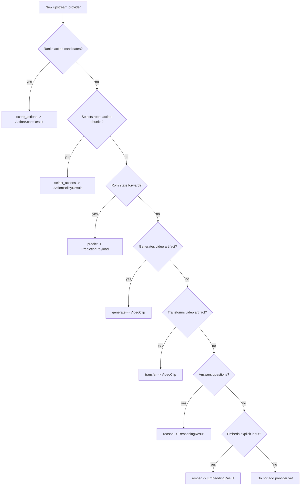

# Provider Authoring Guide

This guide turns the WorldForge world-model taxonomy into an implementation checklist for new
provider adapters. Use it before writing code. The goal is to keep adapters honest: every provider
must say what kind of "world model" it is, expose only capabilities it implements, validate every
boundary, and document failure modes clearly enough that users can operate it without reading the
adapter source.

Related docs:

- [World Model Taxonomy](./world-model-taxonomy.md)
- [Architecture](./architecture.md)
- [Providers](./providers/README.md)
- [Python API](./api/python.md)

## Scaffold Generator

Use the scaffold generator to create the first draft of a provider adapter, fixture files, test
file, and provider docs stub:

```bash
uv run python scripts/scaffold_provider.py "Acme WM" \
  --taxonomy "JEPA latent predictive world model" \
  --planned-capability score \
  --remote \
  --env-var ACME_WM_API_KEY
```

Generated files:

```text
src/worldforge/providers/acme_wm.py
tests/test_acme_wm_provider.py
tests/fixtures/providers/acme_wm_success.json
tests/fixtures/providers/acme_wm_error.json
docs/src/providers/acme-wm.md
```

The generated provider is safe by default: it starts as `implementation_status="scaffold"`,
advertises no public capabilities, and raises `ProviderError` from generated method stubs. Enable
capabilities only after the adapter calls the real upstream runtime, validates inputs and outputs,
and has fixture-driven tests for every documented failure mode.

## Adapter Decision Tree

Start with the provider's real contract, not its marketing category.

```text
New upstream provider
  |
  |-- Can it rank action candidates from observations/goals?
  |     `-- expose score_actions(...) -> ActionScoreResult
  |
  |-- Can it choose robot action chunks from observations/instructions?
  |     `-- expose select_actions(...) -> ActionPolicyResult
  |
  |-- Can it roll a WorldForge state forward from an Action?
  |     `-- expose predict(...) -> PredictionPayload
  |
  |-- Can it generate a video artifact from prompt/options?
  |     `-- expose generate(...) -> VideoClip
  |
  |-- Can it transform one video artifact into another?
  |     `-- expose transfer(...) -> VideoClip
  |
  |-- Can it answer questions about a world/prompt?
  |     `-- expose reason(...) -> ReasoningResult
  |
  |-- Can it embed text or another explicit input?
  |     `-- expose embed(...) -> EmbeddingResult
  |
  `-- If none are true, do not add a provider yet.
      Write host integration code or a design issue first.
```

Mermaid equivalent:



## Step 1: Classify the Provider

Every provider doc and profile should identify the provider's taxonomy category.

| Category | Typical provider surface | WorldForge expectation |
| --- | --- | --- |
| JEPA latent predictive world model | `score`, future `predict` or latent rollout | First-class planning path. Follow the LeWorldModel pattern. |
| Model-based RL latent dynamics | `predict`, `score`, maybe future policy selection | Expose the exported control surface, not the whole trainer. |
| Generative video simulator | `generate`, maybe future action-conditioned `predict` | Do not imply controllable planning unless the API supports it. |
| Spatial / 3D world model | future scene or asset surfaces | Keep out of core until typed scene contracts exist. |
| Physical AI infrastructure | `generate`, `transfer`, future data/eval adapters | Model each stable API as one capability. |
| Embodied policy / VLA action model | `policy`, maybe paired with a score provider | Treat as an actor. Do not claim it predicts futures. |
| Active inference / structured generative model | future belief, uncertainty, or policy outputs | Preserve beliefs and uncertainty explicitly. |
| Deterministic local surrogate | any tested local subset | Make it obvious that it is a surrogate. |

Checklist:

- [ ] The provider's taxonomy category is documented.
- [ ] The provider's capabilities are derived from actual callable behavior.
- [ ] Unsupported surfaces raise `ProviderError` through `BaseProvider`.
- [ ] Scaffold adapters are labeled `scaffold` and do not claim real upstream behavior.
- [ ] The provider profile notes whether it is local, remote, deterministic, beta, stable, or
      scaffold.

## Step 2: Choose Capabilities Narrowly

WorldForge capabilities are not badges. They are callable contracts.

```text
capabilities.predict  -> predict(world_state, action, steps)
capabilities.generate -> generate(prompt, duration_seconds, options)
capabilities.transfer -> transfer(clip, width, height, fps, prompt, options)
capabilities.reason   -> reason(query, world_state)
capabilities.embed    -> embed(text)
capabilities.score    -> score_actions(info, action_candidates)
capabilities.policy   -> select_actions(info)
capabilities.plan     -> currently reserved for providers that implement planning directly
```

Rules:

- [ ] Do not set `predict=True` unless the adapter returns a validated `PredictionPayload`.
- [ ] Do not set `generate=True` unless the adapter returns a validated `VideoClip`.
- [ ] Do not set `score=True` unless the adapter returns `ActionScoreResult` with finite scores
      and a valid `best_index`.
- [ ] Do not set `policy=True` unless the adapter returns `ActionPolicyResult` with at least one
      executable WorldForge `Action`.
- [ ] Do not set `reason=True` for models that only return unstructured logs, captions, or
      provider diagnostics.
- [ ] Do not set `plan=True` just because a provider can score candidates. Score-based planning is
      represented by `score=True` plus `World.plan(...)`.

## Step 3: Define the Contract Before Code

Write down the provider contract in the PR description or docs before implementation.

```text
Provider contract
  name:
  taxonomy category:
  implementation status:
  local or remote:
  credentials/env vars:
  optional dependencies:
  default model/checkpoint:
  supported modalities:
  artifact types:
  capabilities:
  input shape/range constraints:
  output schema:
  score direction, if any:
  retry/timeout behavior:
  failure modes:
  tests:
```

Questions to answer:

- [ ] What exact upstream API, package, checkpoint format, or runtime is being wrapped?
- [ ] What version range or installation path is expected?
- [ ] Which environment variables trigger auto-registration?
- [ ] Which inputs are host-preprocessed rather than inferred by WorldForge?
- [ ] What are the provider-specific limits: duration, resolution, action shape, token budget,
      file size, content type, polling limits, or model context?
- [ ] What does a lower or higher score mean?
- [ ] If this is a policy, who owns embodiment-specific action translation?
- [ ] What does the provider return when output is partial, expired, missing, malformed, or
      physically implausible?

## Step 4: Use the Standard Adapter Shape

Provider adapters should be small boundary objects.

```text
Provider class
  |
  |-- __init__
  |     define identity, capabilities, profile metadata, env vars, request policy
  |
  |-- configured()
  |     return whether registration/runtime config is present
  |
  |-- health()
  |     validate local availability without doing expensive work
  |
  |-- capability method
  |     validate WorldForge inputs
  |     call upstream
  |     parse upstream response
  |     return typed WorldForge model
  |     emit ProviderEvent
  |
  `-- private parser/validator helpers
        keep upstream schemas explicit and testable
```

Minimal skeleton:

```python
from worldforge.models import ProviderCapabilities, ProviderEvent, ProviderHealth
from worldforge.providers import BaseProvider, ProviderError


class ExampleProvider(BaseProvider):
    env_var = "EXAMPLE_API_KEY"

    def __init__(self, *, event_handler=None):
        super().__init__(
            name="example",
            capabilities=ProviderCapabilities(generate=True),
            is_local=False,
            description="Example provider adapter.",
            package="worldforge",
            implementation_status="beta",
            deterministic=False,
            required_env_vars=[self.env_var],
            supported_modalities=["text"],
            artifact_types=["video"],
            notes=["Documents provider-specific limits here."],
            event_handler=event_handler,
        )

    def health(self) -> ProviderHealth:
        # Keep health cheap. Do not download large artifacts or load huge checkpoints here.
        return super().health()

    def generate(self, prompt, duration_seconds, *, options=None):
        try:
            self._require_credentials()
            # validate inputs, call upstream, parse response, return VideoClip
        except ProviderError:
            raise
        except Exception as exc:
            raise ProviderError(f"Provider 'example' generation failed: {exc}") from exc
```

## Step 5: Boundary Validation Checklist

Validate at the narrowest boundary. Do not let malformed upstream or caller data leak into public
models.

Caller input:

- [ ] Non-empty provider name, prompt, model ID, and required env vars.
- [ ] Positive duration, width, height, fps, step count, polling limits, and timeouts.
- [ ] Finite numeric values for positions, scores, probabilities, latencies, and embeddings.
- [ ] Existing local file paths before network upload.
- [ ] Rectangular nested numeric arrays when accepting tensor-like JSON.
- [ ] Explicit action tensor rank and shape for score providers.
- [ ] Explicit observation modalities and action translator requirements for policy providers.

Upstream response:

- [ ] JSON response is an object when an object is expected.
- [ ] Required fields are present and correctly typed.
- [ ] Task IDs are non-empty and stable across create/poll responses.
- [ ] Terminal task states are explicit.
- [ ] Partial outputs fail with `ProviderError` unless the public contract supports partial
      results.
- [ ] Artifact URLs are non-empty and sanitized before download.
- [ ] Expired artifacts fail with context.
- [ ] Unsupported content types fail before returning `VideoClip`.
- [ ] Base64 media fields decode successfully.
- [ ] Scores flatten to a non-empty finite list.
- [ ] Policy action chunks preserve raw provider output and translate to executable
      WorldForge `Action` objects.

State mutation:

- [ ] Do not apply provider-supplied world state until it passes world-state validation.
- [ ] Do not mutate the caller's `World` during comparison workflows.
- [ ] Preserve history and metadata intentionally.

## Step 6: LeWorldModel-Style Score Provider Checklist

Use this checklist for JEPA and latent cost-model providers.

```text
host preprocessing
  -> info tensors / arrays
  -> action candidate tensor
  -> candidate WorldForge Action sequences
  -> provider.score_actions(...)
  -> ActionScoreResult.best_index
  -> Plan(actions=selected candidate)
```

Required behavior:

- [ ] Expose `score=True` and no unrelated capabilities.
- [ ] Keep optional heavy dependencies out of base package dependencies.
- [ ] Import optional runtime packages lazily.
- [ ] Health reports missing optional dependencies clearly.
- [ ] `info` validates required fields such as `pixels`, `goal`, and `action`.
- [ ] `action_candidates` validates provider-specific rank and shape.
- [ ] Model output validates as non-empty finite scores.
- [ ] `best_index` matches provider score direction.
- [ ] `lower_is_better` is explicit.
- [ ] `metadata` includes policy/checkpoint/model identifiers and score semantics.
- [ ] Docs state that host code owns task preprocessing and action-space mapping.
- [ ] Tests cover malformed tensors, missing fields, invalid ranks, non-finite scores, and
      best-index plan selection.

Do not:

- [ ] Do not pretend a cost model can generate video.
- [ ] Do not pretend a score provider can execute a plan.
- [ ] Do not hide score direction in prose only.
- [ ] Do not infer raw image transforms unless the adapter actually implements and tests them.

## Step 7: Embodied Policy Provider Checklist

Use this checklist for VLA and robot policy providers such as NVIDIA Isaac GR00T.

```text
host sensors / simulation state
  -> policy observation dict
  -> provider.select_actions(...)
  -> ActionPolicyResult(actions, raw_actions, action_candidates)
  -> optional score provider filters candidates
  -> Plan(actions=selected candidate)
```

Required behavior:

- [ ] Expose `policy=True` and no unrelated capabilities unless separately implemented.
- [ ] Keep GR00T, CUDA, checkpoints, TensorRT, and robot runtime dependencies host-owned.
- [ ] Import optional runtime packages lazily or accept an injected client/runtime.
- [ ] `info["observation"]` names the modalities it contains, such as `video`, `state`, and
      `language`.
- [ ] Raw provider actions are preserved in `ActionPolicyResult.raw_actions` for debugging.
- [ ] Embodiment tags, action horizons, and provider-native info are preserved in metadata.
- [ ] Embodiment-specific action translation is explicit. Do not guess robot action semantics.
- [ ] Tests cover missing translator, malformed observations, malformed provider output, policy
      plan selection, and policy+score plan selection.

Do not:

- [ ] Do not call a policy a world model just because it is trained for embodied control.
- [ ] Do not set `predict=True` unless the provider returns a validated future WorldForge state.
- [ ] Do not set `score=True` unless it ranks candidates with explicit score semantics.
- [ ] Do not hide real-robot safety checks inside WorldForge. Safety interlocks are host-owned.

## Step 8: Predictive Provider Checklist

Use this checklist for providers that roll a world state forward.

- [ ] Implement `predict(world_state, action, steps)`.
- [ ] Validate `steps` and action fields before calling upstream.
- [ ] Convert upstream output into a complete world-state JSON object.
- [ ] Validate object IDs, metadata, history, and non-negative step.
- [ ] Return `PredictionPayload` with confidence, physics score, frames, metadata, and latency.
- [ ] Preserve provider identity in returned metadata where useful.
- [ ] Tests cover malformed world state, missing scene objects, impossible actions if applicable,
      non-finite metrics, and provider failure propagation.

## Step 9: Generative and Transfer Provider Checklist

Use this checklist for video or artifact providers.

- [ ] Implement `generate(...)` only for prompt-to-video or equivalent artifact generation.
- [ ] Implement `transfer(...)` only for video-to-video or artifact-to-artifact transformation.
- [ ] Validate prompt, duration, size, ratio, fps, and file paths before the outbound request.
- [ ] Model provider-specific options with `GenerationOptions` where possible.
- [ ] Keep create-style mutations single-attempt unless the provider contract is idempotent.
- [ ] Poll with bounded attempts and explicit terminal states.
- [ ] Validate artifact content type before reading into `VideoClip`.
- [ ] Reject empty artifact bodies.
- [ ] Tests cover bad content types, expired artifacts, missing outputs, task failures, malformed
      JSON, timeout, retry, and provider-specific limits.

## Step 10: Observability and Failure Semantics

Every real provider should emit useful `ProviderEvent` records.

```text
operation starts
  -> upstream call or local model call
  -> retry event, if retryable
  -> success event with duration and key metadata
  -> failure event with duration and sanitized message
```

Checklist:

- [ ] Events include provider name, operation, phase, duration, and attempt where relevant.
- [ ] HTTP events include status code when available.
- [ ] Failure events do not leak secrets, bearer tokens, signed URLs, or raw credentials.
- [ ] Retry events are emitted only for retryable operations.
- [ ] Provider errors include operation, provider name, and the failed input class, not just
      "request failed."
- [ ] Unexpected exceptions are wrapped in `ProviderError` with context.

## Step 11: Test Requirements

Provider tests should be fixture-driven and contract-driven.

Recommended layout:

```text
tests/
|-- test_provider_name.py
|-- fixtures/
|   `-- providers/
|       |-- provider_success.json
|       |-- provider_failure.json
|       |-- provider_partial_output.json
|       `-- provider_malformed.json
```

Required tests:

- [ ] Provider profile advertises the correct capabilities and limits.
- [ ] `health()` reports missing credentials, missing optional dependencies, and healthy config.
- [ ] Happy path returns the typed public model.
- [ ] Every documented failure mode raises `ProviderError`, `WorldForgeError`, or
      `WorldStateError` as appropriate.
- [ ] Malformed upstream payloads are rejected.
- [ ] Partial outputs are rejected or represented explicitly.
- [ ] Bad content types are rejected for media artifacts.
- [ ] Expired artifact URLs fail with context.
- [ ] Provider-specific limits are tested.
- [ ] Event emission is tested for success and failure.
- [ ] `worldforge.testing.assert_provider_contract(...)` passes for the provider where applicable.

Remote providers:

- [ ] No tests require live credentials.
- [ ] HTTP calls use fakes, fixtures, or local handlers.
- [ ] Retry and timeout behavior is deterministic.

Local model providers:

- [ ] Heavy model dependencies are faked in unit tests.
- [ ] A real-model smoke script is optional, documented, and not part of the default unit suite.
- [ ] Checkpoint paths and cache directories are host-owned.

## Step 12: Documentation Requirements

A provider PR is incomplete without docs.

- [ ] Provider matrix row in [Providers](./providers/README.md).
- [ ] Provider-specific limits and environment variables.
- [ ] API examples for the public methods touched.
- [ ] Failure modes in [Python API](./api/python.md) when new public errors are introduced.
- [ ] Architecture updates if a new capability or pipeline is introduced.
- [ ] README update if the provider changes the main user-facing story.
- [ ] Changelog entry for user-visible behavior.
- [ ] `AGENTS.md` update if future AI contributors need new constraints or commands.

## Pull Request Checklist

Use this checklist in provider PRs.

```text
Provider identity
  [ ] taxonomy category documented
  [ ] capabilities are narrow and truthful
  [ ] profile metadata is complete

Runtime contract
  [ ] env vars and optional dependencies documented
  [ ] input shapes and limits documented
  [ ] output schema and score direction documented
  [ ] unsupported methods fail through BaseProvider defaults

Validation and errors
  [ ] caller inputs validated
  [ ] upstream responses parsed by typed helpers
  [ ] malformed/partial/expired/bad-content responses rejected
  [ ] ProviderError messages are actionable and sanitized

Observability
  [ ] success events emitted
  [ ] failure events emitted
  [ ] retry events emitted when applicable

Tests
  [ ] happy path covered
  [ ] failure modes covered with fixtures
  [ ] provider-specific limits covered
  [ ] contract tests run where applicable

Docs
  [ ] provider docs updated
  [ ] API docs updated
  [ ] changelog updated
  [ ] agent context updated when needed
```

## Review Standard

The reviewer should reject the provider if any of these are true:

- The adapter advertises a capability that is not implemented end to end.
- The provider's meaning of "world model" is vague.
- Score direction is implicit.
- Input shape is undocumented.
- Remote response parsing is ad hoc and untested.
- Optional heavy dependencies are added to the base install without a strong reason.
- A provider failure can silently fall back to mock behavior.
- A malformed upstream payload can become a successful public result.
- The PR lacks fixture-driven tests for documented failure modes.
