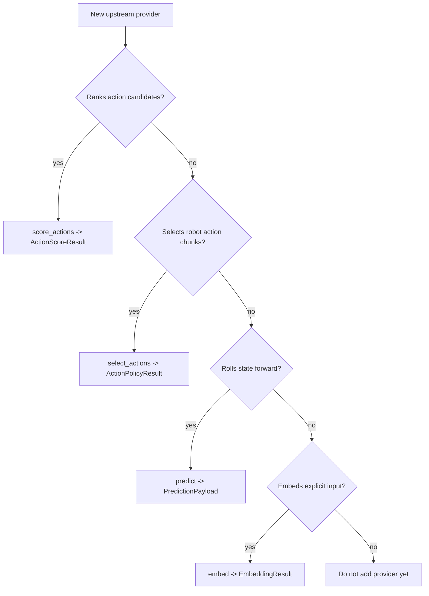

# 提供方编写指南

本指南将 WorldForge 世界模型分类体系转化为新提供方适配器的实施清单，建议在编写代码之前阅读。其目标是确保适配器的准确性：每个提供方必须说明其属于哪种"世界模型"类型，只公开已实现的能力，验证所有边界，并以足够清晰的方式记录故障模式，使调用方无需阅读适配器源码即可正常使用。

相关文档：

- [世界模型分类体系](./world-model-taxonomy.md)
- [架构](./architecture.md)
- [提供方](./providers/README.md)
- [提供方配置索引](./provider-configuration-index.md)
- [Python API](./api/python.md)

## 脚手架生成器

使用脚手架生成器创建提供方适配器的初始草稿，包括夹具文件、测试文件、运行时清单存根、提供方文档存根和工作台检查列表：

```bash
uv run python scripts/scaffold_provider.py "Acme WM" \
  --taxonomy "JEPA latent predictive world model" \
  --implementation-status scaffold \
  --planned-capability score \
  --remote \
  --env-var ACME_WM_API_KEY
```

生成的文件：

```text
src/worldforge/providers/acme_wm.py
tests/test_acme_wm_provider.py
tests/fixtures/providers/acme_wm_success.json
tests/fixtures/providers/acme_wm_error.json
src/worldforge/providers/runtime_manifests/acme-wm.json.stub
docs/src/providers/acme-wm.md
docs/src/providers/acme-wm-workbench.md
```

生成的提供方默认是安全的：初始 `implementation_status="scaffold"`，不公开任何能力，生成的方法存根会抛出 `ProviderError`。只有在适配器已调用真实上游运行时、验证了输入输出，并针对每个已记录的故障模式具备夹具驱动的测试之后，才应启用相应能力。

生成的运行时清单文件名故意使用 `.json.stub` 后缀，它不是可加载的运行时证据，不应在所有 TODO 项完成替换、宿主方冒烟路径写入脱敏的 `run_manifest.json` 且 `uv run pytest tests/test_provider_runtime_manifests.py` 通过之前重命名为 `.json`。生成的工作台检查列表记录了该提供方的关闭失败检查、晋升工作和后续验证命令。

## 工作台循环

在提交提供方 PR 之前，请在干净的签出环境中运行非 TUI 工作台：

```bash
uv run worldforge provider workbench mock
uv run worldforge provider workbench <provider> --format json
uv run worldforge provider workbench jepa-wms --format markdown
uv run python scripts/generate_provider_docs.py --check
```

报告列出了每个已公开能力所需的一致性辅助工具、脚手架/候选适配器的规划能力、运行时清单状态、文档/目录偏差状态、提供方配置索引偏差、脱敏检查、安全工件引用及验证命令。当夹具文件存在时，报告会验证 `tests/fixtures/providers/<provider>_*.json` 回放文件，包括直接构建候选方的模块安全前缀（如 `jepa_wms_*.json`）。报告还会按未来状态（`experimental`、`beta`、`stable`）列出缺失的晋升证据，使脚手架差距清晰可见，而不会意外形成能力声明。默认情况下，报告仅调用确定性的本地提供方。只有在准备好了凭证、可选依赖、注入的运行时和运行时所有的工件的宿主机上，才使用 `--live`。

## 生命周期钩子

已准备好的宿主方提供方可以公开可选的生命周期钩子，而无需更改其能力方法：

```python
from worldforge import ProviderLifecycleResult


def preflight(self) -> ProviderLifecycleResult:
    return ProviderLifecycleResult(
        provider=self.name,
        hook="preflight",
        status="ready",
        ready=True,
        latency_ms=0.1,
        details="runtime reachable",
        evidence={"runtime": "prepared-host"},
    )
```

支持的钩子为 `preflight`、`warmup` 和 `teardown`。支持的状态为 `no-op`、`ready`、`skipped`、`failed` 和 `teardown-failed`。证据必须为 JSON 原生类型且已脱敏：记录版本号、形状摘要、特性标志或清单标识符，而非原始观测数据、令牌、私有端点、检查点路径、GPU 日志或已下载的模型文件。

默认钩子对现有提供方是安全的。已配置的提供方报告 `no-op`；缺少必需配置时报告 `skipped` 并附带跳过原因。能力协议实现可以在其现有 `score_actions`、`select_actions`、`predict` 或 `embed` 方法旁边定义相同的钩子方法；注册仍通过能力方法进行，诊断通过可观测包装器拾取生命周期钩子。

诊断会将聚合的 `ProviderLifecycleStatus` 序列化在 `worldforge doctor` 和 `worldforge provider info <provider>` 中：

```bash
uv run worldforge doctor --registered-only
uv run worldforge provider info gr00t --format json
```

生命周期钩子适用于：宿主方拥有的依赖检查、检查点存在性检查、廉价的服务器可达性探测、模型预热、缓存准备以及释放提供方持有的客户端。不应用于：安装依赖、提供凭证、启动长时间运行的守护进程、意外下载大型资产，或在宿主方未提供可选运行时的情况下声称其可用。

## 适配器决策树

从提供方的真实契约出发，而非其标签或类别。

```text
新上游提供方
  |
  |-- 能否根据观测/目标对动作候选方案进行排序？
  |     `-- 公开 score_actions(...) -> ActionScoreResult
  |
  |-- 能否根据观测/指令为机器人选择动作块？
  |     `-- 公开 select_actions(...) -> ActionPolicyResult
  |
  |-- 能否根据动作将 WorldForge 状态向前推演？
  |     `-- 公开 predict(...) -> PredictionPayload
  |
  |-- 能否对文本或其他显式输入进行嵌入？
  |     `-- 公开 embed(...) -> EmbeddingResult
  |
  `-- 若以上均不满足，暂不添加提供方。
      先编写宿主集成代码或设计 issue。
```

等效的 Mermaid 流程图：



## 第一步：对提供方进行分类

每个提供方的文档和配置文件都应标明其分类类别。

| 类别 | 典型提供方接口 | WorldForge 预期 |
| --- | --- | --- |
| JEPA 隐空间预测世界模型 | `score`，未来可能有 `predict` 或隐空间推演 | 一等规划路径，遵循 LeWorldModel 模式。 |
| 基于模型的强化学习隐动态 | `predict`、`score`，未来可能有策略选择 | 公开导出的控制接口，而非整个训练器。 |
| 空间/三维世界模型 | 未来的场景或资产接口 | 在类型化场景契约存在之前不纳入核心。 |
| 物理 AI 基础设施 | 未来可能有数据/评估适配器 | 仅在稳定 API 映射到当前能力表面时建模。 |
| 具身策略 / VLA 动作模型 | `policy`，可能与打分提供方配对 | 视为执行者，不声称其能预测未来。 |
| 主动推理 / 结构化生成模型 | 未来的信念、不确定性或策略输出 | 显式保留信念和不确定性。 |
| 确定性本地替代模型 | 任意已测试的本地子集 | 明确说明这是替代模型。 |

检查列表：

- [ ] 提供方的分类类别已记录。
- [ ] 提供方的能力来源于实际可调用的行为。
- [ ] 完整提供方继承 `ProviderError` 的默认行为，用于处理不支持的 `BaseProvider` 方法。
- [ ] 单能力协议实现仅公开其唯一的可调用方法。
- [ ] 脚手架适配器标记为 `scaffold`，不声称真实的上游行为。
- [ ] 提供方配置文件注明其是本地、远程、确定性的、beta、stable 还是 scaffold。

## 第二步：精准选择能力

WorldForge 的能力不是荣誉徽章，而是可调用的契约。`ProviderCapabilities()` 初始时所有标志均为 `False`，适配器必须显式地启用每个支持的操作。能力名称会被验证；拼写错误应在过滤、诊断和测试期间明确报错。

```text
capabilities.predict  -> predict(world_state, action, steps)
capabilities.embed    -> embed(text)
capabilities.score    -> score_actions(info, action_candidates)
capabilities.policy   -> select_actions(info)
capabilities.plan     -> 当前为直接实现规划的提供方保留
```

规则：

- [ ] 除非适配器返回经验证的 `PredictionPayload`，否则不设置 `predict=True`。
- [ ] 除非适配器返回具有有限分数且 `best_index` 与 `lower_is_better` 匹配的
      `ActionScoreResult`，否则不设置 `score=True`。
- [ ] 除非适配器返回含有至少一个可执行 WorldForge `Action` 的 `ActionPolicyResult`，否则不设置 `policy=True`。
- [ ] 仅因为提供方能对候选方案打分，不设置 `plan=True`。基于打分的规划应以 `score=True` 加 `World.plan(...)` 表示。

实现选择：

- 当一个适配器承载多项能力、需要目录自动注册，或具有特定于提供方的健康/配置行为时，使用 `BaseProvider` 子类。
- 当一个本地对象仅公开一个窄接口（如 `score_actions(...)` 或 `select_actions(...)`）时，使用能力协议实现。协议实现声明 `name`、可选的 `ProviderProfileSpec` 元数据及对应方法；`WorldForge` 会将其包装，用于事件、健康检查、配置文件、诊断、规划和基准测试。
- 仅当一个逻辑模型确实将多个协议实现归入单次注册调用时，才使用 `RunnableModel`。

## 第三步：应用晋升门控

`ProviderProfileSpec.implementation_status` 是成熟度声明，会出现在诊断报告和生成的提供方目录文档中。只有当提供方具备目标状态所需的证据时，才能更改此字段。

| 状态 | 允许的公开声明 | 晋升前所需证据 | 所需措辞 |
| --- | --- | --- | --- |
| `scaffold` | 保留提供方名称或候选契约。 | 提供方文档说明其并非真实实现；公开能力标志已禁用，或候选方保持在自动注册之外；方法默认关闭失败，除非存在仅测试可用的显式选项。 | "scaffold"、"reservation" 或 "candidate"；绝不使用 "integration" 或 "usable provider"。 |
| `experimental` | 真实上游路径存在，但契约可能变更。 | 注入运行时或夹具测试覆盖了可调用边界，健康检查能清晰报告缺失的运行时/配置，文档列出了已知差距或阻碍。 | "experimental"、"known gaps" 及宿主方拥有的运行时限制。 |
| `beta` | 已准备好的宿主方可将该提供方用于已记录的能力。 | 能力测试、运行时清单、生成的提供方文档、夹具支持的故障模式、脱敏事件，以及已记录的冒烟命令或明确的实时冒烟阻碍。 | "prepared host"、支持的模型/环境变量、故障模式，以及相关的工件保留说明。 |
| `stable` | 推荐用于该能力的提供方路径。 | 反复的冒烟证据、发布证据、解析器和验证覆盖率、故障/操作手册说明、兼容性预期，以及没有未解决的运行时契约阻碍。 | 仅在支持运维使用和兼容性限制的前提下使用 "stable"。 |

晋升检查列表：

- [ ] 在提供方中更新 `ProviderProfileSpec.implementation_status` 和配置文件元数据。
- [ ] 当生成的目录行可能产生误导时，更新 `src/worldforge/providers/catalog.py` 中的 `runtime_ownership` 或 `docs_page`。
- [ ] 在目录/配置文件变更后运行 `uv run python scripts/generate_provider_docs.py`，然后运行 `uv run python scripts/generate_provider_docs.py --check`。
- [ ] 运行提供方专用的 pytest 文件，以及 `uv run pytest tests/test_provider_catalog_docs.py`。
- [ ] 运行 `uv run mkdocs build --strict`。
- [ ] 当行为变更和晋升措辞任一部分较大时，将二者分开提交。

当前分类：

| 提供方 | 状态 | 分类原因 |
| --- | --- | --- |
| `mock` | `stable` | 确定性的仓库内提供方，无可选运行时，签出安全的测试覆盖率广泛。 |
| `leworldmodel` | `stable` | 官方 LeWM 加载路径的推荐打分适配器；已准备好的宿主方负责 torch、`stable_worldmodel`、检查点和任务预处理。 |
| `gr00t` | `beta` | 真实的远程 PolicyClient 边界，具备夹具支持的故障覆盖；已准备好的宿主方负责可达的服务器、凭证、转换器和机器人运行时。 |
| `cosmos-policy` | `beta` | 面向 ALOHA 动作块的真实远程策略边界；已准备好的宿主方负责可达服务器、凭证、转换器和机器人运行时。 |
| `lerobot` | `stable` | LeRobot `PreTrainedPolicy` 路径的推荐具身策略适配器；已准备好的宿主方负责 LeRobot、检查点、转换器和机器人运行时。 |
| `jepa` | `experimental` | 宿主方拥有的 `facebookresearch/jepa-wms` torch-hub 运行时的仅打分适配器。 |
| `genie` | `scaffold` | 关闭失败的保留，直到具体的上游运行时/API 契约存在。 |
| `jepa-wms` | `scaffold` | 仅限直接构建的候选方；在运行时限制和冒烟证据可信之前，不导出或自动注册。 |

## 第四步：在编码前定义契约

在实现之前，在 PR 描述或文档中写下提供方契约。

```text
Provider contract
  name:
  taxonomy category:
  implementation status:
  local or remote:
  credentials/env vars:
  optional dependencies:
  default model/checkpoint:
  supported modalities:
  artifact types:
  capabilities:
  input shape/range constraints:
  output schema:
  score direction, if any:
  retry/timeout behavior:
  failure modes:
  tests:
```

需要回答的问题：

- [ ] 正在包装的确切上游 API、包、检查点格式或运行时是什么？
- [ ] 预期的版本范围或安装路径是什么？
- [ ] 哪些环境变量触发自动注册？
- [ ] 哪些输入由宿主方预处理，而非由 WorldForge 推断？
- [ ] 提供方的特定限制有哪些：时长、分辨率、动作形状、令牌预算、文件大小、内容类型、轮询限制或模型上下文？
- [ ] 较低或较高的分数意味着什么？
- [ ] 如果这是一个策略，谁负责具身相关的动作转换？
- [ ] 当输出部分缺失、过期、丢失、格式错误或在物理上不可行时，提供方返回什么？

## 第五步：使用标准适配器结构

提供方适配器应是小型的边界对象。选择能如实表达集成关系的最小结构。

```text
完整提供方类
  |
  |-- __init__
  |     定义标识、能力、配置文件元数据、环境变量、请求策略
  |
  |-- configured()
  |     返回注册/运行时配置是否存在
  |
  |-- health()
  |     在不执行昂贵操作的情况下验证本地可用性
  |
  |-- 能力方法
  |     验证 WorldForge 输入
  |     调用上游
  |     解析上游响应
  |     返回类型化的 WorldForge 模型
  |     发出 ProviderEvent
  |
  `-- 私有解析器/验证器辅助方法
        保持上游模式明确且可测试
```

最简完整提供方骨架：

```python
from worldforge.models import ProviderCapabilities, ProviderHealth
from worldforge.providers import BaseProvider, ProviderError
from worldforge.providers.base import ProviderProfileSpec


class ExampleProvider(BaseProvider):
    env_var = "EXAMPLE_API_KEY"

    def __init__(self, *, event_handler=None):
        super().__init__(
            name="example",
            capabilities=ProviderCapabilities(predict=True),
            profile=ProviderProfileSpec(
                description="Example provider adapter.",
                package="worldforge",
                implementation_status="beta",
                deterministic=False,
                required_env_vars=(self.env_var,),
                supported_modalities=("text",),
                artifact_types=("video",),
                notes=("Documents provider-specific limits here.",),
            ),
            event_handler=event_handler,
        )

    def health(self) -> ProviderHealth:
        # Keep health cheap. Do not download large artifacts or load huge checkpoints here.
        return super().health()

    def predict(self, world_state, action, steps=1):
        try:
            self._require_credentials()
            # validate inputs, call upstream, parse response, return PredictionPayload
        except ProviderError:
            raise
        except Exception as exc:
            raise ProviderError(f"Provider 'example' prediction failed: {exc}") from exc
```

最简单能力协议骨架：

```python
from worldforge import ActionScoreResult, WorldForge
from worldforge.providers.base import ProviderProfileSpec


class ExampleCost:
    name = "example-cost"
    profile = ProviderProfileSpec(
        description="Example local cost model.",
        implementation_status="experimental",
        deterministic=True,
        supported_modalities=("world_state", "action"),
        artifact_types=("score",),
    )

    def score_actions(self, *, info, action_candidates):
        # validate info and candidates, call model/runtime, return finite scores
        return ActionScoreResult(provider=self.name, scores=[0.2, 0.8], best_index=0)


forge = WorldForge(auto_register_remote=False)
forge.register_cost(ExampleCost())
```

关于使用纯进程内协议对象的策略加打分可运行示例，请参阅[能力协议快速开始](./capability-protocols-quickstart.md)。

## 第六步：边界验证检查列表

在最窄的边界处进行验证，不允许格式错误的上游或调用方数据泄漏到公开模型中。

调用方输入：

- [ ] 非空的提供方名称、提示、模型 ID 及所需环境变量。
- [ ] 正值的时长、宽度、高度、帧率、步数、轮询限制和超时时间。
- [ ] 有限的位置、分数、概率、延迟和嵌入的数值。
- [ ] 网络上传前验证本地文件路径是否存在。
- [ ] 接受类张量 JSON 时，验证嵌套数值数组的矩形结构。
- [ ] 打分提供方的显式动作张量秩和形状。
- [ ] 策略提供方的显式观测模态和动作转换器要求。

上游响应：

- [ ] 当期望对象时，JSON 响应为对象。
- [ ] 必填字段存在且类型正确。
- [ ] 除非公开契约支持部分结果，否则部分输出以 `ProviderError` 失败。
- [ ] 分数展平为非空的有限列表。
- [ ] 策略动作块保留原始提供方输出，并转换为可执行的 WorldForge `Action` 对象。

状态变更：

- [ ] 在通过世界状态验证之前，不应用提供方提供的世界状态。
- [ ] 在比较工作流中不改变调用方的 `World`。
- [ ] 有意保留历史记录和元数据。

## 第七步：LeWorldModel 风格打分提供方检查列表

将此检查列表用于 JEPA 和隐代价模型提供方。

```text
宿主方预处理
  -> info 张量/数组
  -> 动作候选张量
  -> 候选 WorldForge Action 序列
  -> provider.score_actions(...)
  -> ActionScoreResult.best_index
  -> Plan(actions=selected candidate)
```

必需的行为：

- [ ] 公开 `score=True`，不声明无关能力。
- [ ] 将可选的重型依赖保持在基础包依赖之外。
- [ ] 延迟导入可选运行时包。
- [ ] 健康检查能清晰报告缺失的可选依赖。
- [ ] `info` 验证必填字段，如 `pixels`、`goal` 和 `action`。
- [ ] `action_candidates` 验证提供方特定的秩和形状。
- [ ] 模型输出验证为非空的有限分数。
- [ ] 分数数量与 `World.plan(...)` 使用的可执行候选数量一致。
- [ ] `best_index` 与提供方分数方向一致。
- [ ] `lower_is_better` 明确指定。
- [ ] `metadata` 包含策略/检查点/模型标识符及分数语义。
- [ ] 文档说明宿主方代码负责任务预处理和动作空间映射。
- [ ] 测试覆盖格式错误的张量、缺失字段、无效秩、非有限分数以及基于 best-index 的规划选择。

不应做的事：

- [ ] 不要假装代价模型可以生成视频。
- [ ] 不要假装打分提供方可以执行规划。
- [ ] 不要仅在文字描述中隐藏分数方向。
- [ ] 除非适配器实际实现并测试了原始图像变换，否则不要推断它们。

## 第八步：具身策略提供方检查列表

将此检查列表用于 VLA 和机器人策略提供方，如 NVIDIA Isaac GR00T。

```text
宿主方传感器/仿真状态
  -> 策略观测字典
  -> provider.select_actions(...)
  -> ActionPolicyResult(actions, raw_actions, action_candidates)
  -> 可选的打分提供方过滤候选方案
  -> Plan(actions=selected candidate)
```

必需的行为：

- [ ] 公开 `policy=True`，除非另有单独实现，否则不声明无关能力。
- [ ] 将 GR00T、CUDA、检查点、TensorRT 和机器人运行时依赖保持为宿主方持有。
- [ ] 延迟导入可选运行时包，或接受注入的客户端/运行时。
- [ ] `info["observation"]` 注明其包含的模态，如 `video`、`state` 和 `language`。
- [ ] 原始提供方动作保留在 `ActionPolicyResult.raw_actions` 中以供调试。
- [ ] 具身标签、动作时域和提供方原生信息保留在元数据中。
- [ ] 具身相关的动作转换明确说明，不猜测机器人动作语义。
- [ ] 测试覆盖缺失转换器、格式错误的观测、格式错误的提供方输出、策略规划选择以及策略加打分的规划选择。

不应做的事：

- [ ] 不要因为策略为具身控制而训练就称其为世界模型。
- [ ] 除非提供方返回经验证的未来 WorldForge 状态，否则不设置 `predict=True`。
- [ ] 除非以显式的分数语义对候选方案进行排序，否则不设置 `score=True`。
- [ ] 不要在 WorldForge 内部隐藏真实机器人的安全检查，安全联锁装置由宿主方持有。

## 第九步：预测型提供方检查列表

将此检查列表用于向前推演世界状态的提供方。

- [ ] 实现 `predict(world_state, action, steps)`。
- [ ] 在调用上游之前验证 `steps` 和动作字段。
- [ ] 将上游输出转换为完整的世界状态 JSON 对象。
- [ ] 验证对象 ID、元数据、历史记录和非负步数。
- [ ] 返回包含置信度、物理得分、帧、元数据和延迟的 `PredictionPayload`。
- [ ] 在返回的元数据中保留提供方标识（在有用时）。
- [ ] 测试覆盖格式错误的世界状态、缺失的场景对象、不可能的动作（如适用）、非有限指标以及提供方故障传播。

## 第十步：生成式和转换型提供方检查列表

将此检查列表用于面向规划的打分模型和具身策略。

- [ ] 仅当适配器能为每个动作候选返回一个有限分数时，才实现 `score_actions(...)`。
- [ ] 仅当适配器能直接或通过宿主提供的转换器返回可执行 WorldForge `Action` 对象时，才实现 `select_actions(...)`。
- [ ] 在调用可选运行时前验证类张量 JSON 的形状、秩、矩形性和有限数值。
- [ ] 仅以 JSON 原生、脱敏安全的元数据保留原始策略动作。
- [ ] 将观测预处理和具身形态特定动作转换留给宿主方。
- [ ] 测试覆盖格式错误的张量、分数数量不匹配、缺失转换器、可选运行时跳过以及提供方特定限制。

## 第十一步：可观测性与故障语义

每个真实提供方都应发出有用的 `ProviderEvent` 记录。

```text
操作开始
  -> 上游调用或本地模型调用
  -> 重试事件（如可重试）
  -> 成功事件，包含时长和关键元数据
  -> 失败事件，包含时长和脱敏消息
```

检查列表：

- [ ] 事件包含提供方名称、操作、阶段、时长，以及在相关时包含尝试次数。
- [ ] HTTP 事件在可用时包含状态码。
- [ ] 失败事件不泄漏密钥、Bearer 令牌、签名 URL 或原始凭证。
- [ ] 重试事件仅在可重试操作时发出。
- [ ] 提供方错误包含操作、提供方名称及失败的输入类，而非仅"请求失败"。
- [ ] 意外异常被包装为带上下文的 `ProviderError`。

## 第十二步：测试要求

提供方测试应以夹具驱动和契约驱动为原则。

推荐的布局：

```text
tests/
|-- test_provider_name.py
|-- fixtures/
|   `-- providers/
|       |-- provider_success.json
|       |-- provider_failure.json
|       |-- provider_partial_output.json
|       `-- provider_malformed.json
```

必需的测试：

- [ ] 提供方配置文件公开正确的能力和限制。
- [ ] `health()` 报告缺失的凭证、缺失的可选依赖以及健康的配置。
- [ ] 正常路径返回类型化的公开模型。
- [ ] 每个已记录的故障模式都会适当地抛出 `ProviderError`、`WorldForgeError` 或 `WorldStateError`。
- [ ] 格式错误的上游有效载荷被拒绝。
- [ ] 部分输出被拒绝或明确表示。
- [ ] 媒体工件的错误内容类型被拒绝。
- [ ] 过期的工件 URL 附带上下文信息失败。
- [ ] 提供方特定限制已测试。
- [ ] 事件发出已针对成功和失败路径进行测试。
- [ ] 适用时，`worldforge.testing.assert_provider_contract(...)` 通过。

可复用的一致性辅助工具适用于窄提供方测试：

| 辅助工具 | 覆盖的能力 |
| --- | --- |
| `assert_predict_conformance(...)` | `predict -> PredictionPayload` |
| `assert_embed_conformance(...)` | `embed -> EmbeddingResult` |
| `assert_score_conformance(...)` | `score_actions -> ActionScoreResult` |
| `assert_policy_conformance(...)` | `select_actions -> ActionPolicyResult` |
| `assert_provider_events_conform(...)` | JSON 原生、脱敏安全的提供方事件 |

能力辅助工具会针对契约失败抛出 `AssertionError`，包括提供方构造公共结果模型时触发
`WorldForgeError` 验证失败的情况，以及配置完成的提供方在应返回有效结果时抛出的
`ProviderError`。这些辅助工具也会重新验证已返回的可变结果对象，检查有限数值字段以及
JSON 原生的打分/策略载荷。

当夹具或注入的运行时仅覆盖一个操作时，使用特定能力的辅助工具。当测试能安全地覆盖提供方的所有已声明能力时，使用 `assert_provider_contract(...)`。

### 契约 CLI 证据

外部适配器作者可以从 CLI 运行相同的契约面，并将输出附加到 issue 或 PR：

```bash
uv run worldforge provider contract mock --format markdown
uv run worldforge provider contract --factory my_pkg.adapters:make_my_policy_provider --format json
```

该命令首先检查提供方元数据，然后根据提供方配置文件选择能力检查，并打印包含通过的检查、已跳过的宿主方检查、失败、后续步骤和验证命令的 JSON 或 Markdown 证据。已注册的提供方可以直接按名称指定。未通过 `worldforge.providers` 入口点组安装的适配器可以使用 `--factory module:factory`。

对非本地提供方的实时能力调用会被跳过，除非宿主方显式传入 `--live`。打分和策略提供方可以通过 `--score-info`、`--score-candidates` 和 `--policy-info` 提供夹具有效载荷；否则命令会尽可能使用签出安全的契约夹具。通过的 CLI 证据仅作为适配器契约证据，不构成自动晋升证据，也不声明物理保真度、媒体质量或机器人安全性。

如需了解包结构的演练，请运行：

```bash
uv run python scripts/demo_showcases.py run external-provider-package --workspace-dir .worldforge/demo-showcases --overwrite
```

该工作流会生成一个临时外部提供方包，验证 `worldforge.providers` 入口点发现和跳过原因，并在不发布任何内容的情况下保存一份安全报告。

当提供方夹具发生变更时，请在更新已提交的快照之前使用夹具偏差演练：

```bash
uv run python scripts/demo_showcases.py run fixture-drift-review --workspace-dir .worldforge/demo-showcases --overwrite
```

它会在临时工作区下展示缺失夹具、摘要偏差、模式版本偏差、不安全路径和 `intended-update` 审查状态，使作者能够在不改变已跟踪夹具的情况下练习已批准的更新流程。

远程提供方：

- [ ] 没有测试需要实时凭证。
- [ ] HTTP 调用使用伪造、夹具或本地处理器。
- [ ] 重试和超时行为是确定性的。

本地模型提供方：

- [ ] 重型模型依赖在单元测试中被伪造。
- [ ] 真实模型冒烟脚本是可选的、已记录的，且不属于默认单元测试套件。
- [ ] 检查点路径和缓存目录由宿主方持有。

## 第十三步：文档要求

没有文档的提供方 PR 是不完整的。

- [ ] 在[提供方](./providers/README.md)中添加提供方矩阵行。
- [ ] 提供方特定的限制和环境变量。
- [ ] 涉及的公开方法的 API 示例。
- [ ] 引入新公开错误时，在 [Python API](./api/python.md) 中记录故障模式。
- [ ] 引入新能力或流水线时，更新架构文档。
- [ ] 提供方改变了主要面向用户的功能时，更新 README。
- [ ] 用户可见行为变更的变更日志条目。
- [ ] 未来 AI 贡献者需要新约束或命令时，更新 `AGENTS.md`。

## 拉取请求检查列表

在提供方 PR 中使用此检查列表。

```text
提供方标识
  [ ] 分类类别已记录
  [ ] 能力精准且如实
  [ ] 配置文件元数据完整

运行时契约
  [ ] 环境变量和可选依赖已记录
  [ ] 输入形状和限制已记录
  [ ] 输出模式和分数方向已记录
  [ ] 不支持的方法通过 BaseProvider 默认行为失败，或实现为无无关公开方法的单能力协议对象

验证与错误
  [ ] 调用方输入已验证
  [ ] 上游响应由类型化辅助工具解析
  [ ] 返回的 PredictionPayload、EvaluationResult、BenchmarkResult 和提供方特定结果元数据在渲染工件之前为 JSON 原生类型且为有限值
  [ ] 格式错误/部分缺失/过期/错误内容类型的响应被拒绝
  [ ] ProviderError 消息可操作且已脱敏

可观测性
  [ ] 成功事件已发出
  [ ] 失败事件已发出
  [ ] 重试事件在适用时已发出

测试
  [ ] 正常路径已覆盖
  [ ] 故障模式已通过夹具覆盖
  [ ] 提供方特定限制已覆盖
  [ ] 契约测试在适用时已运行

文档
  [ ] 提供方文档已更新
  [ ] 生成的提供方目录文档已检查
  [ ] API 文档已更新
  [ ] 变更日志已更新
  [ ] 代理上下文在需要时已更新
```

## 审查标准

如果以下任意一条为真，审查者应拒绝该提供方：

- 适配器公开了一个未端到端实现的能力。
- 提供方对"世界模型"的定义含糊不清。
- 分数方向是隐式的。
- 输入形状未记录。
- 远程响应解析是临时性的且未经测试。
- 没有充分理由将可选的重型依赖添加到基础安装中。
- 提供方故障可以静默回退到 mock 行为。
- 格式错误的上游有效载荷可以成为成功的公开结果。
- PR 缺少已记录故障模式的夹具驱动测试。
