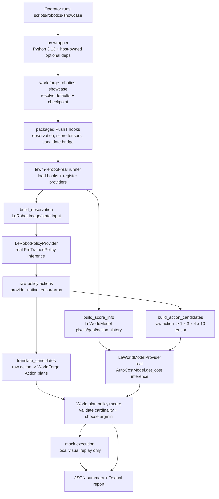
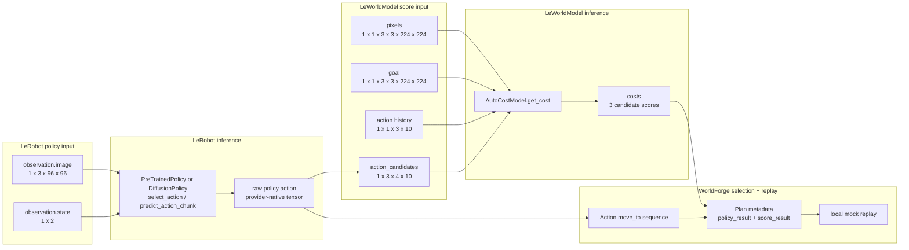
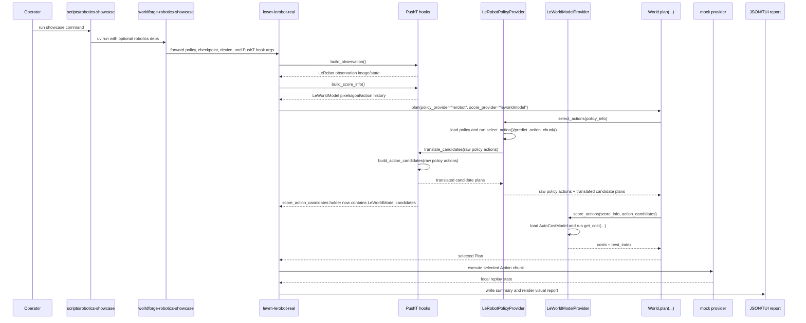

# Robotics Showcase Technical Deep Dive

This page explains the real robotics showcase at the implementation level: which model is used
for each stage, what inputs are passed into it, how WorldForge composes the policy and score
surfaces, and what would need to change for a real robot cell.

The showcase is real neural inference for the policy and score providers when the host runtime is
installed. It is not hardware execution. The selected action chunk is replayed through the local
`mock` provider so the run is inspectable without a robot controller.

## What Runs

The polished entrypoint is:

```bash
scripts/robotics-showcase
```

That wrapper launches:

```text
uv run --python 3.13 ... worldforge-robotics-showcase
```

with host-owned optional dependencies supplied for that one process:

| Runtime package | Why it is loaded |
| --- | --- |
| `stable-worldmodel` from Git | Provides `stable_worldmodel.policy.AutoCostModel` and the PushT environment modules. |
| `datasets>=2.21` | Avoids upstream dataset import incompatibilities in the LeWorldModel runtime. |
| `huggingface_hub` | Downloads LeWorldModel `config.json` and `weights.pt` when building the object checkpoint. |
| `hydra-core`, `omegaconf` | Instantiate the official LeWM config when building the object checkpoint. |
| `transformers` | Builds the ViT encoder referenced by the official PushT LeWM config. |
| `matplotlib` | Kept available for upstream visual-wrapper imports in current LeWorldModel environments. |
| `lerobot[transformers-dep]==0.5.1` | Provides the LeRobot policy classes and a Python 3.13-compatible policy import path. |
| `pygame`, `opencv-python`, `imageio`, `pymunk`, `gymnasium`, `shapely` | Required by the upstream PushT simulation environment, visual-wrapper imports, and rendering path. |
| `textual>=8.2,<9` | Added only when the visual report is requested. |

These are not base package dependencies. WorldForge keeps them host-owned so `worldforge-ai`
remains a lightweight framework package for users who only need the provider layer, CLI,
evaluation, benchmarking, or mock provider.

## Concrete Default Configuration

The default command is a PushT planning showcase:

| Setting | Default |
| --- | --- |
| Task | PushT tabletop manipulation |
| Policy provider | `lerobot` |
| Score provider | `leworldmodel` |
| Execution provider | `mock` |
| LeRobot policy path | `lerobot/diffusion_pusht` |
| LeRobot policy type | `diffusion` |
| LeWorldModel policy name | `pusht/lewm` |
| LeWorldModel object checkpoint | `~/.stable-wm/pusht/lewm_object.ckpt` |
| Device | `cpu`, unless `--device`, `--lerobot-device`, or `--lewm-device` override it |
| JSON summary | `/tmp/worldforge-robotics-showcase/real-run.json` |
| Rerun recording | `/tmp/worldforge-robotics-showcase/real-run.rrd` for normal `scripts/robotics-showcase` runs |

The polished runner forwards the default PushT hooks to the lower-level runner:

```text
--observation-module worldforge.smoke.pusht_showcase_inputs:build_observation
--score-info-module worldforge.smoke.pusht_showcase_inputs:build_score_info
--translator worldforge.smoke.pusht_showcase_inputs:translate_candidates
--candidate-builder worldforge.smoke.pusht_showcase_inputs:build_action_candidates
--expected-action-dim 10
--expected-horizon 4
```

## Component Roles

| Component | WorldForge capability | Exact role |
| --- | --- | --- |
| `scripts/robotics-showcase` | None | Shell wrapper that creates the uv runtime, filters noisy third-party native-library and simulation warnings, and enables the TUI plus Rerun recording by default. Runtime device fallback warnings remain visible. |
| `worldforge.smoke.robotics_showcase` | None | Polished CLI entrypoint. Resolves defaults, ensures the checkpoint exists for normal runs, keeps `--health-only` non-mutating, forwards packaged PushT hooks, and optionally launches the Textual report. |
| `worldforge.smoke.lerobot_leworldmodel` | Orchestration runner | Lower-level configurable runner. Loads task inputs, registers providers, calls `World.plan(...)`, executes local replay, and emits JSON/report/Rerun data. |
| `LeRobotPolicyProvider` | `policy` | Loads a LeRobot `PreTrainedPolicy` or policy-type-specific class, runs `select_action` or `predict_action_chunk`, and returns `ActionPolicyResult`. |
| `LeWorldModelProvider` | `score` | Loads `stable_worldmodel.policy.AutoCostModel`, calls `get_cost(info, action_candidates)`, and returns `ActionScoreResult`. |
| `pusht_showcase_inputs` | Task bridge | Builds PushT observation tensors, LeWorldModel score tensors, candidate tensors, and visual `Action` translations. |
| `WorldForge` / `World` | Planning facade | Composes the `policy` and `score` surfaces through `World.plan(..., policy_provider=..., score_provider=...)`. |
| `mock` provider | `predict` | Replays the selected executable WorldForge action chunk in a local world state. |
| TheWorldHarness Textual report | Report surface | Displays the completed run: pipeline stages, latency, tensor contract, scores, provider events, and tabletop replay. |
| Rerun recording | Artifact surface | Stores the same run as a visual `.rrd`: object boxes, candidate target points, selected path, score bars, latency bars, provider events, plan payload, and world snapshots. |

## End-To-End Flow At A Glance

The showcase has three distinct layers:

1. **Host runtime and task bridge** prepare PushT-specific inputs and load optional robotics/model
   dependencies.
2. **Real model inference** runs LeRobot for policy actions and LeWorldModel for action-candidate
   costs.
3. **WorldForge orchestration** validates contracts, composes policy plus score planning, records
   events, and replays the selected action chunk in a local mock world for inspection.



Reading the diagram correctly matters: `LeRobotPolicyProvider` and `LeWorldModelProvider` are the
real inference stages. `World.plan(...)` is the framework composition stage. `mock` is only the
local replay stage; it is not replacing the policy or score model.

## Inference Responsibility Matrix

| Stage | Runs real model inference? | Input | Output | Purpose in the showcase |
| --- | --- | --- | --- | --- |
| PushT observation hook | No | Upstream PushT environment reset/render | LeRobot observation dict with image and state | Build task-aligned policy input. |
| LeRobot policy provider | Yes, when host runtime/checkpoint is available | `policy_info["observation"]`, mode, policy path/type | Raw policy action tensor/array plus translated candidate action plans | Propose action(s) from the real task policy. |
| Candidate bridge | No | Raw LeRobot action and provider info | LeWorldModel action-candidate tensor shaped `1 x 3 x 4 x 10` | Convert policy output into the score model's native candidate-action contract. |
| LeWorldModel score provider | Yes, when host runtime/checkpoint is available | `pixels`, `goal`, `action` history, action candidates | Cost per candidate, `best_index = argmin(costs)` | Evaluate which policy-derived candidate is lowest cost under the real LeWorldModel checkpoint. |
| WorldForge planner | No | Policy result, score result, typed goal, candidate action plans | `Plan` with selected action chunk and metadata | Compose the two model surfaces, validate score/candidate cardinality, and select the winning candidate. |
| Mock replay | No | Selected WorldForge `Action` sequence | Local world-state update and visualization coordinates | Make the selected chunk inspectable without a robot controller. |
| Textual report | No | Same JSON summary written to disk | Staged visual report | Explain what ran, what tensors were passed, what scores were returned, and what was selected. |

The meaningful robotics work is the policy-plus-score composition: LeRobot proposes actions from a
real policy, LeWorldModel scores compatible candidate action tensors from a real cost checkpoint,
and WorldForge selects the lowest-cost candidate while preserving the raw model outputs in the run
artifact.

## Model Payload Flow

The data path is intentionally split so each model receives the representation it was trained or
configured to consume.



The policy image/state and the score-model pixel/goal/history tensors are not interchangeable. They
are separate task-specific views of the same PushT setup. The candidate bridge is what makes the
raw policy action comparable under the LeWorldModel cost checkpoint.

## Data Contracts

### LeRobot Policy Input

The default PushT observation comes from `build_observation()`:

```python
{
    "observation.image": policy_image,
    "observation.state": state,
}
```

The values are produced from the upstream PushT environment:

| Field | Shape in the default bridge | Meaning |
| --- | --- | --- |
| `observation.image` | `1 x 3 x 96 x 96` | RGB PushT frame resized for the LeRobot policy. |
| `observation.state` | `1 x 2` | First two proprioceptive state values returned by the PushT environment. |

The lower-level runner wraps this as:

```python
policy_info = {
    "observation": {
        "observation.image": policy_image,
        "observation.state": state,
    },
    "mode": "select_action",
    "embodiment_tag": "pusht",
    "score_bridge": {
        "task": "pusht",
        "expected_action_dim": 10,
        "expected_horizon": 4,
        "object_id": "pusht-block",
    },
}
```

`LeRobotPolicyProvider` validates that `info["observation"]` is a non-empty object with string
keys, then loads the policy and calls:

```python
policy.select_action(observation)
```

or, if configured:

```python
policy.predict_action_chunk(observation)
```

The raw tensor stays in `ActionPolicyResult.raw_actions`. It is not interpreted as robot motion by
WorldForge itself.

### LeWorldModel Score Input

The default score tensors come from `build_score_info()`:

```python
{
    "pixels": current_frames,
    "goal": goal_frames,
    "action": action_history,
}
```

The packaged PushT bridge builds them from two deterministic PushT resets:

| Tensor | Default shape | Meaning |
| --- | --- | --- |
| `pixels` | `1 x 1 x 3 x 3 x 224 x 224` | Current PushT RGB frame repeated across the LeWorldModel history window. |
| `goal` | `1 x 1 x 3 x 3 x 224 x 224` | Goal PushT RGB frame repeated across the same history window. |
| `action` | `1 x 1 x 3 x 10` | Zero action history for the 3-step history window and 10-dimensional PushT action block. |

The score provider also receives action candidates. The default `build_action_candidates(...)`
bridge converts the LeRobot raw action into:

```text
batch x samples x horizon x action_dim = 1 x 3 x 4 x 10
```

It does this deliberately:

1. Take the first two LeRobot action values as PushT `x, y`.
2. Clamp them to `[-1.0, 1.0]`.
3. Build three candidates: the original vector, half scale, and negative half scale.
4. Repeat the two coordinates into the known 10-dimensional PushT action-block structure.
5. Repeat that candidate block across the 4-step LeWorldModel horizon.

This is a task-specific bridge, not a generic projection. For other robots, the host must provide a
bridge that preserves the model's native action dimension and horizon.

`LeWorldModelProvider` validates that:

- `info` contains `pixels`, `goal`, and `action`;
- tensor-like inputs are tensors or rectangular nested numeric arrays;
- the required info tensors have at least 3 dimensions;
- `action_candidates` is exactly 4-dimensional: `(batch, samples, horizon, action_dim)`.

Then it runs:

```python
model = stable_worldmodel.policy.AutoCostModel(policy, cache_dir=cache_dir)
scores = model.get_cost(tensor_info, action_tensor)
```

The returned scores are costs. Lower is better, and `best_index` is the argmin.

### Executable WorldForge Actions

LeRobot returns embodiment-specific raw actions. WorldForge needs executable `Action` objects for
planning output and local replay. The default `translate_candidates(...)` hook maps each candidate
into a visual `Action.move_to(...)`:

```python
x = 0.5 + raw_x * 0.25
y = 0.5 + raw_y * 0.25
Action.move_to(x, y, 0.0, object_id="pusht-block")
```

This translation is only for local visualization and mock replay. It is not a hardware command,
joint-space command, impedance command, or controller message.

## End-To-End Sequence

The default run follows this exact sequence.



### 1. Shell Wrapper Creates The Runtime

`scripts/robotics-showcase` changes to the repo root and invokes `uv run --python 3.13` with the
optional runtime dependencies listed above. If the request is not `--help`, `--json-only`,
`--health-only`, or `--no-tui`, the wrapper adds `--tui` so the Textual report opens by default.
If the request is not `--help`, `--json-only`, `--health-only`, or `--no-rerun`, the wrapper also
adds `--rerun` so the run leaves a visual `.rrd` artifact under
`/tmp/worldforge-robotics-showcase/real-run.rrd`. The wrapper does not force a separate Rerun SDK
version; it uses the `rerun-sdk` version resolved by the LeRobot runtime to avoid dependency
conflicts.

When the Rerun artifact exists, the Textual report shows the exact viewer command and binds `o`
to launch:

```bash
uvx --from "rerun-sdk>=0.24,<0.32" rerun /tmp/worldforge-robotics-showcase/real-run.rrd
```

The wrapper filters common native-library and simulation warning noise. Runtime device fallback
warnings, such as LeRobot switching from CUDA to MPS, remain visible because they affect
performance and reproducibility. Set `WORLDFORGE_SHOW_RUNTIME_WARNINGS=1` to see raw third-party
stderr.

### 2. Polished CLI Resolves Defaults

`worldforge-robotics-showcase` resolves:

- LeRobot policy path and policy type;
- LeWorldModel policy name;
- object checkpoint path or cache root;
- optional Hugging Face revision for auto-built LeWorldModel assets;
- device settings;
- state directory;
- JSON output path;
- TUI mode and animation timing.

If `--checkpoint` is not provided, the runner expects:

```text
<stablewm-home>/<lewm-policy>_object.ckpt
```

For the default policy, that is:

```text
~/.stable-wm/pusht/lewm_object.ckpt
```

If the default checkpoint is missing, the polished runner builds it from Hugging Face assets using
`worldforge.smoke.leworldmodel_checkpoint`. That builder downloads `config.json` and `weights.pt`
from `quentinll/lewm-pusht`, instantiates the upstream model, loads the weights, freezes the
module, and saves the object checkpoint where `AutoCostModel` expects it.

This auto-build step runs only for normal showcase execution. With `--health-only`, the runner
reports whether the checkpoint path exists and exits without downloading assets or writing to the
cache.

For reproducible artifact resolution, pass `--lewm-revision <tag-or-commit>` or set
`LEWORLDMODEL_REVISION`; the same revision is passed to both Hugging Face downloads. The builder
loads the downloaded `weights.pt` with `torch.load(..., weights_only=True)` by default. The
`--allow-unsafe-pickle` flag is intentionally explicit and should be limited to trusted legacy
weights or older torch environments that cannot perform safe weights-only deserialization.

### 3. The Runner Forwards Packaged PushT Hooks

The polished CLI does not implement the robotics loop itself. It forwards a complete set of PushT
task hooks to `lewm-lerobot-real`:

```text
observation factory -> build_observation()
score-info factory  -> build_score_info()
translator          -> translate_candidates()
candidate builder   -> build_action_candidates()
```

The lower-level runner is reusable for other tasks because those hooks can point at host-owned
Python modules or JSON/NPZ artifacts.

### 4. Providers Are Created And Health Checked

The lower-level runner creates:

```python
policy_provider = LeRobotPolicyProvider(
    policy_path=args.policy_path,
    policy_type=args.policy_type,
    device=lerobot_device,
    cache_dir=args.lerobot_cache_dir,
    embodiment_tag=args.embodiment_tag,
    action_translator=action_translator,
    event_handler=provider_events.append,
)

score_provider = LeWorldModelProvider(
    policy=args.lewm_policy,
    cache_dir=str(lewm_cache_dir),
    device=lewm_device,
    event_handler=provider_events.append,
)
```

The health checks verify runtime availability before planning:

- LeRobot must be configured with a policy path or injected policy and be able to import LeRobot.
- LeWorldModel must be configured with a policy name and be able to import `torch` and
  `stable_worldmodel.policy.AutoCostModel`.

`--health-only` stops here after reporting those checks and the object-checkpoint presence bit.

### 5. Task Inputs Are Loaded

The runner loads:

- `policy_info` from a policy-info JSON object, observation JSON object, or observation factory;
- `score_info` from JSON, NPZ, or score-info factory;
- either static action candidates or a dynamic `candidate_builder`;
- an `action_translator`.

The packaged showcase uses factories from `worldforge.smoke.pusht_showcase_inputs`, so it builds a
fresh PushT observation and score tensor set inside the same uv runtime that loaded the optional
packages.

### 6. WorldForge Creates The Planning Surface

The runner creates a local WorldForge state directory, disables remote auto-registration, registers
the two real providers, and creates a mock world:

```python
forge = WorldForge(state_dir=state_dir, auto_register_remote=False)
forge.register_provider(policy_provider)
forge.register_provider(score_provider)
world = forge.create_world("real-robotics-policy-world-model", provider="mock")
```

It adds one local scene object:

```python
SceneObject(
    "pusht-block",
    Position(0.0, 0.5, 0.0),
    BBox(Position(-0.05, 0.45, -0.05), Position(0.05, 0.55, 0.05)),
)
```

The structured goal is:

```python
StructuredGoal.object_at(
    object_id=block.id,
    object_name=block.name,
    position=Position(0.5, 0.5, 0.0),
    tolerance=0.05,
)
```

This world is a replay and visualization state. It is not the PushT simulator state and not robot
hardware state.

### 7. WorldForge Calls Policy-Plus-Score Planning

The core call is:

```python
plan = world.plan(
    goal=args.goal,
    goal_spec=goal_spec,
    planner="lerobot-leworldmodel-mpc",
    policy_provider="lerobot",
    policy_info=policy_info,
    score_provider="leworldmodel",
    score_info=score_info,
    score_action_candidates=score_action_candidates,
    execution_provider="mock",
)
```

Inside `World.plan(...)`, WorldForge chooses the `policy+score` path because both policy and score
inputs are present.

The planner first calls:

```python
policy_result = forge.select_actions("lerobot", info=policy_info)
```

`LeRobotPolicyProvider`:

1. validates `policy_info`;
2. loads the LeRobot policy with `from_pretrained(...)` or a policy-type-specific class such as
   `DiffusionPolicy`;
3. moves/prepares the model on the configured device when the runtime supports it;
4. resets policy state when `reset()` is available;
5. runs inference under a no-grad context;
6. preserves raw actions and normalized provider info;
7. calls the host translator to produce candidate WorldForge action sequences;
8. emits a `ProviderEvent` for `lerobot.policy`.

The dynamic candidate bridge also calls the candidate builder during translation. That fills the
`score_action_candidates` holder with LeWorldModel-shaped action tensors for the same raw policy
output.

Then WorldForge calls:

```python
score_result = forge.score_actions(
    "leworldmodel",
    info=score_info,
    action_candidates=score_payload,
)
```

`LeWorldModelProvider`:

1. imports `torch`;
2. loads `stable_worldmodel.policy.AutoCostModel`;
3. tensorizes and validates `pixels`, `goal`, `action`, and `action_candidates`;
4. calls `model.get_cost(tensor_info, action_tensor)` under no-grad;
5. flattens finite scores;
6. selects `best_index = argmin(scores)`;
7. emits a `ProviderEvent` for `leworldmodel.score`.

WorldForge verifies that the number of scores matches the number of candidate action plans. It then
selects:

```python
selected_actions = candidate_action_plans[score_result.best_index]
```

The plan metadata records:

- `planning_mode = "policy+score"`;
- `policy_provider = "lerobot"`;
- `score_provider = "leworldmodel"`;
- serialized `policy_result`;
- serialized `score_result`;
- `candidate_count`;
- `execution_provider = "mock"`;
- `success_probability_source = "inverse_best_cost_heuristic"`.

The success probability is a display heuristic:

```python
1.0 / (1.0 + max(0.0, best_score))
```

It is not a calibrated task-success estimate.

### 8. Local Mock Replay Applies The Selected Chunk

Unless `--no-execute` is set, the runner calls:

```python
execution = world.execute_plan(plan, provider="mock")
```

The mock provider updates the local `pusht-block` scene object according to the selected
`Action.move_to(...)` sequence. The JSON summary records the number of applied actions, final local
world step, and final block position.

This is intentionally local. The showcase proves that WorldForge selected and can represent an
executable action chunk. It does not send that chunk to a robot controller.

### 9. Report And Artifact Are Written

The runner builds a summary payload containing:

- runtime mode;
- task string;
- checkpoint path;
- provider health;
- input shapes and approximate tensor memory;
- serialized plan;
- policy result;
- score result;
- score statistics;
- provider events;
- selected candidate visualization coordinates;
- local mock execution result;
- timing metrics.

The polished command writes that JSON to:

```text
/tmp/worldforge-robotics-showcase/real-run.json
```

If TUI mode is active, `worldforge.harness.cli.launch_robotics_showcase_report(...)` receives the
same summary and renders the staged visual report.

## Sequence Summary

```text
scripts/robotics-showcase
  -> uv runtime with optional robotics dependencies
  -> worldforge-robotics-showcase
  -> ensure LeWorldModel object checkpoint exists for normal runs
  -> forward PushT hooks to lewm-lerobot-real
  -> build LeRobot observation
  -> build LeWorldModel score tensors
  -> register LeRobot policy provider
  -> register LeWorldModel score provider
  -> create local mock world and pusht-block
  -> World.plan(policy_provider="lerobot", score_provider="leworldmodel")
      -> LeRobot select_action / predict_action_chunk
      -> translate raw policy actions to WorldForge action candidates
      -> build LeWorldModel action-candidate tensor
      -> AutoCostModel.get_cost(...)
      -> select lowest-cost candidate
  -> mock execute selected action chunk
  -> write JSON summary
  -> render Textual report
```

## What The Showcase Proves

The showcase proves:

- WorldForge can load and compose a real LeRobot policy provider with a real LeWorldModel score
  provider in one planning flow.
- Raw policy output can be preserved, translated to executable WorldForge actions, and bridged to
  score-model candidate tensors.
- The score provider can rank candidate action chunks and return a typed `ActionScoreResult`.
- The planner validates score/candidate cardinality and selects the lowest-cost candidate.
- Provider events, health reports, runtime metrics, and serialized artifacts agree on the same run.
- The selected action chunk can be replayed in a local mock world for inspection.

The showcase does not prove:

- hardware safety;
- physical execution success;
- camera calibration correctness;
- robot-controller integration;
- task-general action-space translation;
- calibrated success probability;
- closed-loop recovery under contact, slippage, occlusion, or actuator limits.

## Mapping To A Real Robot Cell

For a real robot, keep the same policy-plus-score architecture but replace the packaged PushT demo
hooks and mock replay with host-owned production components.

### Equivalent Real-World Loop

```text
robot sensors
  -> observation builder
  -> LeRobot policy or another policy provider
  -> raw action candidates
  -> candidate builder for the score model
  -> LeWorldModel or another score provider
  -> WorldForge candidate selection
  -> safety and feasibility filters
  -> robot controller
  -> execution telemetry
  -> next observation
```

### What The Host Must Provide

| Layer | PushT showcase default | Real robot equivalent |
| --- | --- | --- |
| Observation source | Upstream PushT simulator render and proprio values | Calibrated camera frames, robot state, gripper state, force/torque data, task context. |
| Policy checkpoint | `lerobot/diffusion_pusht` | Task-trained policy aligned with the robot embodiment and sensor schema. |
| Policy observation builder | `build_observation()` | Host preprocessing that produces exactly the keys and tensor shapes expected by the policy. |
| Score tensors | `build_score_info()` | Host preprocessing that produces current pixels, goal representation, action history, and any model-specific context. |
| Candidate builder | `build_action_candidates()` | Task-specific bridge that preserves the score model's native `(batch, samples, horizon, action_dim)` contract. |
| Action translator | `translate_candidates()` | Translation from raw policy output into typed candidate actions or controller-level command plans. |
| Execution | `mock` provider | Safety-gated robot controller, simulation executor, or host adapter. |
| Safety | Not part of the demo | Workspace limits, collision checks, speed/force limits, interlocks, emergency stop, operator approval. |
| Feedback | JSON summary and local world state | Hardware telemetry, sensor replay, controller status, success/failure labels, incident logs. |

### Production Adaptation Rules

1. Keep policy and score inputs task-aligned.
   A LeRobot policy, LeWorldModel checkpoint, observation builder, and candidate bridge must all
   describe the same embodiment, action dimension, horizon, and task semantics.

2. Do not pad or project mismatched action spaces inside WorldForge.
   If the policy outputs 7-DoF end-effector deltas and the score model expects a different action
   representation, write an explicit task bridge or train compatible artifacts.

3. Treat translation as robotics code, not framework glue.
   The translator is where raw model output becomes a candidate executable action. In a real
   system it should encode units, frames, workspace bounds, gripper semantics, controller mode,
   and safety constraints.

4. Put safety after selection and before actuation.
   WorldForge can choose a candidate. A real robot stack still needs feasibility checks, collision
   checks, rate limits, force limits, stop conditions, and operator policy before commands reach
   actuators.

5. Preserve the raw model outputs.
   Keep raw policy tensors, score tensors, selected index, provider events, and execution telemetry
   in the run artifact. That is the audit trail for debugging model/controller disagreements.

6. Close the loop explicitly.
   The showcase is one-shot. A real deployment usually repeats observe -> propose -> score ->
   select -> execute -> observe until the goal is reached or a safety/timeout policy stops the run.

## Failure Boundaries

Common failure points and where to inspect them:

| Symptom | Likely boundary | First file or command |
| --- | --- | --- |
| `missing optional dependency lerobot` | Host runtime | `scripts/robotics-showcase --health-only` |
| `missing optional dependency torch` or `stable_worldmodel` | Host runtime | `scripts/robotics-showcase --health-only` |
| checkpoint not found | LeWorldModel artifact cache | `scripts/robotics-showcase --health-only`, then `worldforge-build-leworldmodel-checkpoint` or `--checkpoint` |
| torch does not support `weights_only=True` | Checkpoint builder safety gate | upgrade torch or use `--allow-unsafe-pickle` only for trusted weights |
| policy output cannot translate | Action translator | `--translator module:function` |
| score provider rejects action candidates | Candidate bridge | `--candidate-builder module:function` and `--expected-action-dim` |
| score count does not match candidates | Planner contract | `World.plan(...)` score/candidate validation |
| selected action is visually wrong | Task bridge or translation | JSON `policy_result`, `score_result`, and `visualization.candidate_targets` |
| TUI does not launch | Optional report runtime | `scripts/robotics-showcase --no-tui` or install the `harness` extra |

## Related Source Files

- `scripts/robotics-showcase`: uv runtime wrapper and warning filter.
- `scripts/lewm-lerobot-real`: lower-level uv wrapper for configurable policy-plus-score runs.
- `src/worldforge/smoke/robotics_showcase.py`: polished CLI, default PushT forwarding, checkpoint
  preparation, TUI launch.
- `src/worldforge/smoke/lerobot_leworldmodel.py`: lower-level runner, input loading, provider
  registration, planner call, JSON summary.
- `src/worldforge/smoke/pusht_showcase_inputs.py`: packaged PushT observation, score-info,
  translator, and candidate builder.
- `src/worldforge/providers/lerobot.py`: LeRobot `policy` provider.
- `src/worldforge/providers/leworldmodel.py`: LeWorldModel `score` provider.
- `src/worldforge/framework.py`: `World.plan(...)` policy-plus-score composition.

## Validation Commands

Use the docs and smoke checks after changing this flow:

```bash
uv run worldforge-robotics-showcase --help
scripts/robotics-showcase --help
uv run python scripts/generate_provider_docs.py --check
uv run mkdocs build --strict
uv run pytest tests/test_robotics_showcase.py tests/test_lerobot_leworldmodel_smoke_script.py
```

Use `scripts/robotics-showcase --health-only` on a host that should have the real optional
runtime. If it fails on a development laptop without LeRobot, torch, or the checkpoint cache, that
is a host setup result, not a base package failure.
