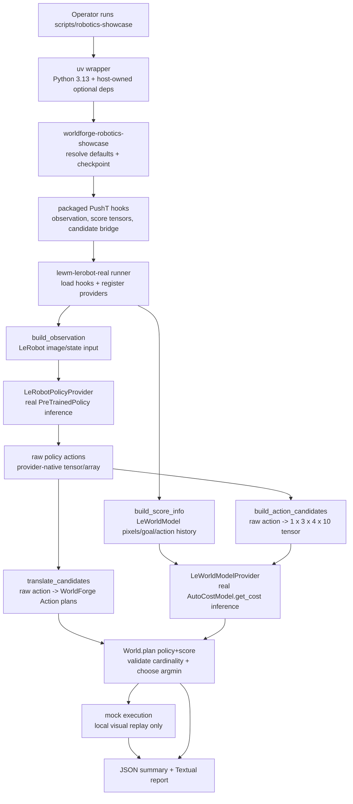
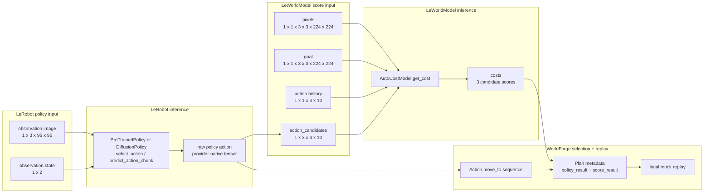
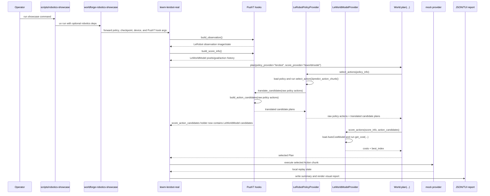

# 机器人案例展示技术深入解析

本页从实现层面阐述真实机器人案例展示的运作方式：每个阶段使用了哪个模型、传入的输入是什么、WorldForge 如何组合策略与打分能力，以及若要应用于真实机器人单元需要做哪些改动。

当宿主运行时已安装时，该案例展示会对策略提供方和打分提供方执行真实的神经网络推断。这不是硬件执行。所选的动作片段通过本地 `mock` 提供方进行回放，使整个运行过程可在无需机器人控制器的情况下得到检视。

## 实际运行内容

经过完善的入口点为：

```bash
scripts/robotics-showcase
```

该包装脚本启动：

```text
uv run --python 3.13 ... worldforge-robotics-showcase
```

并为该进程提供宿主方持有的可选依赖：

| 运行时包 | 加载原因 |
| --- | --- |
| Git 版 `stable-worldmodel` | 提供 `stable_worldmodel.policy.AutoCostModel` 以及 PushT 环境模块。 |
| `datasets>=2.21` | 避免 LeWorldModel 运行时中上游数据集导入的不兼容问题。 |
| `huggingface_hub` | 在构建对象检查点时下载 LeWorldModel 的 `config.json` 和 `weights.pt`。 |
| `hydra-core`, `omegaconf` | 在构建对象检查点时实例化官方 LeWM 配置。 |
| `transformers` | 构建官方 PushT LeWM 配置所引用的 ViT 编码器。 |
| `matplotlib` | 在当前 LeWorldModel 环境中为上游可视化包装器的导入保持可用性。 |
| `lerobot[transformers-dep]==0.5.1` | 提供 LeRobot 策略类以及兼容 Python 3.13 的策略导入路径。 |
| `pygame`, `opencv-python`, `imageio`, `pymunk`, `gymnasium`, `shapely` | 上游 PushT 仿真环境、可视化包装器导入及渲染路径所需。 |
| `textual>=8.2,<9` | 仅在请求可视化报告时添加。 |

这些均非基础包依赖。WorldForge 将它们保留为宿主方持有，以确保 `worldforge-ai` 对于只需要提供方层、CLI、评估、基准测试或 mock 提供方的用户而言始终是一个轻量级框架包。

## 具体默认配置

默认命令为 PushT 规划案例展示：

| 设置 | 默认值 |
| --- | --- |
| 任务 | PushT 桌面操作 |
| 策略提供方 | `lerobot` |
| 打分提供方 | `leworldmodel` |
| 执行提供方 | `mock` |
| LeRobot 策略路径 | `lerobot/diffusion_pusht` |
| LeRobot 策略类型 | `diffusion` |
| LeWorldModel 策略名称 | `pusht/lewm` |
| LeWorldModel 对象检查点 | `~/.stable-wm/pusht/lewm_object.ckpt` |
| 设备 | `cpu`，除非通过 `--device`、`--lerobot-device` 或 `--lewm-device` 覆盖 |
| JSON 摘要 | `/tmp/worldforge-robotics-showcase/real-run.json` |
| Rerun 记录 | 常规 `scripts/robotics-showcase` 运行为 `/tmp/worldforge-robotics-showcase/real-run.rrd` |

经过完善的运行器将默认 PushT 钩子转发给底层运行器：

```text
--observation-module worldforge.smoke.pusht_showcase_inputs:build_observation
--score-info-module worldforge.smoke.pusht_showcase_inputs:build_score_info
--translator worldforge.smoke.pusht_showcase_inputs:translate_candidates
--candidate-builder worldforge.smoke.pusht_showcase_inputs:build_action_candidates
--expected-action-dim 10
--expected-horizon 4
```

## 组件角色

| 组件 | WorldForge 能力 | 确切角色 |
| --- | --- | --- |
| `scripts/robotics-showcase` | 无 | Shell 包装脚本，创建 uv 运行时、过滤噪声较多的第三方原生库和仿真警告，并默认启用 TUI 及 Rerun 记录。运行时设备回退警告仍可见。 |
| `worldforge.smoke.robotics_showcase` | 无 | 经过完善的 CLI 入口点。解析默认值，确保正常运行时检查点存在，保持 `--health-only` 无副作用，转发封装好的 PushT 钩子，并可选择性地启动 Textual 报告。 |
| `worldforge.smoke.lerobot_leworldmodel` | 编排运行器 | 底层可配置运行器。加载任务输入，注册提供方，调用 `World.plan(...)`，执行本地回放，并输出 JSON/报告/Rerun 数据。 |
| `LeRobotPolicyProvider` | `policy` | 加载 LeRobot `PreTrainedPolicy` 或特定策略类，运行 `select_action` 或 `predict_action_chunk`，并返回 `ActionPolicyResult`。 |
| `LeWorldModelProvider` | `score` | 加载 `stable_worldmodel.policy.AutoCostModel`，调用 `get_cost(info, action_candidates)`，并返回 `ActionScoreResult`。 |
| `pusht_showcase_inputs` | 任务桥接 | 构建 PushT 观测张量、LeWorldModel 打分张量、候选动作张量以及可视化 `Action` 转换。 |
| `WorldForge` / `World` | 规划门面 | 通过 `World.plan(..., policy_provider=..., score_provider=...)` 组合 `policy` 和 `score` 能力。 |
| `mock` 提供方 | `predict` | 在本地世界状态中回放所选的可执行 WorldForge 动作片段。 |
| 机器人案例展示 Textual 报告 | 报告界面 | 展示已完成的运行：流水线阶段、延迟、张量契约、得分、提供方事件以及桌面回放。 |
| Rerun 记录 | 工件界面 | 将同一运行存储为可视化 `.rrd`：对象框、候选目标点、所选路径、得分条、延迟条、提供方事件、规划载荷以及世界快照。 |

## 端到端流程概览

案例展示分为三个明确的层次：

1. **宿主运行时与任务桥接**：准备 PushT 专用输入并加载可选的机器人/模型依赖。
2. **真实模型推断**：运行 LeRobot 获取策略动作，运行 LeWorldModel 评估候选动作代价。
3. **WorldForge 编排**：验证契约、组合策略与打分规划、记录事件，并在本地 mock 世界中回放所选动作片段以供检视。



正确理解图示至关重要：`LeRobotPolicyProvider` 和 `LeWorldModelProvider` 是真实的推断阶段，`World.plan(...)` 是框架组合阶段，`mock` 仅是本地回放阶段，并不替代策略模型或打分模型。

## 推断职责矩阵

| 阶段 | 是否运行真实模型推断？ | 输入 | 输出 | 在案例展示中的用途 |
| --- | --- | --- | --- | --- |
| PushT 观测钩子 | 否 | 上游 PushT 环境复位/渲染 | 包含图像和状态的 LeRobot 观测字典 | 构建与任务对齐的策略输入。 |
| LeRobot 策略提供方 | 是（宿主运行时/检查点可用时） | `policy_info["observation"]`、模式、策略路径/类型 | 原始策略动作张量/数组以及转换后的候选动作方案 | 由真实任务策略提出候选动作。 |
| 候选动作桥接 | 否 | LeRobot 原始动作与提供方信息 | 形状为 `1 x 3 x 4 x 10` 的 LeWorldModel 动作候选张量 | 将策略输出转换为打分模型所需的原生候选动作契约。 |
| LeWorldModel 打分提供方 | 是（宿主运行时/检查点可用时） | `pixels`、`goal`、`action` 历史、动作候选 | 每个候选的代价，`best_index = argmin(costs)` | 基于真实 LeWorldModel 检查点评估哪个策略派生候选动作代价最低。 |
| WorldForge 规划器 | 否 | 策略结果、打分结果、类型化目标、候选动作方案 | 包含所选动作片段和元数据的 `Plan` | 组合两个模型能力，验证打分/候选数量匹配，并选取获胜候选。 |
| Mock 回放 | 否 | 所选 WorldForge `Action` 序列 | 本地世界状态更新与可视化坐标 | 使所选片段可在无需机器人控制器的情况下得到检视。 |
| Textual 报告 | 否 | 写入磁盘的同一 JSON 摘要 | 分阶段的可视化报告 | 解释运行内容、传入的张量、返回的得分以及最终选择。 |

案例展示中有意义的机器人工作是策略加打分的组合：LeRobot 从真实策略中提出动作，LeWorldModel 基于真实代价检查点对兼容的候选动作张量打分，WorldForge 选取代价最低的候选，并将原始模型输出保留在运行工件中。

## 模型载荷流

数据路径经过刻意拆分，以确保每个模型接收其被训练或配置为消费的表示形式。



策略的图像/状态张量与打分模型的像素/目标/历史张量不可互换。它们是同一 PushT 场景下各自独立的、任务专属的视图。候选动作桥接正是使原始策略动作能够在 LeWorldModel 代价检查点下进行比较的关键。

## 数据契约

### LeRobot 策略输入

默认 PushT 观测来自 `build_observation()`：

```python
{
    "observation.image": policy_image,
    "observation.state": state,
}
```

这些值由上游 PushT 环境生成：

| 字段 | 默认桥接中的形状 | 含义 |
| --- | --- | --- |
| `observation.image` | `1 x 3 x 96 x 96` | 为 LeRobot 策略调整尺寸的 RGB PushT 帧。 |
| `observation.state` | `1 x 2` | PushT 环境返回的前两个本体感受状态值。 |

底层运行器将其封装为：

```python
policy_info = {
    "observation": {
        "observation.image": policy_image,
        "observation.state": state,
    },
    "mode": "select_action",
    "embodiment_tag": "pusht",
    "score_bridge": {
        "task": "pusht",
        "expected_action_dim": 10,
        "expected_horizon": 4,
        "object_id": "pusht-block",
    },
}
```

`LeRobotPolicyProvider` 验证 `info["observation"]` 是一个键为字符串的非空对象，然后加载策略并调用：

```python
policy.select_action(observation)
```

或在配置时调用：

```python
policy.predict_action_chunk(observation)
```

原始张量保留在 `ActionPolicyResult.raw_actions` 中。WorldForge 本身不将其解释为机器人运动。

### LeWorldModel 打分输入

默认打分张量来自 `build_score_info()`：

```python
{
    "pixels": current_frames,
    "goal": goal_frames,
    "action": action_history,
}
```

封装好的 PushT 桥接从两次确定性 PushT 复位中构建它们：

| 张量 | 默认形状 | 含义 |
| --- | --- | --- |
| `pixels` | `1 x 1 x 3 x 3 x 224 x 224` | 在 LeWorldModel 历史窗口中重复的当前 PushT RGB 帧。 |
| `goal` | `1 x 1 x 3 x 3 x 224 x 224` | 在同一历史窗口中重复的目标 PushT RGB 帧。 |
| `action` | `1 x 1 x 3 x 10` | 3 步历史窗口与 10 维 PushT 动作块的零动作历史。 |

冒烟测试命令通过可安全检出的 `--bridge pusht` 注册表条目解析该桥接。该条目指定了观测工厂、打分信息工厂、转换器、候选动作构建器、预期视野长度、预期打分动作维度以及静态形状摘要。注册表不为其他机器人推断任务张量；宿主引入其他任务时必须提供等效的桥接。

打分提供方还会接收动作候选。默认 `build_action_candidates(...)` 桥接将 LeRobot 原始动作转换为：

```text
batch x samples x horizon x action_dim = 1 x 3 x 4 x 10
```

该转换经过刻意设计：

1. 取 LeRobot 动作的前两个值作为 PushT 的 `x, y`。
2. 将其截断至 `[-1.0, 1.0]`。
3. 构建三个候选：原始向量、半倍缩放和负半倍缩放。
4. 将这两个坐标重复填充到已知的 10 维 PushT 动作块结构中。
5. 在 4 步 LeWorldModel 视野长度上重复该候选块。

这是特定于任务的桥接，并非通用投影。对于其他机器人，宿主必须提供保留模型原生动作维度和视野长度的桥接。

`LeWorldModelProvider` 验证：

- `info` 包含 `pixels`、`goal` 和 `action`；
- 类张量输入为张量或矩形嵌套数值数组；
- 必需的信息张量至少有 3 个维度；
- `action_candidates` 恰好是 4 维：`(batch, samples, horizon, action_dim)`。

然后运行：

```python
model = stable_worldmodel.policy.AutoCostModel(policy, cache_dir=cache_dir)
scores = model.get_cost(tensor_info, action_tensor)
```

返回的得分为代价值。值越低越好，`best_index` 为 argmin。

### 可执行的 WorldForge 动作

LeRobot 返回具身专属的原始动作。WorldForge 需要可执行的 `Action` 对象用于规划输出和本地回放。默认 `translate_candidates(...)` 钩子将每个候选映射为可视化的 `Action.move_to(...)`：

```python
x = 0.5 + raw_x * 0.25
y = 0.5 + raw_y * 0.25
Action.move_to(x, y, 0.0, object_id="pusht-block")
```

该转换仅用于本地可视化和 mock 回放，不是硬件命令、关节空间命令、阻抗命令或控制器消息。

## 端到端执行序列

默认运行遵循如下精确序列。



### 1. Shell 包装脚本创建运行时

`scripts/robotics-showcase` 切换到仓库根目录，并使用上述可选运行时依赖调用 `uv run --python 3.13`。如果请求不是 `--help`、`--json-only`、`--health-only` 或 `--no-tui`，包装脚本会添加 `--tui` 以默认打开 Textual 报告。如果请求不是 `--help`、`--json-only`、`--health-only` 或 `--no-rerun`，包装脚本还会添加 `--rerun`，使运行在 `/tmp/worldforge-robotics-showcase/real-run.rrd` 下留下可视化 `.rrd` 工件。包装脚本不强制使用单独的 Rerun SDK 版本，而是使用 LeRobot 运行时解析的 `rerun-sdk` 版本以避免依赖冲突。

当 Rerun 工件存在时，Textual 报告会显示精确的查看器命令，并将 `o` 绑定为启动快捷键：

```bash
uvx --from "rerun-sdk>=0.24,<0.32" rerun /tmp/worldforge-robotics-showcase/real-run.rrd
```

包装脚本过滤常见的原生库和仿真警告噪声。运行时设备回退警告（例如 LeRobot 从 CUDA 切换到 MPS）仍保持可见，因为它们影响性能和可复现性。设置 `WORLDFORGE_SHOW_RUNTIME_WARNINGS=1` 可查看原始第三方 stderr。

### 2. 经过完善的 CLI 解析默认值

`worldforge-robotics-showcase` 解析：

- LeRobot 策略路径和策略类型；
- LeWorldModel 策略名称；
- 对象检查点路径或缓存根目录；
- 用于自动构建 LeWorldModel 资产的可选 Hugging Face 修订版本；
- 设备设置；
- 状态目录；
- JSON 输出路径；
- TUI 模式和动画时序。

如果未提供 `--checkpoint`，运行器期望：

```text
<stablewm-home>/<lewm-policy>_object.ckpt
```

对于默认策略，即：

```text
~/.stable-wm/pusht/lewm_object.ckpt
```

如果默认检查点缺失，经过完善的运行器会使用 `worldforge.smoke.leworldmodel_checkpoint` 从 Hugging Face 资产构建它。该构建器从 `quentinll/lewm-pusht` 下载固定提交 `22b330c28c27ead4bfd1888615af1340e3fe9052` 的 `config.json`，对照经审计的白名单验证每个 Hydra `_target_` 及已知 PushT ViT 主干参数，下载 `weights.pt`，从净化后的配置实例化上游模型，加载权重，冻结模块，并将对象检查点保存至 `AutoCostModel` 期望的位置。

此自动构建步骤仅在常规案例展示执行时运行。使用 `--health-only` 时，运行器仅报告检查点路径是否存在，并在不下载资产或写入缓存的情况下退出。

如需不同的可复现工件，可传入 `--lewm-revision <40字符提交SHA>` 或设置 `LEWORLDMODEL_REVISION`；同一不可变修订版本将传递给两次 Hugging Face 下载。构建器默认使用 `torch.load(..., weights_only=True)` 加载下载的 `weights.pt`。`--allow-unsafe-pickle` 标志是一个刻意明确的标志，应仅限于可信赖的历史权重或无法执行安全仅权重反序列化的旧版 torch 环境。

### CI 缓存契约

实时机器人工作流为 `.github/workflows/robotics-showcase.yml`。它在每次拉取请求更新和推送到 `main` 时以非交互模式运行同一案例展示路径，使用 `--json-only --no-tui --no-rerun`，然后验证 JSON 证据：

- LeRobot 和 LeWorldModel 提供方健康状态；
- 成功的 `lerobot.policy` 和 `leworldmodel.score` 提供方事件；
- 默认 PushT `1 x 3 x 4 x 10` 动作候选张量契约；
- 三个返回的 LeWorldModel 得分以及一个整数类型的所选候选；
- 通过的 `run_manifest.json`。

检查点缓存分为三个明确目录，以便 CI 可以保留正确的层次：

| 路径 | 内容 | 缓存策略 |
| --- | --- | --- |
| `.cache/huggingface` | LeRobot 策略快照和 Hugging Face 元数据 | `actions/cache`，以 Python、LeRobot 版本和 LeWM 修订版本为键。 |
| `.cache/worldforge/leworldmodel` | 下载的 LeWorldModel `config.json` 和 `weights.pt` 资产 | `actions/cache`，使用相同的不可变修订版本键。 |
| `.cache/stable-wm` | 构建的 `pusht/lewm_object.ckpt`，由 `AutoCostModel` 消费 | `actions/cache`，在每次实时冒烟测试前恢复。 |

运行证据作为保留期较短的普通工作流工件上传。检查点工件不会上传，因为 `actions/cache` 是可复用检查点的正确机制；工件更适合保留附属于某次运行的精确 JSON 证据。

### 3. 运行器转发封装好的 PushT 钩子

经过完善的 CLI 本身不实现机器人循环，而是将一套完整的 PushT 任务钩子转发给 `lewm-lerobot-real`：

```text
observation factory -> build_observation()
score-info factory  -> build_score_info()
translator          -> translate_candidates()
candidate builder   -> build_action_candidates()
```

底层运行器对其他任务可复用，因为这些钩子可以指向宿主方持有的 Python 模块或 JSON/NPZ 工件。

### 4. 提供方被创建并进行健康检查

底层运行器创建：

```python
policy_provider = LeRobotPolicyProvider(
    policy_path=args.policy_path,
    policy_type=args.policy_type,
    device=lerobot_device,
    cache_dir=args.lerobot_cache_dir,
    embodiment_tag=args.embodiment_tag,
    action_translator=action_translator,
    event_handler=provider_events.append,
)

score_provider = LeWorldModelProvider(
    policy=args.lewm_policy,
    cache_dir=str(lewm_cache_dir),
    device=lewm_device,
    event_handler=provider_events.append,
)
```

健康检查在规划前验证运行时可用性：

- LeRobot 必须配置了策略路径或注入的策略，并且能够导入 LeRobot。
- LeWorldModel 必须配置了策略名称，并且能够导入 `torch` 和 `stable_worldmodel.policy.AutoCostModel`。

`--health-only` 在报告这些检查和对象检查点存在标志后停止。

### 5. 任务输入被加载

运行器加载：

- `policy_info`：来自策略信息 JSON 对象、观测 JSON 对象或观测工厂；
- `score_info`：来自 JSON、NPZ 或打分信息工厂；
- 静态动作候选或动态 `candidate_builder`；
- `action_translator`。

封装好的案例展示使用来自 `worldforge.smoke.pusht_showcase_inputs` 的工厂，因此在加载了可选包的同一 uv 运行时内构建全新的 PushT 观测和打分张量集。

### 6. WorldForge 创建规划界面

运行器创建本地 WorldForge 状态目录，禁用远程自动注册，注册两个真实提供方，并创建一个 mock 世界：

```python
forge = WorldForge(state_dir=state_dir, auto_register_remote=False)
forge.register_provider(policy_provider)
forge.register_provider(score_provider)
world = forge.create_world("real-robotics-policy-world-model", provider="mock")
```

添加一个本地场景对象：

```python
SceneObject(
    "pusht-block",
    Position(0.0, 0.5, 0.0),
    BBox(Position(-0.05, 0.45, -0.05), Position(0.05, 0.55, 0.05)),
)
```

结构化目标为：

```python
StructuredGoal.object_at(
    object_id=block.id,
    object_name=block.name,
    position=Position(0.5, 0.5, 0.0),
    tolerance=0.05,
)
```

此世界是回放与可视化状态，不是 PushT 仿真器状态，也不是机器人硬件状态。

### 7. WorldForge 调用策略加打分规划

核心调用为：

```python
plan = world.plan(
    goal=args.goal,
    goal_spec=goal_spec,
    planner="lerobot-leworldmodel-mpc",
    policy_provider="lerobot",
    policy_info=policy_info,
    score_provider="leworldmodel",
    score_info=score_info,
    score_action_candidates=score_action_candidates,
    execution_provider="mock",
)
```

在 `World.plan(...)` 内部，WorldForge 因策略和打分输入均存在而选择 `policy+score` 路径。

规划器首先调用：

```python
policy_result = forge.select_actions("lerobot", info=policy_info)
```

`LeRobotPolicyProvider`：

1. 验证 `policy_info`；
2. 使用 `from_pretrained(...)` 或特定策略类（如 `DiffusionPolicy`）加载 LeRobot 策略；
3. 当运行时支持时，在配置的设备上移动/准备模型；
4. 当 `reset()` 可用时重置策略状态；
5. 在无梯度上下文下运行推断；
6. 保留原始动作和归一化的提供方信息；
7. 调用宿主转换器生成候选 WorldForge 动作序列；
8. 为 `lerobot.policy` 发出 `ProviderEvent`。

动态候选桥接在转换过程中也会调用候选构建器。这会将 LeWorldModel 形状的动作张量填充到 `score_action_candidates` 占位符中，对应同一原始策略输出。

然后 WorldForge 调用：

```python
score_result = forge.score_actions(
    "leworldmodel",
    info=score_info,
    action_candidates=score_payload,
)
```

`LeWorldModelProvider`：

1. 导入 `torch`；
2. 加载 `stable_worldmodel.policy.AutoCostModel`；
3. 将 `pixels`、`goal`、`action` 和 `action_candidates` 张量化并验证；
4. 在无梯度下调用 `model.get_cost(tensor_info, action_tensor)`；
5. 展平有限得分；
6. 选取 `best_index = argmin(scores)`；
7. 为 `leworldmodel.score` 发出 `ProviderEvent`。

WorldForge 验证得分数量与候选动作方案数量匹配，然后选取：

```python
selected_actions = candidate_action_plans[score_result.best_index]
```

规划元数据记录：

- `planning_mode = "policy+score"`；
- `policy_provider = "lerobot"`；
- `score_provider = "leworldmodel"`；
- 序列化的 `policy_result`；
- 序列化的 `score_result`；
- `candidate_count`；
- `execution_provider = "mock"`；
- `success_probability_source`，由分数方向决定。

成功概率只是展示性启发。lower-is-better 成本模型使用：

```python
1.0 / (1.0 + max(0.0, best_score))
```

Higher-is-better utility 模型只有在最佳分数已经位于 `[0, 1]` 时才直接使用该分数。
无界 utility 分数会退回到中性的 `0.5`，避免把原始 utility 伪装成校准概率。

这不是经过校准的任务成功估计值。

### 8. 本地 Mock 回放应用所选片段

除非设置了 `--no-execute`，运行器调用：

```python
execution = world.execute_plan(plan, provider="mock")
```

mock 提供方根据所选的 `Action.move_to(...)` 序列更新本地 `pusht-block` 场景对象。JSON 摘要记录已应用的动作数量、最终本地世界步骤以及最终块位置。

此操作刻意在本地进行。案例展示证明 WorldForge 已选择并能表示一个可执行的动作片段，但不会将该片段发送给机器人控制器。

### 9. 报告和工件被写入

运行器构建包含以下内容的摘要载荷：

- 运行时模式；
- 任务字符串；
- 检查点路径；
- 提供方健康状态；
- 输入形状和近似张量内存；
- 序列化的规划；
- 策略结果；
- 打分结果；
- 打分统计；
- 提供方事件；
- 所选候选可视化坐标；
- 本地 mock 执行结果；
- 计时指标。

经过完善的命令将该 JSON 写入：

```text
/tmp/worldforge-robotics-showcase/real-run.json
```

如果 TUI 模式处于活动状态，`worldforge.harness.cli.launch_robotics_showcase_report(...)` 接收同一摘要并渲染分阶段的可视化报告。

## 序列摘要

```text
scripts/robotics-showcase
  -> uv runtime with optional robotics dependencies
  -> worldforge-robotics-showcase
  -> ensure LeWorldModel object checkpoint exists for normal runs
  -> forward PushT hooks to lewm-lerobot-real
  -> build LeRobot observation
  -> build LeWorldModel score tensors
  -> register LeRobot policy provider
  -> register LeWorldModel score provider
  -> create local mock world and pusht-block
  -> World.plan(policy_provider="lerobot", score_provider="leworldmodel")
      -> LeRobot select_action / predict_action_chunk
      -> translate raw policy actions to WorldForge action candidates
      -> build LeWorldModel action-candidate tensor
      -> AutoCostModel.get_cost(...)
      -> select lowest-cost candidate
  -> mock execute selected action chunk
  -> write JSON summary
  -> render Textual report
```

## 案例展示证明了什么

案例展示证明了：

- WorldForge 能够在一个规划流程中加载并组合真实的 LeRobot 策略提供方与真实的 LeWorldModel 打分提供方。
- 原始策略输出可被保留、转换为可执行的 WorldForge 动作，并桥接为打分模型的候选张量。
- 打分提供方能够对候选动作片段排序并返回类型化的 `ActionScoreResult`。
- 规划器验证打分/候选数量匹配并选取代价最低的候选。
- 提供方事件、健康报告、运行时指标以及序列化工件就同一运行达成一致。
- 所选动作片段可在本地 mock 世界中回放以供检视。

案例展示未证明：

- 硬件安全性；
- 物理执行成功；
- 摄像头标定正确性；
- 机器人控制器集成；
- 任务通用的动作空间转换；
- 经过校准的成功概率；
- 在接触、滑动、遮挡或执行器限制条件下的闭环恢复。

## 映射到真实机器人单元

对于真实机器人，保留相同的策略加打分架构，但将封装好的 PushT 演示钩子和 mock 回放替换为宿主方持有的生产组件。

### 等效的真实世界循环

```text
robot sensors
  -> observation builder
  -> LeRobot policy or another policy provider
  -> raw action candidates
  -> candidate builder for the score model
  -> LeWorldModel or another score provider
  -> WorldForge candidate selection
  -> safety and feasibility filters
  -> robot controller
  -> execution telemetry
  -> next observation
```

### 宿主必须提供的内容

| 层次 | PushT 案例展示默认值 | 真实机器人等效物 |
| --- | --- | --- |
| 观测来源 | 上游 PushT 仿真器渲染和本体感受值 | 校准摄像头帧、机器人状态、夹爪状态、力/力矩数据、任务上下文。 |
| 策略检查点 | `lerobot/diffusion_pusht` | 与机器人具身和传感器模式对齐的任务训练策略。 |
| 策略观测构建器 | `build_observation()` | 产生策略所期望的精确键和张量形状的宿主预处理。 |
| 打分张量 | `build_score_info()` | 产生当前像素、目标表示、动作历史以及任何模型专属上下文的宿主预处理。 |
| 候选构建器 | `build_action_candidates()` | 保留打分模型原生 `(batch, samples, horizon, action_dim)` 契约的任务专属桥接。 |
| 动作转换器 | `translate_candidates()` | 将原始策略输出转换为类型化候选动作或控制器级命令方案。 |
| 执行 | `mock` 提供方 | 经安全门控的机器人控制器、仿真执行器或宿主适配器。 |
| 安全性 | 演示中不涉及 | 工作空间限制、碰撞检测、速度/力限制、互锁、急停、操作员确认。 |
| 反馈 | JSON 摘要和本地世界状态 | 硬件遥测、传感器回放、控制器状态、成功/失败标签、事故日志。 |

### 生产适配规则

1. 保持策略和打分输入与任务对齐。
   LeRobot 策略、LeWorldModel 检查点、观测构建器和候选桥接必须描述相同的具身、动作维度、视野长度和任务语义。

2. 不要在 WorldForge 内部填充或投影不匹配的动作空间。
   如果策略输出 7 自由度末端执行器增量而打分模型期望不同的动作表示，请编写明确的任务桥接或训练兼容工件。

3. 将转换视为机器人代码，而非框架胶水代码。
   转换器是原始模型输出成为候选可执行动作的地方。在真实系统中，它应编码单位、坐标系、工作空间边界、夹爪语义、控制器模式和安全约束。

4. 将安全检查置于选择之后、执行之前。
   WorldForge 可以选择候选。真实机器人系统在命令到达执行器之前仍需可行性检查、碰撞检查、速率限制、力限制、停止条件和操作员策略。

5. 保留原始模型输出。
   在运行工件中保留原始策略张量、打分张量、所选索引、提供方事件和执行遥测。这是调试模型/控制器分歧的审计跟踪。

6. 显式地关闭循环。
   案例展示是单次运行。真实部署通常重复执行"观测 -> 提出 -> 打分 -> 选择 -> 执行 -> 观测"直到目标达成或安全/超时策略停止运行。

## 故障边界

常见故障点及其检查位置：

| 症状 | 可能的边界 | 首个文件或命令 |
| --- | --- | --- |
| `missing optional dependency lerobot` | 宿主运行时 | `scripts/robotics-showcase --health-only` |
| `missing optional dependency torch` 或 `stable_worldmodel` | 宿主运行时 | `scripts/robotics-showcase --health-only` |
| 检查点未找到 | LeWorldModel 工件缓存 | `scripts/robotics-showcase --health-only`，然后 `worldforge-build-leworldmodel-checkpoint` 或 `--checkpoint` |
| torch 不支持 `weights_only=True` | 检查点构建器安全门控 | 升级 torch，或仅对可信权重使用 `--allow-unsafe-pickle` |
| 策略输出无法转换 | 动作转换器 | `--translator module:function` |
| 打分提供方拒绝动作候选 | 候选桥接 | `--candidate-builder module:function` 和 `--expected-action-dim` |
| 得分数量与候选不匹配 | 规划器契约 | `World.plan(...)` 打分/候选验证 |
| 所选动作在可视化上有误 | 任务桥接或转换 | JSON `policy_result`、`score_result` 和 `visualization.candidate_targets` |
| TUI 无法启动 | 可选报告运行时 | `scripts/robotics-showcase --no-tui` 或安装 `harness` 扩展 |

## 相关源文件

- `scripts/robotics-showcase`：uv 运行时包装脚本和警告过滤器。
- `scripts/lewm-lerobot-real`：用于可配置策略加打分运行的底层 uv 包装脚本。
- `src/worldforge/smoke/robotics_showcase.py`：经过完善的 CLI、默认 PushT 转发、检查点准备、TUI 启动。
- `src/worldforge/smoke/lerobot_leworldmodel.py`：底层运行器、输入加载、提供方注册、规划器调用、JSON 摘要。
- `src/worldforge/smoke/pusht_showcase_inputs.py`：封装好的 PushT 观测、打分信息、转换器和候选构建器。
- `src/worldforge/providers/lerobot.py`：LeRobot `policy` 提供方。
- `src/worldforge/providers/leworldmodel.py`：LeWorldModel `score` 提供方。
- `src/worldforge/_world.py`：`World.plan(...)` 策略加打分组合。

## 验证命令

在更改此流程后，使用文档和冒烟测试检查：

```bash
uv run worldforge-robotics-showcase --help
scripts/robotics-showcase --help
uv run python scripts/generate_provider_docs.py --check
uv run mkdocs build --strict
uv run pytest tests/test_robotics_showcase.py tests/test_lerobot_leworldmodel_smoke_script.py
```

在应拥有真实可选运行时的宿主上使用 `scripts/robotics-showcase --health-only`。如果在没有 LeRobot、torch 或检查点缓存的开发笔记本上失败，这是宿主设置问题，而非基础包故障。
