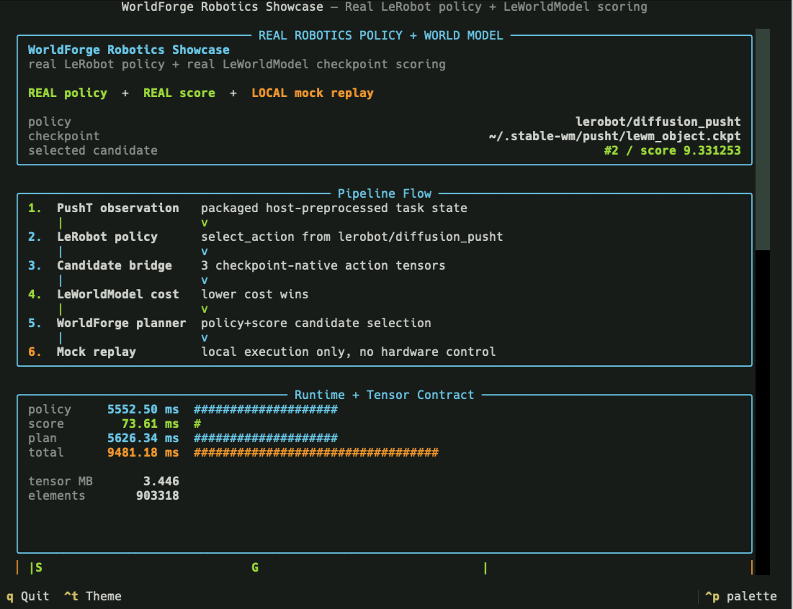
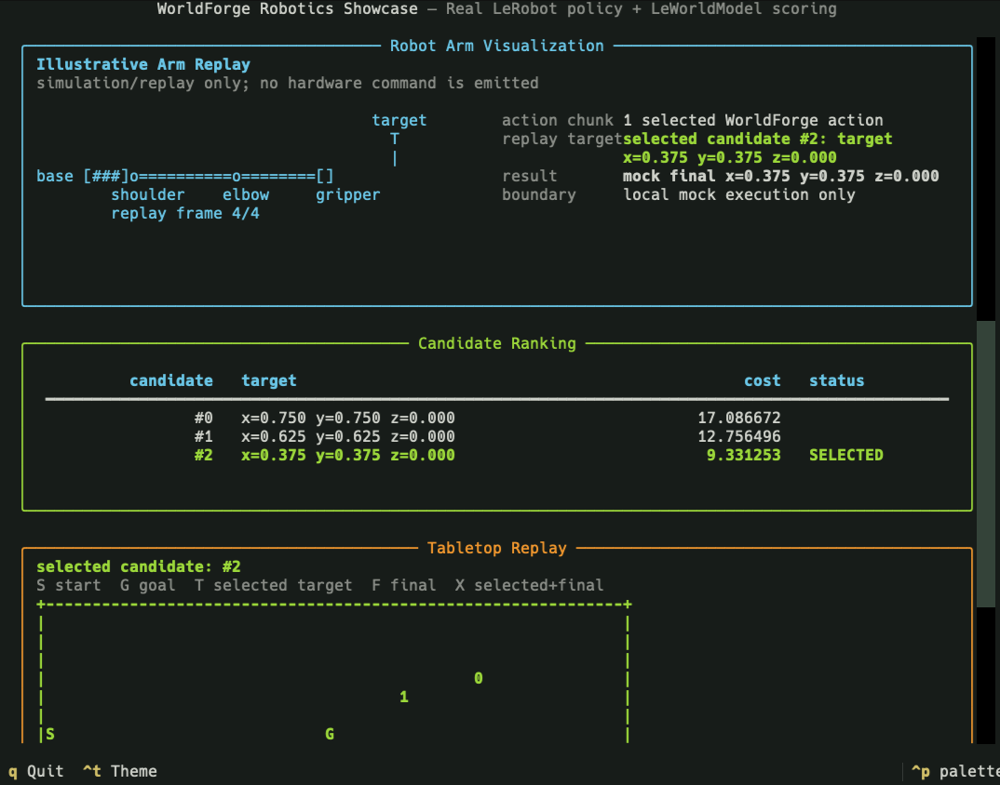

# Robotics Replay Showcase

The real robotics showcase is WorldForge's primary end-to-end physical-AI demo. It combines a
Hugging Face LeRobot policy with a LeWorldModel cost-model checkpoint, then uses WorldForge's
policy-plus-score planner to select and mock-replay the best action chunk.

No hardware is controlled by this command. It demonstrates policy inference, score-model
inference, candidate ranking, provider events, and local replay; robot controllers, safety checks,
and task-specific preprocessing remain host-owned.

The default task is PushT. The default policy is `lerobot/diffusion_pusht`. The default
LeWorldModel checkpoint is `~/.stable-wm/pusht/lewm_object.ckpt`.

For the implementation-level contract, tensor shapes, provider sequence, and real-robot mapping,
see [Robotics Showcase Technical Deep Dive](./robotics-showcase-deep-dive.md).

<div align="center">
<table>
  <tr>
    <td width="50%">
      
      <br />
      <sub><strong>Pipeline:</strong> real LeRobot policy, real LeWorldModel checkpoint scoring, WorldForge planning, local mock replay.</sub>
    </td>
    <td width="50%">
      
      <br />
      <sub><strong>Decision:</strong> selected candidate, cost landscape, provider events, and tabletop replay.</sub>
    </td>
  </tr>
</table>
</div>

## Run It

Use the one-command showcase entrypoint:

```bash
scripts/robotics-showcase
```

By default, the script:

- launches an ephemeral Python 3.13 `uv` runtime with host-owned optional dependencies;
- requests `lerobot[transformers-dep]==0.5.1` so the Python 3.13 policy import path is stable
  while the LeWorldModel runtime is also installed;
- runs real LeRobot policy inference and real LeWorldModel checkpoint scoring;
- opens a staged Textual report with the pipeline trace, metric bars, tensor contract, candidate
  ranking, provider event log, robot-arm illustration, tabletop replay, and Rerun open shortcut;
- writes a JSON summary to `/tmp/worldforge-robotics-showcase/real-run.json`;
- writes a visual Rerun recording to `/tmp/worldforge-robotics-showcase/real-run.rrd`.

Useful flags:

```bash
scripts/robotics-showcase --health-only       # non-mutating dependency/checkpoint preflight
scripts/robotics-showcase --no-tui            # plain terminal report
scripts/robotics-showcase --json-only         # machine-readable summary only
scripts/robotics-showcase --no-rerun          # skip the default Rerun .rrd artifact
scripts/robotics-showcase --rerun-output /tmp/pusht.rrd
scripts/robotics-showcase --tui-stage-delay 0.1
scripts/robotics-showcase --no-tui-animation
scripts/robotics-showcase --lewm-revision 22b330c28c27ead4bfd1888615af1340e3fe9052
```

Open the Rerun artifact from the TUI with `o`, or from the shell with:

```bash
uvx --from "rerun-sdk>=0.24,<0.32" rerun /tmp/worldforge-robotics-showcase/real-run.rrd
```

## What It Demonstrates

The showcase exercises the composition WorldForge is designed for:

```text
PushT observation
  -> LeRobot policy checkpoint
  -> policy action candidates
  -> WorldForge candidate bridge
  -> LeWorldModel candidate tensors
  -> LeWorldModel cost-model scoring
  -> WorldForge policy+score planner
  -> local mock replay
  -> visual report and JSON artifact
```

The core planner call is:

```python
world.plan(
    policy_provider="lerobot",
    score_provider="leworldmodel",
    planning_mode="policy+score",
    ...
)
```

LeRobot is treated as a `policy` provider. LeWorldModel is treated as a `score` provider. The
planner uses the policy output as candidate action chunks, asks the score provider to rank those
candidates, selects the lowest-cost chunk, and applies the selected executable action to the local
mock world.

## Reading The Report Panels

The Textual report is meant to be read as a short evidence trail, not as a generic dashboard:

| Pane | How to read it | What it means |
| --- | --- | --- |
| Runtime bars | `policy`, `score`, `plan`, and `total` are wall-clock milliseconds from the completed run. | `policy` is the LeRobot checkpoint call, `score` is the LeWorldModel cost call, `plan` is WorldForge orchestration, and `total` includes the surrounding showcase flow. |
| Tensor contract | `tensor MB` and `elements` describe the preprocessed score tensors handed to LeWorldModel. | These numbers explain runtime shape and size. They are not task success, physical fidelity, or model quality scores. |
| Candidate ranking | Lower cost is better. The `SELECTED` row is the candidate WorldForge mock-replays. | The selected row should match `best_index`, the provider event log, and the tabletop replay's selected/final marker. |

Use the panes together. A coherent run should have healthy provider events, a candidate count that
matches the score count, one selected candidate, and a tabletop replay whose selected marker agrees
with the selected row. If those disagree, inspect the action translator, candidate bridge, score
tensors, or task preprocessing before trusting the visualization.

## Reading The Tabletop Replay

The tabletop replay is a small top-down map of the PushT workspace. Read it like a view from the
ceiling: left/right is the normalized `x` axis, and vertical position is the task's tabletop plane.
It is not a full physics trace or a hardware camera feed. It is a compact map of the start, goal,
candidate targets, selected target, and final mock replay state.

Example output:

```text
Tabletop replay
---------------
  legend: S=start, G=goal, T=selected target, F=mock final, X=selected+final
  selected candidate: #2
  +------------------------------------------+
  |                                          |
  |                                          |
  |                                          |
  |                               0          |
  |                          1               |
  |                                          |
  |S                   G                     |
  |                                          |
  |               X                          |
  |                                          |
  |                                          |
  |                                          |
  |                                          |
  +------------------------------------------+
  x=0.00             x=0.50             x=1.00
```

Plain-language interpretation:

- `S` is where the block starts in the local replay.
- `G` is the desired goal region.
- `0` and `1` are alternative action candidates proposed by the LeRobot policy and scored by
  LeWorldModel.
- `selected candidate: #2` means the planner chose candidate `#2` as the lowest-cost candidate.
- `X` means the selected target and the mock final state landed on the same rendered cell. In this
  example, candidate `#2` is not printed as a separate `2` because the map collapses "selected
  target" and "final replay position" into `X`.
- `x=0.00`, `x=0.50`, and `x=1.00` mark the left, middle, and right sides of the normalized table.

The mental model is simple: imagine the policy saying, "Here are a few places I could try to push
the object." Those possible targets appear as candidate marks. Then the world model says, "This one
looks cheapest or most promising for the goal." WorldForge chooses that candidate, translates it
into an executable local action, and runs a mock replay. The map shows the decision result: which
candidate won and where the local replay ended.

The replay is useful because it makes the policy-plus-score loop visible at a glance. If the chosen
candidate is near the goal and the final mark overlaps it, the local plan is coherent for this
toy replay. If the selected mark is far from the goal, or the final mark diverges from the selected
target, that is a signal to inspect the candidate bridge, score tensors, action translator, or task
preprocessing.

## Step By Step

1. Resolve runtime settings.
   The script chooses the LeRobot policy path, LeWorldModel policy name, checkpoint path, device,
   cache directory, and PushT bridge defaults.

2. Preflight optional dependencies.
   LeRobot, `stable_worldmodel`, torch, datasets, PushT simulation packages, and Textual are loaded
   from the host-owned `uv` runtime. They are not WorldForge base dependencies.

3. Build the task observation and score tensors.
   `worldforge.smoke.pusht_showcase_inputs` provides the packaged PushT observation, LeWorldModel
   score-info tensors, action translator, and candidate-builder hook used by the default demo.

4. Run the LeRobot policy.
   `LeRobotPolicyProvider` loads `PreTrainedPolicy`, calls the configured policy mode, and preserves
   raw policy output together with provider event metadata.

5. Bridge policy actions into candidate tensors.
   The packaged PushT bridge converts policy candidates into LeWorldModel-shaped action-candidate
   tensors. WorldForge validates the provider boundary but does not infer task-specific image
   transforms or project mismatched action spaces.

6. Score candidates with LeWorldModel.
   `LeWorldModelProvider` calls `stable_worldmodel.policy.AutoCostModel` and returns ranked
   candidate costs through WorldForge's `score` surface.

7. Select and replay the plan.
   WorldForge chooses the best candidate from the policy-plus-score plan and applies the translated
   action chunk to the local mock world. This replay is a local visualization and state update, not
   hardware execution.

8. Render the report.
   The showcase displays the pipeline, runtime metrics, tensor sizes, candidate cost landscape,
   selected plan, provider events, and tabletop replay in a Textual report. The same data is saved
   as JSON for automation and regression checks.

## What Is Real And What Is Local

| Surface | Runtime | Boundary |
| --- | --- | --- |
| LeRobot policy | Real host-owned LeRobot checkpoint | Produces task-specific raw policy actions. |
| LeWorldModel score | Real host-owned LeWorldModel object checkpoint | Scores preprocessed pixels, goals, history, and candidate tensors. |
| PushT bridge | Packaged WorldForge demo hook | Supplies the default observation, score-info tensors, translator, and candidate builder. |
| WorldForge planner | In-repo typed orchestration | Composes `policy` and `score` providers, validates counts, selects the best action chunk. |
| Execution | Local mock world replay | Updates a local scene for visualization only. |
| Robot hardware | Host-owned | Controllers, safety checks, calibration, and physical execution are outside this demo. |

This distinction is intentional. The showcase proves real policy inference, real score-model
inference, and WorldForge's planning composition. It does not claim physical safety, hardware
readiness, or task-general preprocessing.

## Artifacts And Metrics

The JSON summary includes:

- selected candidate index and candidate scores;
- LeRobot policy latency, LeWorldModel scoring latency, planning latency, and total latency;
- tensor shapes and approximate tensor memory;
- provider event log entries;
- selected action count and final mock-world state.

Default artifact path:

```text
/tmp/worldforge-robotics-showcase/real-run.json
/tmp/worldforge-robotics-showcase/run_manifest.json
```

Use `--json-output <path>` on the lower-level runner when you need to preserve a specific artifact
location. Use `--run-manifest <path>` to place the evidence manifest beside the summary in another
directory. The manifest links the policy, score, replay, and report evidence back to the preserved
summary JSON and state directory without embedding checkpoint bytes, raw policy inputs, or
credentials.

## Customizing The Showcase

The packaged `scripts/robotics-showcase` command is the polished PushT entrypoint. For another task,
use the lower-level configurable runner:

```bash
scripts/lewm-lerobot-real \
  --policy-path lerobot/diffusion_pusht \
  --policy-type diffusion \
  --checkpoint ~/.stable-wm/pusht/lewm_object.ckpt \
  --device cpu \
  --mode select_action \
  --observation-module /path/to/task_inputs.py:build_observation \
  --score-info-npz /path/to/lewm_score_tensors.npz \
  --translator /path/to/task_bridge.py:translate_candidates \
  --candidate-builder /path/to/task_bridge.py:build_action_candidates
```

For non-PushT tasks, the host must provide:

- a task-aligned LeRobot policy and observation builder;
- LeWorldModel-compatible `pixels`, `goal`, `action_history`, and `action_candidates` tensors;
- an action translator that converts raw policy actions into executable WorldForge `Action`
  objects;
- a candidate builder that preserves the model's expected action dimension and horizon.

When the default LeWorldModel object checkpoint is missing, the polished command can build it from
Hugging Face assets. By default it uses the pinned Hugging Face commit
`22b330c28c27ead4bfd1888615af1340e3fe9052`; use
`--lewm-revision <40-char-commit-sha>` or `LEWORLDMODEL_REVISION` for a different audited immutable
asset revision. The builder validates the downloaded Hydra config against the official PushT LeWM
target and parameter allowlist before instantiating the model or downloading weights. It then loads
`weights.pt` with `torch.load(..., weights_only=True)` by default; the `--allow-unsafe-pickle` flag
is an explicit trusted-artifact escape hatch for legacy weights. This auto-build path is skipped
for `--health-only`, which only reports whether the checkpoint is present.

WorldForge fails instead of padding, projecting, or silently reinterpreting mismatched action
spaces.

## Source Map

- [`src/worldforge/smoke/robotics_showcase.py`](https://github.com/AbdelStark/worldforge/blob/main/src/worldforge/smoke/robotics_showcase.py)
  implements the polished report entrypoint.
- [`src/worldforge/smoke/lerobot_leworldmodel.py`](https://github.com/AbdelStark/worldforge/blob/main/src/worldforge/smoke/lerobot_leworldmodel.py)
  implements the lower-level real policy-plus-score runner.
- [`src/worldforge/smoke/pusht_showcase_inputs.py`](https://github.com/AbdelStark/worldforge/blob/main/src/worldforge/smoke/pusht_showcase_inputs.py)
  contains the packaged PushT observation, score-info, translator, and candidate bridge.
- [`src/worldforge/providers/lerobot.py`](https://github.com/AbdelStark/worldforge/blob/main/src/worldforge/providers/lerobot.py) implements the
  LeRobot policy provider.
- [`src/worldforge/providers/leworldmodel.py`](https://github.com/AbdelStark/worldforge/blob/main/src/worldforge/providers/leworldmodel.py)
  implements the LeWorldModel score provider.
- [`src/worldforge/framework.py`](https://github.com/AbdelStark/worldforge/blob/main/src/worldforge/framework.py) contains the policy-plus-score
  planning path.

Related docs:

- [Robotics Showcase Technical Deep Dive](./robotics-showcase-deep-dive.md)
- [LeRobot provider](./providers/lerobot.md)
- [LeWorldModel provider](./providers/leworldmodel.md)
- [TheWorldHarness](./theworldharness.md)
- [Optional runtime playbooks](./playbooks.md#8-run-optional-runtime-smokes)

External references:

- [Hugging Face LeRobot](https://github.com/huggingface/lerobot)
- [LeRobot policy documentation](https://huggingface.co/docs/lerobot/bring_your_own_policies)
- [LeRobot PushT diffusion policy](https://huggingface.co/lerobot/diffusion_pusht)
- [LeWorldModel paper](https://arxiv.org/abs/2603.19312)
- [LeWorldModel project page](https://le-wm.github.io/)
- [LeWorldModel code](https://github.com/lucas-maes/le-wm)
