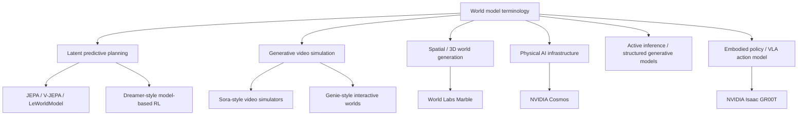
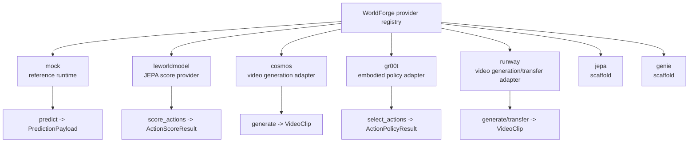

# World Model Taxonomy

"World model" is an overloaded term. In current AI discourse it can mean a learned dynamics model,
a video generator, a robot policy, a 3D scene generator, a simulation platform, or a cognitive
architecture. Those systems overlap, but they are not interchangeable.

WorldForge uses a narrower operational definition:

```text
A world model is an action-conditioned predictive model that helps a caller evaluate, rank, or
roll out possible futures from observations, state, actions, and goals.
```

That definition is closer to Yann LeCun's JEPA-oriented planning view than to the broad colloquial
usage of "any model that emits a world-like artifact." WorldForge can still integrate video
generators and simulation APIs, but the architecture is centered on planning surfaces: candidate
actions, predicted or latent future states, costs, scores, uncertainty, and explicit provider
capabilities.

## One Term, Many Systems

Text diagram:

```text
                           "world model"
                                  |
          +-----------------------+-----------------------+
          |                       |                       |
  planning model           world generator         world infrastructure
          |                       |                       |
  predicts/ranks futures   emits pixels/3D scenes  creates data, tokens,
  for action selection     or interactive worlds   simulation, eval tooling
```

WorldForge cares most about the left branch, supports the middle branch as provider artifacts, and
expects the right branch to be integrated through adapters rather than absorbed into the core.

Mermaid view:



## WorldForge's Center of Gravity

WorldForge is built around this loop:

```text
observe state
  -> propose candidate action sequences
  -> score or roll out futures
  -> choose the best candidate
  -> execute the first action or selected action sequence
  -> observe again
```

This is the model-predictive-control shape described in LeCun's architecture proposal: an actor
proposes actions, a world model predicts future state representations, costs evaluate candidate
futures, and the loop repeats after acting. In that proposal, JEPA-style models learn abstractions
that make prediction feasible by avoiding unnecessary pixel-level detail.

WorldForge's corresponding runtime shape is:

```text
World state / observation tensors
  |
  |-- candidate_actions            # public WorldForge Action sequences
  |-- score_action_candidates      # optional model-native tensor candidates
  |-- score_info                   # model-native observation/action/goal context
  v
provider.score_actions(...)
  |
  v
ActionScoreResult(scores, best_index)
  |
  v
Plan(actions=candidate_actions[best_index])
  |
  v
execute through a provider that supports predict(...)
```

LeWorldModel is the first-class provider for this design because it is a JEPA-based world model
that plans in latent space from pixels, exposes a cost surface, and naturally fits the
`score_actions(...) -> ActionScoreResult.best_index` contract. It should shape WorldForge's
provider architecture more than generic video-generation providers do.

## Taxonomy

| Category | Main question | Representation | Typical output | WorldForge stance |
| --- | --- | --- | --- | --- |
| Explicit simulation | What happens under known physics and geometry? | Equations, meshes, contacts, engines | State rollouts, sensor renders | Adapter target, not core runtime |
| Model-based RL latent dynamics | Can an agent learn inside imagined futures? | Compact latent state | Rollouts, values, policies | Fits `predict`, `score`, and evaluation |
| JEPA latent predictive world models | Which action makes the latent future match a goal or low cost? | Learned embeddings | Scores, costs, latent rollouts | Architectural center |
| Generative video simulators | Can a model synthesize plausible future pixels or interactive frames? | Pixels, latents, video tokens | Video clips, interactive frames | Fits `generate`, `transfer`, maybe future `predict` |
| Spatial / 3D world models | What persistent 3D world can be reconstructed or generated? | Geometry, depth, radiance, assets | 3D scenes, meshes, camera paths | Future provider family |
| Physical AI infrastructure | How are data, tokenizers, fine-tunes, and evaluation produced at scale? | Runtime/tooling stack | Models, synthetic data, APIs | Provider adapters |
| Embodied policy / VLA action models | What action chunk should a robot execute from this observation and instruction? | Vision-language-action policy state | Robot action chunks | First-class actor provider family |
| Active inference / structured generative models | How should beliefs, objects, uncertainty, and action be updated online? | Probabilistic structured state | Beliefs, policies, expected free energy | Conceptual influence, future adapter target |

## Category Notes

### JEPA and LeCun-style Planning

JEPA predicts in representation space rather than reconstructing every future pixel. The point is
not just compression. It is to let the model ignore unpredictable details while retaining task-
relevant structure for prediction and planning.

In LeCun's architecture proposal, this becomes a broader cognitive architecture:

```text
perception -> encoder -> world-state representation
                          |
actor proposes actions -> world model predicts futures
                          |
cost / critic scores predicted futures
                          |
planner selects low-cost action sequence
                          |
act, observe, store, repeat
```

That is the WorldForge north star. The library should make it easy to plug in a model that can
rank futures, compare providers, evaluate failures, and keep the host in control of execution and
persistence.

### LeWorldModel

LeWorldModel is a concrete JEPA implementation authored by Lucas Maes, Quentin Le Lidec, Damien
Scieur, Yann LeCun, and Randall Balestriero. The project describes LeWM as an end-to-end JEPA from
raw pixels with two loss terms: a next-embedding prediction loss and a Gaussian latent regularizer.
Its public description emphasizes pixel-to-latent prediction, cost-based planning, and efficient
candidate evaluation.

For WorldForge this means:

- LeWM is not modeled as a text reasoner.
- LeWM is not modeled as a video generator.
- LeWM is modeled as a local score provider.
- Hosts own task preprocessing from sensor data into checkpoint-shaped tensors.
- WorldForge owns provider registration, score result validation, plan selection, plan metadata,
  observability, and execution handoff.

### V-JEPA 2 and jepa-wms

Meta's V-JEPA 2 work shows the same family of ideas at larger scale: self-supervised video
pretraining, then action-conditioned post-training for robotic planning with image goals. The
`facebookresearch/jepa-wms` repository is directly relevant to future WorldForge provider work
because it contains code, data, weights, training loops, shared planning components, and simulation
planning evaluations for joint-embedding predictive world models.

WorldForge's `jepa` provider is a scaffold. A real JEPA provider should follow the
LeWorldModel pattern: do not advertise generation or reasoning unless implemented; expose score,
latent rollout, or prediction capabilities explicitly; document tensor shapes and task contracts.
WorldForge also carries a [`jepa-wms` provider candidate scaffold](./providers/jepa-wms.md) with
fake-runtime and host-owned torch-hub contract tests for future work against
`facebookresearch/jepa-wms`; it is intentionally not exported or registered.

### Dreamer-style Model-Based RL

Dreamer-style agents learn a latent dynamics model from observations and improve behavior by
imagining future scenarios. This lineage fits WorldForge conceptually because it treats the world
model as a control component, not just an artifact generator. A Dreamer provider could expose
`predict`, `score`, or a future policy-selection capability depending on how much of the agent loop
is exported.

### Generative Video Simulators

Sora-style and Genie-style systems use video generation to simulate physical or digital worlds.
OpenAI explicitly frames Sora as a step toward simulators of physical and digital worlds while also
documenting simulator limitations. Google DeepMind describes Genie 3 as a real-time interactive
world model that generates controllable worlds from text.

These systems are valuable, but they are not the same interface as LeWorldModel:

```text
video simulator:
  prompt + frame/action context -> pixels or frames

latent planner:
  observation + goal + action candidates -> costs or future latent states
```

WorldForge can use video models for data synthesis, transfer, evaluation, red teaming, and
eventual predictive planning. It should not treat "generated plausible video" as proof that a
provider exposes controllable planning semantics.

### Spatial Intelligence and 3D World Models

World Labs' Marble is a good example of the spatial-intelligence meaning of world model: generate
or reconstruct persistent 3D worlds from text, images, video, or 3D structure. This is close to
scene creation and spatial memory. It is important for robotics and simulation, but its primary
contract is a persistent spatial artifact rather than an action-conditioned planning cost.

A future WorldForge spatial provider might expose:

- scene import/export
- camera-path generation
- geometry validation
- collision or affordance metadata
- synthetic observation generation for planners

### Physical AI Infrastructure

NVIDIA Cosmos is best understood as physical-AI infrastructure: world foundation models, tokenizers,
guardrails, video processing, synthetic data generation, fine-tuning, and deployment routes. It can
feed world-model workflows, but it is not a single narrow model contract.

WorldForge should integrate upstream pieces through explicit provider capabilities:

- `generate` for video synthesis
- `transfer` for video-to-video transformation
- future data-curation or tokenizer adapters if they become library scope
- future evaluation adapters if upstream APIs expose stable contracts

### Embodied Policy / VLA Action Models

NVIDIA Isaac GR00T is best classified as an embodied policy rather than a world model under the
WorldForge planning definition. Its policy API accepts multimodal observations such as video,
state, and language, then returns future action chunks for a robot embodiment. That is an actor
surface:

```text
observation + language instruction -> action chunk
```

It is not a future-state transition model:

```text
state + action -> predicted next state
```

and it is not a JEPA-style candidate scorer:

```text
observation + goal + candidate actions -> action costs
```

WorldForge therefore models GR00T as a `policy` provider. This makes it useful in the control loop
without overstating what it can prove about future physical state:

```text
GR00T proposes actions
  -> LeWorldModel / JEPA-WMS scores or filters candidates
  -> WorldForge selects a plan
  -> a host-owned controller, simulator, or predict provider executes
  -> the host observes again
```

### Active Inference

Active inference uses structured generative models, beliefs, and expected free energy rather than
the usual reward-maximization framing. It is not implemented in WorldForge, but it
matters because it keeps the architecture honest about uncertainty, beliefs, object structure, and
online replanning. A future provider in this family should expose beliefs and uncertainty as typed
outputs rather than hiding them inside generic scores.

## Provider Taxonomy in WorldForge

```text
mock
  deterministic local surrogate
  useful for contracts, examples, and tests

leworldmodel
  JEPA latent cost model
  score provider
  first-class architectural reference

cosmos
  remote physical-AI video foundation model adapter
  generation provider
  useful for synthetic video and physical-AI artifacts

gr00t
  host-owned embodied policy client adapter
  policy provider
  useful as an actor that proposes robot action chunks

runway
  remote video generation and transfer adapter
  generation/transfer provider
  useful for artifact workflows

jepa
  scaffold
  future home for real JEPA provider work

genie
  scaffold
  future home for real interactive simulator provider work
```

Mermaid:



## Design Rules for New Providers

Use the full [Provider Authoring Guide](./provider-authoring-guide.md) when turning these rules
into a new adapter PR.

1. Declare capabilities narrowly.
2. Document the provider's actual meaning of "world model."
3. Validate input shape, range, content type, and task-specific limits at the adapter boundary.
4. Return typed outputs that preserve score direction, uncertainty, model name, and provider
   metadata.
5. Do not hide task preprocessing inside vague dictionaries when the contract can be named.
6. Add fixture-driven tests for malformed payloads, missing artifacts, partial outputs, and
   provider-specific limits.
7. Keep host-owned concerns host-owned: secrets, locks, databases, long-running orchestration,
   production metrics, and real robot safety interlocks.

## Sources

Primary sources used to shape this taxonomy:

- [Yann LeCun, A Path Towards Autonomous Machine Intelligence](https://openreview.net/pdf/315d43ba26f55357a84cec9a7ed15a6610094f79.pdf)
- [LeWorldModel project page](https://le-wm.github.io/)
- [LeWorldModel paper](https://arxiv.org/abs/2603.19312)
- [LeWorldModel code](https://github.com/lucas-maes/le-wm)
- [V-JEPA 2 paper](https://arxiv.org/abs/2506.09985)
- [Meta announcement for V-JEPA 2](https://about.fb.com/news/2025/06/our-new-model-helps-ai-think-before-it-acts/)
- [facebookresearch/jepa-wms](https://github.com/facebookresearch/jepa-wms)
- [Ha and Schmidhuber, World Models](https://arxiv.org/abs/1803.10122)
- [Dreamer introduction](https://research.google/blog/introducing-dreamer-scalable-reinforcement-learning-using-world-models/)
- [DreamerV3 paper](https://arxiv.org/abs/2301.04104)
- [OpenAI, Video generation models as world simulators](https://openai.com/index/video-generation-models-as-world-simulators/)
- [Google DeepMind Genie 3](https://deepmind.google/models/genie/)
- [NVIDIA Isaac GR00T](https://github.com/NVIDIA/Isaac-GR00T)
- [World Labs Marble documentation](https://docs.worldlabs.ai/)
