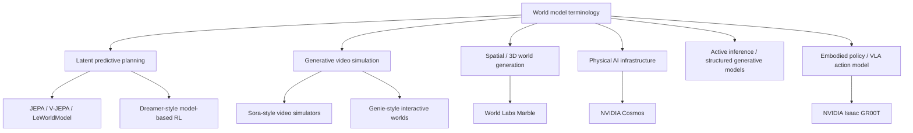
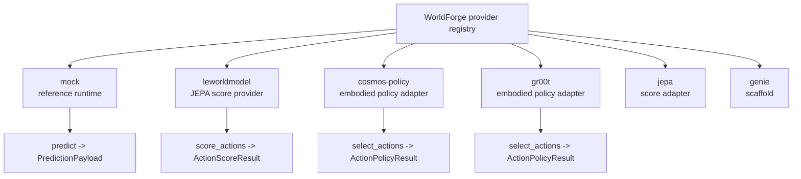

# 世界模型分类法

"世界模型"是一个含义重载的术语。在当前的 AI 讨论中，它可以指学习到的动力学模型、视频生成器、机器人策略、3D 场景生成器、仿真平台或认知架构。这些系统存在交叉，但它们并不可以互换。

WorldForge 使用一个更窄的操作性定义：

```text
世界模型是一种以动作为条件的预测模型，帮助调用方根据观测、状态、动作和目标，
对可能的未来进行评估、排序或展开推演。
```

这个定义更接近 Yann LeCun 以 JEPA 为导向的规划视角，而非泛化的通俗用法——即"任何能生成类世界工件的模型"。WorldForge 仍然可以集成视频生成器和仿真 API，但其架构以规划接口为中心：候选动作、预测或隐式的未来状态、代价、分数、不确定性以及显式的提供方能力。

## 同一术语，众多系统

文本图示：

```text
                           "world model"
                                  |
          +-----------------------+-----------------------+
          |                       |                       |
  planning model           world generator         world infrastructure
          |                       |                       |
  predicts/ranks futures   emits pixels/3D scenes  creates data, tokens,
  for action selection     or interactive worlds   simulation, eval tooling
```

WorldForge 最关注左侧分支，将中间分支作为提供方工件加以支持，并期望通过适配器而非吸收进核心的方式集成右侧分支。

Mermaid 视图：



## WorldForge 的核心重心

WorldForge 围绕以下循环构建：

```text
观测状态
  -> 提出候选动作序列
  -> 对未来进行打分或展开推演
  -> 选择最优候选项
  -> 执行第一个动作或所选动作序列
  -> 再次观测
```

这是 LeCun 架构提案中描述的模型预测控制形式：动作者提出动作，世界模型预测未来状态表示，代价函数评估候选未来，循环在执行动作后重复进行。在该提案中，JEPA 风格的模型通过避免不必要的像素级细节来学习抽象表示，从而使预测变得可行。

WorldForge 对应的运行时形式为：

```text
世界状态 / 观测张量
  |
  |-- candidate_actions            # 公共 WorldForge Action 序列
  |-- score_action_candidates      # 可选的模型原生张量候选项
  |-- score_info                   # 模型原生的观测/动作/目标上下文
  v
provider.score_actions(...)
  |
  v
ActionScoreResult(scores, best_index)
  |
  v
Plan(actions=candidate_actions[best_index])
  |
  v
通过支持 predict(...) 的提供方执行
```

LeWorldModel 是该设计的第一等级提供方，因为它是一个基于 JEPA 的世界模型，在隐空间中从像素进行规划，暴露代价接口，并自然契合 `score_actions(...) -> ActionScoreResult.best_index` 契约。它对 WorldForge 提供方架构的影响应当超过通用视频生成提供方。

## 分类法

| 类别 | 核心问题 | 表示形式 | 典型输出 | WorldForge 立场 |
| --- | --- | --- | --- | --- |
| 显式仿真 | 在已知物理和几何条件下会发生什么？ | 方程、网格、接触、引擎 | 状态展开、传感器渲染 | 适配器目标，非核心运行时 |
| 基于模型的 RL 隐动力学 | 智能体能否在想象的未来中学习？ | 紧凑隐状态 | 展开序列、价值、策略 | 适合 `predict`、`score` 及评估 |
| JEPA 隐预测世界模型 | 哪个动作能使隐式未来匹配目标或实现低代价？ | 学习到的嵌入 | 分数、代价、隐式展开 | 架构核心 |
| 生成式视频仿真器 | 模型能否合成可信的未来像素或交互式帧？ | 像素、隐变量、视频 token | 视频片段、交互式帧 | 不在当前提供方表面内 |
| 空间 / 3D 世界模型 | 能否重建或生成持久的 3D 世界？ | 几何、深度、辐射场、资产 | 3D 场景、网格、相机路径 | 未来的提供方家族 |
| 物理 AI 基础设施 | 如何大规模生产数据、分词器、微调和评估？ | 运行时/工具栈 | 模型、合成数据、API | 提供方适配器 |
| 具身策略 / VLA 动作模型 | 机器人应根据当前观测和指令执行哪个动作块？ | 视觉-语言-动作策略状态 | 机器人动作块 | 第一等级的动作者提供方家族 |
| 主动推断 / 结构化生成模型 | 如何在线更新信念、对象、不确定性和动作？ | 概率结构化状态 | 信念、策略、期望自由能 | 概念性影响，未来的适配器目标 |

## 类别说明

### JEPA 与 LeCun 式规划

JEPA 在表示空间中进行预测，而非重建每一个未来像素。其意义不仅仅是压缩。关键在于让模型在忽略不可预测细节的同时，保留与任务相关的结构，以用于预测和规划。

在 LeCun 的架构提案中，这演变为一种更广泛的认知架构：

```text
感知 -> 编码器 -> 世界状态表示
                    |
动作者提出动作 -> 世界模型预测未来
                    |
代价/评价器对预测未来打分
                    |
规划器选择低代价动作序列
                    |
行动、观测、存储、重复
```

这是 WorldForge 的北极星。该库应使插入能够排序未来、比较提供方、评估失败，并让宿主方掌控执行和持久化的模型变得容易。

### LeWorldModel

LeWorldModel 是由 Lucas Maes、Quentin Le Lidec、Damien Scieur、Yann LeCun 和 Randall Balestriero 共同撰写的具体 JEPA 实现。该项目将 LeWM 描述为一个从原始像素端到端训练的 JEPA，具有两个损失项：下一嵌入预测损失和高斯隐式正则化器。其公开描述强调像素到隐空间的预测、基于代价的规划和高效的候选评估。

对于 WorldForge，这意味着：

- LeWM 不被建模为文本推理器。
- LeWM 不被建模为视频生成器。
- LeWM 被建模为本地打分提供方。
- 宿主方负责从传感器数据到检查点形状张量的任务预处理。
- WorldForge 负责提供方注册、打分结果验证、计划选择、计划元数据、可观测性和执行交接。

### V-JEPA 2 与 jepa-wms

Meta 的 V-JEPA 2 工作在更大规模上展示了同一系列想法：自监督视频预训练，然后以动作为条件的后训练用于具有图像目标的机器人规划。`facebookresearch/jepa-wms` 仓库与未来的 WorldForge 提供方工作直接相关，因为它包含用于联合嵌入预测世界模型的代码、数据、权重、训练循环、共享规划组件和仿真规划评估。

WorldForge 的公共 `jepa` 提供方现在遵循 LeWorldModel 模式作为纯打分适配器：它不宣传生成、推理、预测或嵌入能力，并在运行时调用前记录张量形状和由宿主方持有的任务预处理。
WorldForge 还携带一个 [`jepa-wms` 提供方候选脚手架](./providers/jepa-wms.md)，其中包含针对 `facebookresearch/jepa-wms` 未来工作的注入式运行时和由宿主方持有的 torch-hub 契约测试；它被有意地不导出也不注册。

### Dreamer 式基于模型的 RL

Dreamer 风格的智能体从观测中学习隐动力学模型，并通过想象的展开序列改进行为。这一谱系在概念上与 WorldForge 契合，因为它将世界模型视为控制组件，而不仅仅是工件生成器。Dreamer 提供方可以暴露 `predict`、`score` 或策略选择，具体取决于智能体循环的哪个部分被导出。

### 生成式视频仿真器

Sora 风格和 Genie 风格的系统使用视频生成来模拟物理或数字世界。它们相关的技术契约是从提示、状态、帧或动作上下文生成帧或世界。这与状态转换预测或候选动作打分是不同的契约。

这些系统很有价值，但它们与 LeWorldModel 的接口并不相同：

```text
视频仿真器：
  提示 + 帧/动作上下文 -> 像素或帧

隐式规划器：
  观测 + 目标 + 候选动作 -> 代价或未来隐状态
```

WorldForge 可以使用视频模型进行合成观测、迁移和评估。但不应将生成的可信视频视为提供方暴露可控规划语义的证据。

### 空间智能与 3D 世界模型

World Labs 的 Marble 是世界模型空间智能含义的一个好例子：从文本、图像、视频或 3D 结构生成或重建持久的 3D 世界。这接近于场景创建和空间记忆。它对机器人技术和仿真非常重要，但其主要契约是持久化的空间工件，而非以动作为条件的规划代价。

未来的 WorldForge 空间提供方可能会暴露：

- 场景导入/导出
- 相机路径生成
- 几何验证
- 碰撞或可供性元数据
- 为规划器生成合成观测

### 物理 AI 基础设施

NVIDIA Cosmos 最好被理解为物理 AI 基础设施：世界基础模型、分词器、护栏、视频处理、合成数据生成、微调和部署路由。它可以为世界模型工作流提供素材，但它不是单一的窄范围模型契约。

WorldForge 仅应在上游组件能映射到当前规划、预测、打分、策略或嵌入表面时才集成它们。
- 若上游 API 暴露稳定契约，则为未来的评估适配器

### 具身策略 / VLA 动作模型

在 WorldForge 的规划定义下，NVIDIA Isaac GR00T 最好被归类为具身策略，而非世界模型。其策略 API 接受多模态观测（如视频、状态和语言），然后为机器人形态返回未来的动作块。这是一个动作者接口：

```text
观测 + 语言指令 -> 动作块
```

它不是未来状态转换模型：

```text
状态 + 动作 -> 预测的下一状态
```

也不是 JEPA 风格的候选打分器：

```text
观测 + 目标 + 候选动作 -> 动作代价
```

因此，WorldForge 将 GR00T 建模为 `policy` 提供方。这使其在控制循环中发挥作用，同时不夸大它能对未来物理状态证明的内容：

```text
GR00T 提出动作
  -> LeWorldModel / JEPA-WMS 对候选项进行打分或过滤
  -> WorldForge 选择计划
  -> 由宿主方持有的控制器、仿真器或 predict 提供方执行
  -> 宿主方再次观测
```

### 主动推断

主动推断使用结构化生成模型、信念和期望自由能，而非通常的奖励最大化框架。WorldForge 中尚未实现它，但它的重要性在于：它使架构对不确定性、信念、对象结构和在线重规划保持诚实。该家族中未来的提供方应将信念和不确定性作为类型化输出暴露，而非隐藏在通用分数内部。

## WorldForge 中的提供方分类法

```text
mock
  确定性的本地代理
  适用于契约、示例和测试

leworldmodel
  JEPA 隐代价模型
  打分提供方
  第一等级的架构参考

gr00t
  由宿主方持有的具身策略客户端适配器
  策略提供方
  适用作提出机器人动作块的动作者

jepa
  脚手架
  未来真实 JEPA 提供方工作的归宿

genie
  脚手架
  未来真实交互式仿真器提供方工作的归宿
```

Mermaid 图：



## 新提供方的设计规则

将这些规则转化为新的适配器 PR 时，请使用完整的[提供方编写指南](./provider-authoring-guide.md)。

1. 窄范围声明能力。
2. 记录提供方对"世界模型"的实际含义。
3. 在适配器边界验证输入形状、范围、内容类型和任务特定限制。
4. 返回类型化输出，保留分数方向、不确定性、模型名称和提供方元数据。
5. 当契约可以命名时，不要将任务预处理隐藏在模糊的字典中。
6. 为格式错误的载荷、缺失的工件、部分输出和提供方特定限制添加基于夹具的测试。
7. 保持由宿主方持有的关注点由宿主方持有：密钥、锁、数据库、长时间运行的编排、生产指标和真实机器人安全联锁。

## 主要参考文献

用于构建本分类法的主要技术参考文献：

- [Yann LeCun, A Path Towards Autonomous Machine Intelligence](https://openreview.net/pdf/315d43ba26f55357a84cec9a7ed15a6610094f79.pdf)
- [LeWorldModel project page](https://le-wm.github.io/)
- [LeWorldModel paper](https://arxiv.org/abs/2603.19312)
- [LeWorldModel code](https://github.com/lucas-maes/le-wm)
- [V-JEPA 2 paper](https://arxiv.org/abs/2506.09985)
- [facebookresearch/jepa-wms](https://github.com/facebookresearch/jepa-wms)
- [Ha and Schmidhuber, World Models](https://arxiv.org/abs/1803.10122)
- [DreamerV3 paper](https://arxiv.org/abs/2301.04104)
- [OpenAI, Video generation models as world simulators](https://openai.com/index/video-generation-models-as-world-simulators/)
- [Google DeepMind Genie 3](https://deepmind.google/models/genie/)
- [NVIDIA Cosmos documentation](https://docs.nvidia.com/cosmos/latest/)
- [NVIDIA Cosmos Predict2.5 code](https://github.com/nvidia-cosmos/cosmos-predict2.5)
- [Hugging Face LeRobot code](https://github.com/huggingface/lerobot)
- [Hugging Face LeRobot policy documentation](https://huggingface.co/docs/lerobot/bring_your_own_policies)
- [NVIDIA Isaac GR00T](https://github.com/NVIDIA/Isaac-GR00T)
- [World Labs Marble documentation](https://docs.worldlabs.ai/)
